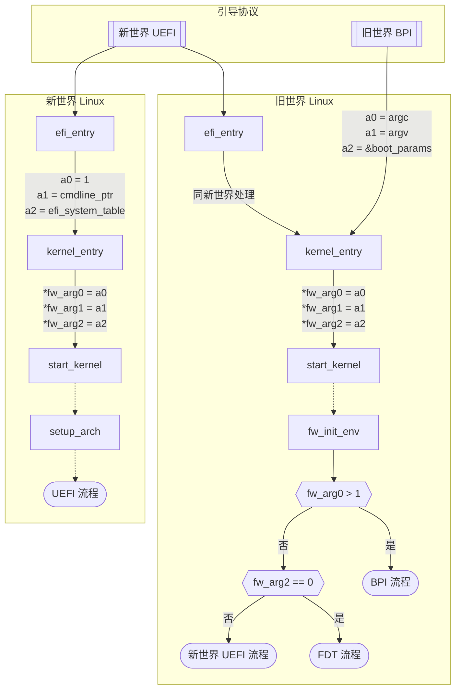

# 旧世界与新世界（底层细节）

这些资料主要面向那些参与 LoongArch 内核研发、发行版集成工作等底层工作的开发者们，
介绍新旧世界问题的技术细节与已知的兼容方案等。

已知的兼容方案有：

* [`libLoL`](liblol.md)

## 导言

虽然新旧世界的程序几乎无法兼容使用，但是这并不意味着新旧世界存在着特别本质的区别。
恰恰相反，二者之间存在着很多共同的特点，使得新旧世界的兼容性变得可能。
事实上，不在新旧世界的差异点内的特性就是他们的共同点。
为了更好地理解新旧世界的差异与共同点，本文仍然会列举一些二者之间较为重要的共同点。

本文将从内核和用户态两个方面来讨论新旧世界的差异与共同点，
主要涵盖的是其对外呈现的特性的异同，而较少涉及其内部实现的差异。
本文不涉及到新旧世界在编译系统方面的异同，因为一般而言，开发者一定会使用一整套同一世界的工具链。
本文也不会涉及到新旧世界的非技术层面的差异，如商业策略、社区合作等。

考虑到目前龙芯生态都在使用 Linux 内核与 glibc C 运行时，且所有「旧世界」系统都采用此搭配，
简明起见，当我们提到「内核」或「用户态」、「libc」，都默认为指代 Linux 或 glibc。

## 内核

内核上，对外暴露的接口可以被分为两方面，一个是引导协议，可以被视为上游接口；
另一个是系统调用，可以被视为下游接口。

### 引导协议

从表面上看，旧世界发行版提供的内核映像文件是 ELF 格式的，需要搭配旧世界移植的 GRUB2 引导器才能启动。
新世界提供的内核映像文件则是 PE 格式的 EFI 应用——EFI Stub，可以直接由 UEFI 固件启动，也可以由新世界移植的 GRUB2 引导器启动。

从固件向内核传参的具体细节上看，两个世界的 Linux 内核期待从上一级引导程序接受的数据结构也有不同。
见以下示意图。

:::info 图例
* 方形的节点表示 EFI 应用程序，是 PE 格式的映像文件。
* 圆角的节点表示 ELF 格式的映像文件。
* 有向的边表示控制权的交接顺序，边上的文字代表被交接的数据结构。
:::

首先，新旧世界的 UEFI 固件，如 EDK2，虽然大部分行为都相同，但就传参而言，存在以下两点明显区别。

* 各类 UEFI 表格中的指针。
    * 旧世界：都是形如 `0x9xxx_xxxx_xxxx_xxxx` 的虚拟地址。

      这「碰巧」是龙芯 Linux 在 MIPS 时代被迫使用的固定「直接映射」窗口之一。
      快进到 LoongArch 时代，这「碰巧」仍然是旧世界内核，与未全面切换至 TLB
      的新世界内核所共同约定使用的「一致可缓存」直接映射窗口。

      「一致可缓存」是在《龙芯架构参考手册》卷一 2.1.7 节「存储访问类型」中定义的术语，又叫
      Coherent Cached 或 CC。
    * 新世界：都是物理地址。

      固件不应该，也确实没有替操作系统操心，甚至半强迫操作系统一定要采用某种特定的 DMW 配置。
* ACPI 数据结构。
    * 旧世界：个别表格，包括但不限于 MADT，遵循的是 ACPI 6.5 定稿前的早期龙芯标准。

      这些数据结构与 ACPI 6.5 不兼容：例如，新世界内核见到旧世界 MADT，便会认为此系统有 0 个 CPU，
      而最终启动失败。
    * 新世界：遵循 ACPI 6.5 或更新的版本。

其次，新世界 Linux 期待直接解析 UEFI 系统表（system table）。
旧世界 Linux 则与前代（MIPS）龙芯内核一样，
期待接受龙芯自行定义的「BPI」结构体：`struct bootparamsinterface`（在 Loongnix 的 Linux 源码中，叫作 `struct boot_params`，本质相同）：
在旧世界，将 UEFI system table 相关信息转换为 BPI 结构，是引导器的职责。

再具体一些，控制权交接至 Linux 之后，早期引导流程的差异见以下示意图。

新旧世界 Linux 对三个固件参数的解释也有如下不同：

|固件参数|旧世界解释|新世界解释|
|-----|--------|--------|
|`fw_arg0`|`int argc` 内核命令行的参数个数|`int efi_boot` EFI 引导标志|
|`fw_arg1`|`const char *argv[]` 内核命令行，如同用户态的 C `main` 函数一般使用|`const char *argv` 内核命令行，单个字符串|
|`fw_arg2`|`struct boot_params *efi_bp` BPI 表格|`u64 efi_system_table` UEFI system table 的物理地址|

最后，在 2023 年，龙芯为其旧世界 Linux 添加了新世界引导协议的兼容支持，并将其集成进了一些新世界发行版，如
[openAnolis](https://gitee.com/anolis/cloud-kernel/commit/97a912cb723611c9ab706592621249354c9615a4)。
这种内核的 EFI stub 形态就支持了新世界方式的引导。
如图所示，此时在内核中走到的代码路径都与新世界本质相同了：基于对 `fw_arg0`
参数的灵活解释——假定所有「正常的」内核引导，其内核命令行参数个数都超过 1——而得以在实践中无歧义地区分两种引导协议。

### 系统调用

系统调用的 ABI 框架上，新旧世界的内核是一致的，这包括了调用系统调用的方式（通过 `syscall 0` 指令）、
系统调用号、参数、返回值的寄存器分配；大多数系统调用的编号是相同的；多数系统调用所接受的结构体的定义也是相同的。
本节介绍那些导致新世界不兼容旧世界系统调用的不同点。

#### 新世界废弃的系统调用

LoongArch 是 Linux 内核最新引入的架构，因此决定不再提供一些较老的系统调用；
而这些系统调用在旧世界是存在的。这样的系统调用有：

系统调用名称 | 编号
------------|-----
`newfstatat` | 79
`fstat`      | 80
`getrlimit`  | 163
`setrlimit`  | 164

可以通过直接补充上述系统调用来实现这一部分的兼容。

#### 信号数量相关

新世界的 `NSIG` 宏（即最多允许的信号数量）定义为 64，而旧世界的 `NSIG` 宏定义为 128，
这直接导致了 `sigset_t` 结构体的大小不同，进而导致 `sigaction` 结构体的大小不同。

与此同时，一些与 `sigset_t` 相关的系统调用要求传入 `sigsetsize` 参数
（即 `sigset_t` 结构体的长度），并要求传入的值与内核中定义的相同，
因此下列新世界中的系统调用无法处理旧世界用户态的调用：

系统调用名称 | 编号
------------|-----
`rt_sigsuspend`  | 133
`rt_sigaction` | 134
`rt_sigprocmask` | 135
`rt_sigpending` | 136
`rt_sigtimedwait` | 137
`pselect6`  | 72
`ppoll`  | 73
`signalfd4`  | 74
`epoll_pwait`  | 22
`epoll_pwait2`  | 441

其中，`rt_sigprocmask`、`rt_sigpending`、`rt_sigaction` 这三个系统调用涉及写入到用户态提供的 `sigset_t` 结构体；
其余的系统调用则仅涉及读取用户态提供的 `sigset_t` 结构体。

为实现这部分的兼容性，一种简单的处理方式是：首先覆盖这些系统调用的定义，允许用户态传入 16 作为 `sigsetsize` 参数值。
此外，新世界允许的信号数目比旧世界少，这意味着对于读取用户态提供的 `sigset_t` 结构体的系统调用，
可以采取直接截断，仅处理前面 64 个信号的方法。对于要写入用户态提供的 `sigset_t` 结构体的系统调用，
如果用户态提供的 `sigsetsize` 参数值为 16，则清零 sigset 中后 64 个信号对应的比特位。最后，
对于那些直接和信号编号打交道的系统调用，如 `sigaction`、`kill` 等，可以直接拒绝用户态传入大于 64 的信号编号。

这样的处理方式，会导致旧世界的程序按照旧世界的 ABI 调用上述系统调用时，实际行为与旧世界原本的系统调用略有区别。
例如通过 `rt_sigprocmask` 先设置一个信号的 mask，再使用该系统调用读取回来，如果设定值中，后 64 个信号对应的比特位有 1，那么设定值和读取值是不同的。
此外，如果试图为后 64 个信号安装信号处理程序或试图向进程发送这些信号，都会返回错误。
但是，旧世界上鲜有依赖这后 64 个自定义信号工作的程序，所以上述简易处理方式可以兼容绝大多数仅为旧世界发行的程序。

#### 用户态进程上下文相关

在进程收到信号时，内核会将进程收到信号时的上下文保存到用户态栈上，然后作为信号处理函数的第三个参数传入（无论用户在注册信号处理函数时是否要求传入上下文）。
并将注入的调用 `rt_sigreturn` 系统调用的函数地址作为信号处理函数的返回地址（见
[`setup_rt_frame` 函数](https://elixir.bootlin.com/linux/v6.6/source/arch/loongarch/kernel/signal.c#L959)）。
当信号处理函数返回时，程序会调用 `rt_sigreturn` 系统调用，此时，内核会将此前保存在用户态栈上的上下文恢复到进程的上下文中（见
[`sys_rt_sigreturn` 函数](https://elixir.bootlin.com/linux/v6.6/source/arch/loongarch/kernel/signal.c#L926)）。
这样，如果用户态程序的信号处理函数修改了这个上下文，那么信号处理程序返回时，就会跳转到其指定的位置及使用指定的上下文继续执行，
而不是返回到发生信号的位置继续执行。新旧世界存储上下文的结构体 `ucontext` 不同，且其成员的地址偏移也相去甚远，
无法在原位通过特殊布置的数据结构来实现兼容。

旧世界内核中的 `ucontext` 结构体的内存排布如下：

偏移量 | 成员名 | 长度 | 备注
-------|------|-----|-----
0 | `uc_flags` | 8
8 | `uc_link` | 8
16 | `uc_stack` | 24
40 | （间隙） | 24
64 | `uc_mcontext.sc_pc` | 8
72 | `uc_mcontext.sc_regs[32]` | 32 × 8 | 32 个通用寄存器
328 | `uc_mcontext.sc_flags` | 4
332 | `uc_mcontext.sc_fcsr` | 4
336 | `uc_mcontext.sc_none` | 4
340 | （间隙） | 4
344 | `uc_mcontext.sc_fcc` | 8
352 | `uc_mcontext.sc_scr[4]` | 4 × 8 | 4 个 LBT 寄存器
384 | `uc_mcontext.sc_fpregs[32]` | 32 × 32 | 32 个浮点寄存器，对齐到 32 字节
1408 | `uc_mcontext.sc_reserved[4]` | 4 | 对齐到 16 字节，前 4 字节实际存储 LBT 的 `eflags`
1412 | `uc_mcontext.sc_reserved[4092]` | 4092
5504 | `uc_sigmask` | 16
5520 | `__unused` | 112
5632

其中，旧世界所使用的 `ucontext` 结构体是定长的，其大小为 5632 字节，
可以被用于存储进程被中断时的上下文。上下文中也包括了为存储 LBT 扩展寄存器和浮点扩展寄存器的内容而准备的字段，
无论 LBT 和浮点扩展指令是否被进程用到。当进程用到了浮点指令时，视所用的指令集（FPU、LSX、LASX）的不同，
将浮点寄存器靠低位对齐存储在 `uc_mcontext.sc_fpregs` 中。但是，该结构体中无法表达目前进程是否使用了浮点扩展指令和/或 LBT 扩展指令，
也无法表达进程使用了哪种浮点扩展指令集。在恢复上下文时，内核会根据进程的当前状态来决定恢复哪种浮点扩展指令集的寄存器。

新世界内核中的 `ucontext` 结构数据则较为复杂，分为基础数据和扩展数据。基础数据存储在 `ucontext` 结构体中，
其内存排布如下：

偏移量 | 成员名 | 长度 | 备注
-------|------|-----|-----
0 | `uc_flags` | 8
8 | `uc_link` | 8
16 | `uc_stack` | 24
40 | `uc_sigmask` | 8
48 | `unused` | 120
168 | （间隙） | 8
176 | `uc_mcontext.sc_pc` | 8
184 | `uc_mcontext.sc_regs[32]` | 32 × 8 | 32 个通用寄存器
440 | `uc_mcontext.sc_flags` | 4
444 | （间隙） | 4
448 | `uc_mcontext.sc_extcontext` |  | 对齐到 16 字节

其中 `uc_mcontext.sc_extcontext` 字段长度为 0，是一个[灵活数组成员](https://en.wikipedia.org/wiki/Flexible_array_member)。
紧跟着 `ucontext` 结构体后面的，是一系列 TLV（类型-长度-值）形式的扩展数据，用于存储扩展指令的上下文。
扩展数据的公共头部的内存排布如下：

偏移量 | 成员名 | 长度 | 备注
-------|------|-----|-----
0 | `magic` | 4 | 标识扩展数据的类型
4 | `size` | 4
8 | `padding` | 8
16 | | | 对齐到 16 字节

其中，从一个扩展数据的头部地址开始，加上 `size` 所指示的长度，就是下一个扩展数据的地址。
最后一个扩展数据的 `magic` 和 `size` 字段的值都为 0，表示扩展数据的结束。
目前定义的扩展数据有 4 种类型，分别对应于 FPU、LSX、LASX 和 LBT 扩展指令集的上下文。
新世界内核实际产生的上下文数据，会根据进程的当前状态来决定产生哪些扩展数据。
其中 FPU、LSX 和 LASX 扩展指令集的上下文数据至多只有一个。
在顺序方面，LBT 扩展指令集的上下文数据排布在最前面（如果有），
然后是 FPU、LSX 或 LASX 扩展指令集的上下文数据（如果有），最后是结束标志。
具体这些扩展数据的内存排布如下：

FPU 扩展指令集，`magic` = `0x46505501`

偏移量 | 成员名 | 长度 | 备注
-------|------|-----|-----
0 | `regs[32]` | 32 × 8 | 32 个浮点寄存器
256 | `fcc` | 8
264 | `fcsr` | 4
268 | （间隙） | 4
272

LSX 扩展指令集，`magic` = `0x53580001`

偏移量 | 成员名 | 长度 | 备注
-------|------|-----|-----
0 | `regs[2*32]` | 32 × 16 | 32 个浮点寄存器
512 | `fcc` | 8
520 | `fcsr` | 4
524 | （间隙） | 4
528

LASX 扩展指令集，`magic` = `0x41535801`

偏移量 | 成员名 | 长度 | 备注
-------|------|-----|-----
0 | `regs[4*32]` | 32 × 32 | 32 个浮点寄存器
1024 | `fcc` | 8
1032 | `fcsr` | 4
1036 | （间隙） | 4
1040

LBT 扩展指令集，`magic` = `0x42540001`

偏移量 | 成员名 | 长度 | 备注
-------|------|-----|-----
0 | `regs[4]` | 4 × 8 | 4 个 LBT 寄存器
32 | `eflags` | 4
36 | `ftop` | 4
40

对比新旧世界的 `ucontext` 数据，我们可以发现，新旧世界的 `uc_flags`、`uc_link`、`uc_stack`
这三个字段的排布是一致的，且 `uc_sigmask` 都填充至 1024 位（即 128 字节）。其不同是，
新旧世界的 `uc_mcontext` 和 `uc_sigmask` 字段的顺序恰好相反，并且新旧世界的 `uc_mcontext`
的结构也不同。新世界的 `uc_mcontext` 靠变长的 TLV 形式的扩展数据来实现对扩展指令集的上下文的存储，
并为未来的扩展指令集的上下文的存储预留了空间；而旧世界则采用了定长的结构体来存储扩展指令集的上下文，
并靠预留的 4096 字节的空间来存储未来的扩展指令集的上下文。此外，旧世界的 LBT 扩展指令集的 `ftop`
寄存器并未被存储，并且 `eflags` 寄存器就占用了前述预留空间的前 4 字节。

在内核态无法实现新旧世界的 `ucontext` 数据的兼容，因为内核无法辨别用户态程序接受的上下文是哪一种。
即使修改内核，使其在加载可执行程序时对此作出了判断并相应为进程作出标记，
如果用户态程序混合动态连接了新旧世界的动态链接库，内核也无法辨别要调用的信号处理函数接受的上下文是哪一种。
所以这方面的兼容需要在用户态实现。

根据不完全的测试，Chromium 以及基于此的 Electron 打包的程序，
其中的 sandbox 机制会[检查](https://chromium.googlesource.com/chromium/src/+/refs/tags/98.0.4758.141/sandbox/linux/seccomp-bpf/trap.cc#192)
`SIGSYS` 信号处理函数收到的 `ucontext` 结构中记录的发生中断的地址是否与收到的 `siginfo` 结构中记录的地址一致，且也会实际使用 `ucontext` 中的数据。
这使得仅采用内核态的兼容方案，搭配完整的旧世界用户态系统目录树，旧世界的基于 Electron 打包的程序需要禁用 sandbox 机制才能正常运行。

## 用户态

TODO
