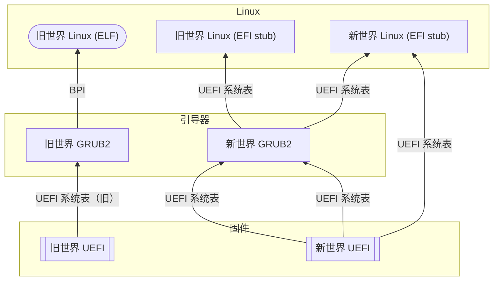
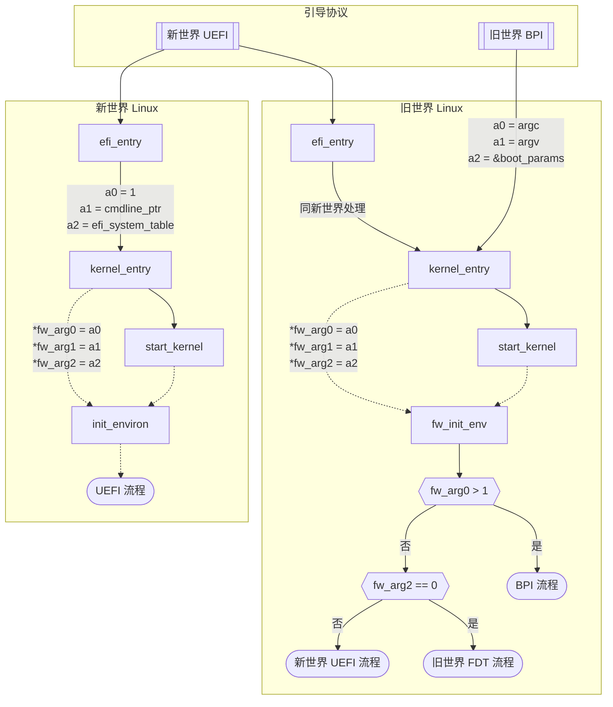

# 旧世界与新世界（底层细节）

这些资料主要面向那些参与 LoongArch 内核研发、发行版集成工作等底层工作的开发者们，
介绍新旧世界问题的技术细节与已知的兼容方案等。

已知的兼容方案有：

* [`libLoL`](https://liblol.aosc.io)

## 导言

虽然新旧世界的程序几乎无法兼容使用，但是这并不意味着新旧世界存在着特别本质的区别。
恰恰相反，二者之间存在着很多共同的特点，使得新旧世界的兼容性变得可能。
事实上，不在新旧世界的差异点内的特性就是他们的共同点。
为了更好地理解新旧世界的差异与共同点，本文仍然会列举一些二者之间较为重要的共同点。

本文将从内核和用户态两个方面来讨论新旧世界的差异与共同点，
主要涵盖的是其对外呈现的特性的异同，而较少涉及其内部实现的差异。
本文不涉及到新旧世界在编译系统方面的异同，因为一般而言，开发者一定会使用一整套同一世界的工具链。
本文也不会涉及到新旧世界的非技术层面的差异，如商业策略、社区合作等。

考虑到目前龙芯生态都在使用 Linux 内核与 glibc C 运行时，且所有「旧世界」系统都采用此搭配，
简明起见，当我们提到「内核」或「用户态」、「libc」，都默认为指代 Linux 或 glibc。

## 内核

内核上，对外暴露的接口可以被分为两方面，一个是引导协议，可以被视为上游接口；
另一个是系统调用，可以被视为下游接口。

### 引导协议

从表面上看，旧世界发行版提供的内核映像文件是 ELF 格式的，需要搭配旧世界移植的 GRUB2 引导器才能启动。
新世界提供的内核映像文件则是 PE 格式的 EFI 应用——EFI Stub，可以直接由 UEFI 固件启动，也可以由新世界移植的 GRUB2 引导器启动。

从固件向内核传参的具体细节上看，两个世界的 Linux 内核期待从上一级引导程序接受的数据结构也有不同。
见以下示意图。

:::info 图例
* 方形的节点表示 EFI 应用程序，是 PE 格式的映像文件。
* 圆角的节点表示 ELF 格式的映像文件。
* 有向的边表示控制权的交接顺序，边上的文字代表被交接的数据结构。
:::

首先，新旧世界的 UEFI 固件，如 EDK2，虽然大部分行为都相同，但就传参而言，存在以下两点明显区别。

* 各类 UEFI 表格中的指针。
    * 旧世界：都是形如 `0x9xxx_xxxx_xxxx_xxxx` 的虚拟地址。

      这「碰巧」是龙芯 Linux 在 MIPS 时代，由于架构规定而被迫使用的固定 1:1 映射窗口之一。
      快进到 LoongArch 时代，这「碰巧」仍然是旧世界内核，与未全面切换至 TLB
      的新世界内核，所共同约定使用的「一致可缓存」直接映射窗口（DMW）。

      「一致可缓存」是在《龙芯架构参考手册》卷一 2.1.7 节「存储访问类型」中定义的术语，又叫
      Coherent Cached 或 CC。

      讽刺的是：虽然在内核拿到控制权之前，固件已经做了相同的 DMW 配置，但在旧世界内核入口点，仍然重复配了一遍……
      这显然意味着其中有一次是多余的！
    * 新世界：都是物理地址。

      固件不应该，也确实没有替操作系统操心，甚至在某种意义上半强迫操作系统一定要采用某种特定的 DMW 配置。
* ACPI 数据结构。
    * 旧世界：个别表格，包括但不限于 MADT，遵循的是 ACPI 6.5 定稿前的早期龙芯标准。

      这些数据结构与 ACPI 6.5 不兼容：例如，新世界内核见到旧世界 MADT，便会认为此系统有 0 个 CPU，
      而最终启动失败。
    * 新世界：遵循 ACPI 6.5 或更新的版本。

其次，新世界 Linux 期待直接解析 UEFI 系统表（system table）。
旧世界 Linux 则与前代（MIPS）龙芯内核一样，
期待接受龙芯自行定义的「BPI」结构体：`struct bootparamsinterface`（在 Loongnix 的 Linux 源码中，叫作 `struct boot_params`，本质相同）：
在旧世界，将 UEFI system table 相关信息转换为 BPI 结构，是引导器的职责。

再具体一些，控制权交接至 Linux 之后，早期引导流程的差异见以下示意图。

:::info 图例
实线的边表示过程调用。有文字注解的虚线边表示数据流动，无文字注解的虚线边则表示有所简化的过程调用。
:::

图中未包含新世界 FDT 流程的详细介绍，因为它的真实逻辑比较复杂，您可以先自行查阅代码。
但简单来说：新世界传递 FDT 根指针的方式是在 UEFI 系统表中包含一条类型为 `DEVICE_TREE_GUID`
即 `b1b621d5-f19c-41a5-830b-d9152c69aae0`，值为此指针的物理地址的记录。
因此，新世界 Linux 无论是以 ACPI 还是 FDT 方式启动，其传参方式都遵循 UEFI 约定：奇妙的统一！
同时也可发现旧世界不具备这种统一性质了。

新旧世界 Linux 对三个固件参数的解释也有如下不同：

|固件参数|旧世界解释|新世界解释|
|-----|--------|--------|
|`fw_arg0`|`int argc` 内核命令行的参数个数|`int efi_boot` EFI 引导标志，0 代表 EFI 运行时服务不可用，反之可用|
|`fw_arg1`|`const char *argv[]` 内核命令行参数列表的虚拟地址，如同用户态的 C `main` 函数一般使用|`const char *argv` 内核命令行的物理地址，单个字符串|
|`fw_arg2`|`struct boot_params *efi_bp` BPI 表的虚拟地址|`u64 efi_system_table` UEFI 系统表的物理地址|

最后，在 2023 年，龙芯为其旧世界 Linux fork 添加了新世界引导协议的兼容支持，
并已经将此支持全面推送至下游商业发行版如 UOS、麒麟等。
这种内核的 EFI stub 形态就支持了新世界方式的引导。
如图所示，此时在内核中走到的代码路径都与新世界本质相同了：基于对 `fw_arg0`
参数的灵活解释——假定所有「正常的」内核引导，其内核命令行参数个数都超过 1——而得以在实践中无歧义地区分两种引导协议。

此外，2023 年龙芯也为新世界 Linux 制作了旧世界引导协议的兼容支持，并向一些有商业背景的、
需要支持无新世界固件机型的社区发行版，如 openAnolis 等推送了；例如 openAnolis 的[相关提交](https://gitee.com/anolis/cloud-kernel/commit/97a912cb723611c9ab706592621249354c9615a4)。
（请注意：此功能暂未由第三方社区成员验证。）
这种排列组合暂未在上文的描述中体现。

### 系统调用

系统调用的 ABI 框架上，新旧世界的内核是一致的，这包括了调用系统调用的方式（通过 `syscall 0` 指令）、
系统调用号、参数、返回值的寄存器分配；大多数系统调用的编号是相同的；多数系统调用所接受的结构体的定义也是相同的。
本节介绍那些导致新世界不兼容旧世界系统调用的不同点。

#### 新世界废弃的系统调用

LoongArch 是 Linux 内核最新引入的架构，因此决定不再提供一些较老的系统调用；
而这些系统调用在旧世界是存在的。这样的系统调用有：

系统调用名称 | 编号
------------|-----
`newfstatat` | 79
`fstat`      | 80
`getrlimit`  | 163
`setrlimit`  | 164

可以通过直接补充上述系统调用来实现这一部分的兼容。

#### 信号数量相关

新世界的 `NSIG` 宏（即最多允许的信号数量）定义为 64，而旧世界的 `NSIG` 宏定义为 128，
这直接导致了 `sigset_t` 结构体的大小不同，进而导致 `sigaction` 结构体的大小不同。

与此同时，一些与 `sigset_t` 相关的系统调用要求传入 `sigsetsize` 参数
（即 `sigset_t` 结构体的长度），并要求传入的值与内核中定义的相同，
因此下列新世界中的系统调用无法处理旧世界用户态的调用：

系统调用名称 | 编号
------------|-----
`rt_sigsuspend`  | 133
`rt_sigaction` | 134
`rt_sigprocmask` | 135
`rt_sigpending` | 136
`rt_sigtimedwait` | 137
`pselect6`  | 72
`ppoll`  | 73
`signalfd4`  | 74
`epoll_pwait`  | 22
`epoll_pwait2`  | 441

其中，`rt_sigprocmask`、`rt_sigpending`、`rt_sigaction` 这三个系统调用涉及写入到用户态提供的 `sigset_t` 结构体；
其余的系统调用则仅涉及读取用户态提供的 `sigset_t` 结构体。

为实现这部分的兼容性，一种简单的处理方式是：首先覆盖这些系统调用的定义，允许用户态传入 16 作为 `sigsetsize` 参数值。
此外，新世界允许的信号数目比旧世界少，这意味着对于读取用户态提供的 `sigset_t` 结构体的系统调用，
可以采取直接截断，仅处理前面 64 个信号的方法。对于要写入用户态提供的 `sigset_t` 结构体的系统调用，
如果用户态提供的 `sigsetsize` 参数值为 16，则清零 sigset 中后 64 个信号对应的比特位。最后，
对于那些直接和信号编号打交道的系统调用，如 `sigaction`、`kill` 等，可以直接拒绝用户态传入大于 64 的信号编号。

这样的处理方式，会导致旧世界的程序按照旧世界的 ABI 调用上述系统调用时，实际行为与旧世界原本的系统调用略有区别。
例如通过 `rt_sigprocmask` 先设置一个信号的 mask，再使用该系统调用读取回来，如果设定值中，后 64 个信号对应的比特位有 1，那么设定值和读取值是不同的。
此外，如果试图为后 64 个信号安装信号处理程序或试图向进程发送这些信号，都会返回错误。
但是，旧世界上鲜有依赖这后 64 个自定义信号工作的程序，所以上述简易处理方式可以兼容绝大多数仅为旧世界发行的程序。

#### 用户态进程上下文相关

在进程收到信号时，内核会将进程收到信号时的上下文保存到用户态栈上，然后作为信号处理函数的第三个参数传入（无论用户在注册信号处理函数时是否要求传入上下文）。
并将注入的调用 `rt_sigreturn` 系统调用的函数地址作为信号处理函数的返回地址（见
[`setup_rt_frame` 函数](https://elixir.bootlin.com/linux/v6.6/source/arch/loongarch/kernel/signal.c#L959)）。
当信号处理函数返回时，程序会调用 `rt_sigreturn` 系统调用，此时，内核会将此前保存在用户态栈上的上下文恢复到进程的上下文中（见
[`sys_rt_sigreturn` 函数](https://elixir.bootlin.com/linux/v6.6/source/arch/loongarch/kernel/signal.c#L926)）。
这样，如果用户态程序的信号处理函数修改了这个上下文，那么信号处理程序返回时，就会跳转到其指定的位置及使用指定的上下文继续执行，
而不是返回到发生信号的位置继续执行。新旧世界存储上下文的结构体 `ucontext` 不同，且其成员的地址偏移也相去甚远，
无法在原位通过特殊布置的数据结构来实现兼容。

旧世界内核中的 `ucontext` 结构体的内存排布如下：

偏移量 | 成员名 | 长度 | 备注
-------|------|-----|-----
0 | `uc_flags` | 8
8 | `uc_link` | 8
16 | `uc_stack` | 24
40 | （间隙） | 24
64 | `uc_mcontext.sc_pc` | 8
72 | `uc_mcontext.sc_regs[32]` | 32 × 8 | 32 个通用寄存器
328 | `uc_mcontext.sc_flags` | 4
332 | `uc_mcontext.sc_fcsr` | 4
336 | `uc_mcontext.sc_none` | 4
340 | （间隙） | 4
344 | `uc_mcontext.sc_fcc` | 8
352 | `uc_mcontext.sc_scr[4]` | 4 × 8 | 4 个 LBT 寄存器
384 | `uc_mcontext.sc_fpregs[32]` | 32 × 32 | 32 个浮点寄存器，对齐到 32 字节
1408 | `uc_mcontext.sc_reserved[4]` | 4 | 对齐到 16 字节，前 4 字节实际存储 LBT 的 `eflags`
1412 | `uc_mcontext.sc_reserved[4092]` | 4092
5504 | `uc_sigmask` | 16
5520 | `__unused` | 112
5632

其中，旧世界所使用的 `ucontext` 结构体是定长的，其大小为 5632 字节，
可以被用于存储进程被中断时的上下文。上下文中也包括了为存储 LBT 扩展寄存器和浮点扩展寄存器的内容而准备的字段，
无论 LBT 和浮点扩展指令是否被进程用到。当进程用到了浮点指令时，视所用的指令集（FPU、LSX、LASX）的不同，
将浮点寄存器靠低位对齐存储在 `uc_mcontext.sc_fpregs` 中。但是，该结构体中无法表达目前进程是否使用了浮点扩展指令和/或 LBT 扩展指令，
也无法表达进程使用了哪种浮点扩展指令集。在恢复上下文时，内核会根据进程的当前状态来决定恢复哪种浮点扩展指令集的寄存器。

新世界内核中的 `ucontext` 结构数据则较为复杂，分为基础数据和扩展数据。基础数据存储在 `ucontext` 结构体中，
其内存排布如下：

偏移量 | 成员名 | 长度 | 备注
-------|------|-----|-----
0 | `uc_flags` | 8
8 | `uc_link` | 8
16 | `uc_stack` | 24
40 | `uc_sigmask` | 8
48 | `unused` | 120
168 | （间隙） | 8
176 | `uc_mcontext.sc_pc` | 8
184 | `uc_mcontext.sc_regs[32]` | 32 × 8 | 32 个通用寄存器
440 | `uc_mcontext.sc_flags` | 4
444 | （间隙） | 4
448 | `uc_mcontext.sc_extcontext` |  | 对齐到 16 字节

其中 `uc_mcontext.sc_extcontext` 字段长度为 0，是一个[灵活数组成员](https://en.wikipedia.org/wiki/Flexible_array_member)。
紧跟着 `ucontext` 结构体后面的，是一系列 TLV（类型-长度-值）形式的扩展数据，用于存储扩展指令的上下文。
扩展数据的公共头部的内存排布如下：

偏移量 | 成员名 | 长度 | 备注
-------|------|-----|-----
0 | `magic` | 4 | 标识扩展数据的类型
4 | `size` | 4
8 | `padding` | 8
16 | | | 对齐到 16 字节

其中，从一个扩展数据的头部地址开始，加上 `size` 所指示的长度，就是下一个扩展数据的地址。
最后一个扩展数据的 `magic` 和 `size` 字段的值都为 0，表示扩展数据的结束。
目前定义的扩展数据有 4 种类型，分别对应于 FPU、LSX、LASX 和 LBT 扩展指令集的上下文。
新世界内核实际产生的上下文数据，会根据进程的当前状态来决定产生哪些扩展数据。
其中 FPU、LSX 和 LASX 扩展指令集的上下文数据至多只有一个。
在顺序方面，LBT 扩展指令集的上下文数据排布在最前面（如果有），
然后是 FPU、LSX 或 LASX 扩展指令集的上下文数据（如果有），最后是结束标志。
具体这些扩展数据的内存排布如下：

FPU 扩展指令集，`magic` = `0x46505501`

偏移量 | 成员名 | 长度 | 备注
-------|------|-----|-----
0 | `regs[32]` | 32 × 8 | 32 个浮点寄存器
256 | `fcc` | 8
264 | `fcsr` | 4
268 | （间隙） | 4
272

LSX 扩展指令集，`magic` = `0x53580001`

偏移量 | 成员名 | 长度 | 备注
-------|------|-----|-----
0 | `regs[2*32]` | 32 × 16 | 32 个浮点寄存器
512 | `fcc` | 8
520 | `fcsr` | 4
524 | （间隙） | 4
528

LASX 扩展指令集，`magic` = `0x41535801`

偏移量 | 成员名 | 长度 | 备注
-------|------|-----|-----
0 | `regs[4*32]` | 32 × 32 | 32 个浮点寄存器
1024 | `fcc` | 8
1032 | `fcsr` | 4
1036 | （间隙） | 4
1040

LBT 扩展指令集，`magic` = `0x42540001`

偏移量 | 成员名 | 长度 | 备注
-------|------|-----|-----
0 | `regs[4]` | 4 × 8 | 4 个 LBT 寄存器
32 | `eflags` | 4
36 | `ftop` | 4
40

对比新旧世界的 `ucontext` 数据，我们可以发现，新旧世界的 `uc_flags`、`uc_link`、`uc_stack`
这三个字段的排布是一致的，且 `uc_sigmask` 都填充至 1024 位（即 128 字节）。其不同是，
新旧世界的 `uc_mcontext` 和 `uc_sigmask` 字段的顺序恰好相反，并且新旧世界的 `uc_mcontext`
的结构也不同。新世界的 `uc_mcontext` 靠变长的 TLV 形式的扩展数据来实现对扩展指令集的上下文的存储，
并为未来的扩展指令集的上下文的存储预留了空间；而旧世界则采用了定长的结构体来存储扩展指令集的上下文，
并靠预留的 4096 字节的空间来存储未来的扩展指令集的上下文。此外，旧世界的 LBT 扩展指令集的 `ftop`
寄存器并未被存储，并且 `eflags` 寄存器就占用了前述预留空间的前 4 字节。

在内核态无法实现新旧世界的 `ucontext` 数据的兼容，因为内核无法辨别用户态程序接受的上下文是哪一种。
即使修改内核，使其在加载可执行程序时对此作出了判断并相应为进程作出标记，
如果用户态程序混合动态链接了新旧世界的动态链接库，内核也无法辨别要调用的信号处理函数接受的上下文是哪一种。
所以这方面的兼容需要在用户态实现。

根据不完全的测试，Chromium 以及基于此的 Electron 打包的程序，
其中的 sandbox 机制会[检查](https://chromium.googlesource.com/chromium/src/+/refs/tags/98.0.4758.141/sandbox/linux/seccomp-bpf/trap.cc#192)
`SIGSYS` 信号处理函数收到的 `ucontext` 结构中记录的发生中断的地址是否与收到的 `siginfo` 结构中记录的地址一致，且也会实际使用 `ucontext` 中的数据。
这使得仅采用内核态的兼容方案，搭配完整的旧世界用户态系统目录树，旧世界的基于 Electron 打包的程序需要禁用 sandbox 机制才能正常运行。

## 用户态

根据截至目前（2024 年 2 月中）的观察，旧世界系统中打包的 glibc 版本为 2.28；而上游 glibc
对 LoongArch 的支持是从 2.36 版本开始的。在本文写作时，最新的 glibc 版本为 2.39，
而目前绝大多数新世界系统中打包的 glibc 版本为 2.37 或 2.38。因为 glibc 具有极佳的兼容性，
即运行在较旧版本 glibc 上的程序，不出意外都能在较新版本 glibc 上运行，所以本文着重对比 glibc
2.38 与旧世界移植的 glibc 2.28；未来新世界中更新的 glibc 版本，可以认为一定是与 2.38 版本兼容的，
所以不出意外的话，本文的结论也适用于未来新世界系统中更新版本的 glibc。

### ELF 文件格式

新旧世界的 ELF 文件格式是一致的，包括 ELF 头中的架构字段 `e_machine`，其值在新旧世界中都为 258；
其余的构造也基本一致。唯一不同的是 `e_flags` 字段的 `bit[7:6]`。旧世界的取值是 `0`，
而新世界的 ELF 文件取值是 `1`[^b1]。使用 `readelf --headers` 查看一个 ELF 文件的头部信息，
在 `ELF Header:` 一节的 `Flags:` 可以看到 `OBJ-v1` 字样，说明这是一个为新世界编译的 ELF
文件；反之，如果看到 `OBJ-v0` 字样，说明这是一个为旧世界编译的 ELF 文件。

检查这个标志是判断一个 ELF 文件是为新世界编译的还是为旧世界编译的最直接和可靠[^b2]的方法。但是，
截至目前（2024 年 2 月中），新旧世界运行时（包括内核的 ELF 加载器和 glibc 的动态链接器）都不会因为这个标志的不同而拒绝加载一个 ELF 文件，
也不会因为这个标志的不同而采取不同的行为。

[^b1]: 事实上，这个标志的真正含义是，目标（`.o`）文件告知链接器其包含的重定位指令语义的版本。
    这些存在版本区别的重定位指令不会被用于动态链接，也就不会出现在最终链接产物（`.so` 和可执行程序）中。
    因此，该标志的原始含义对于动态链接库和可执行程序而言是没有意义的。
    但是恰好可被用于区分新旧世界的程序和动态链接库。
[^b2]: 该标志是在 binutils 2.40 [引入](https://github.com/bminor/binutils-gdb/commit/c4a7e6b56218e1d5a858682186b542e2eae01a4a)的，
    因此存在由此前版本的 binutils 为新世界生成的程序和动态链接库不带有 `OBJ-v1` 标志的情况。
    binutils 2.40 发布的时间是 2023 年初，当时龙架构的新世界尚未形成较为可用的工具链等生态环境，
    这样的程序和动态链接库的数量应该不多。

### 程序解释器

程序解释器（Program Interpreter）是动态链接的 ELF 可执行程序中的一个字段，
用于指出该程序需要的动态链接器的路径。内核在加载一个动态链接的 ELF 可执行程序时，
会根据这个字段的内容来加载动态链接器。新旧世界的程序解释器的路径是不同的：
新世界的程序解释器路径是 `/lib64/ld-linux-loongarch-lp64d.so.1`，
而旧世界的程序解释器路径是 `/lib64/ld.so.1`。这个路径是硬编码在所有动态链接的可执行程序中的。
该路径的不同，直接导致旧世界的程序无法在新世界中运行，反之亦然。
执行异世界程序时提示的 `No such file or directory` 错误，就是因为找不到对应的程序解释器。

### 过程调用约定

新旧世界的过程调用的参数和返回值的传递方式是一致的，大致而言，都是优先通过寄存器传递参数，
多余的参数通过栈传递，返回值通过寄存器传递。同时，新旧世界用于传递参数和返回值的寄存器的编号也是一致的。
另外，新旧世界调用者保存（caller-saved）寄存器和被调用者保存（callee-saved）寄存器的集合也是一致的。

### 用户态兼容性概述

正是因为新旧世界中，ELF 文件的头部存在不同的标记，并且对应的程序解释器的路径也不同，
这使得在新世界系统中，无需 `chroot` 就能运行旧世界程序成为可能。

实现这一目标，存在两种技术路线：隔离型和混合型。其中隔离型是指，
旧世界的可执行程序调用旧世界的 `ld.so`，后者通过修改搜索路径，避开存储新世界动态链接库的路径，
只加载旧世界的动态链接库；而新世界的可执行程序调用原有新世界的 `ld.so`，由于旧世界的动态链接库存放在另外的路径中，
自然不会被搜索和加载，新世界的可执行程序的整个加载和执行过程不会有任何变化。这种技术路线的特点是，
新旧世界泾渭分明。为实现兼容性，该技术路线不得不携带一整套满足旧世界程序运行的动态链接库。
其中，那些有框架性质的动态链接库，存在着在特定路径中查找其它作为插件的动态链接库的行为，
这类框架库，需要被重新编译，相应调整其查找位置。其余的简单的动态链接库则可以直接从旧世界中原样移植。
这可能导致该解决方案占用较多存储空间。另外，对于插件性质的动态链接库，如果用户的新世界系统中安装了该插件，
但旧世界的兼容层中没有提供该插件的旧世界版本，可能导致相应功能的缺失。隔离型路线的边界清晰，
不需要大幅修改 glibc。事实上，隔离型的路线中，glibc 只需要实现信号处理函数中，上下文参数（`ucontext`）
的转换翻译即可，其余的兼容性都可以交由内核解决。此外，隔离型路线的正确性易于保证，
因为新旧世界存在着明确的分隔，对在该环境下工作的旧世界 glibc 而言，
可以明确知道接受程序传入或传出给程序的结构体等数据是旧世界版本的，不至发生错误解读的问题。

混合型则与隔离型相反。混合型利用了新旧世界的过程调用约定相同的特点，提供了一套修改过的 glibc。
这套 glibc 同时提供了多个版本的符号，使得旧世界的程序和新世界的动态链接库可以同时与之动态链接。
这种技术路线的特点是，新旧世界混杂，兼容层无须携带一整套满足旧世界程序运行的动态链接库，
而是直接借用新世界的动态链接库，从而节约了存储空间，并且无需考虑所携带的动态链接库是否完备的问题。
混合型技术路线需要对 glibc 进行较为复杂的修改。同时，对于接受程序传入或传出给程序的结构体等数据是新世界版本还是旧世界版本，
可能存在误判的问题，导致错误解读数据。

### glibc 符号版本

众所周知，glibc 具有相当良好的兼容性。这是通过符号版本（Symbol Versioning）来实现的。
具体而言 glibc 中所有的符号都相应地被分配了一个符号引入时的版本号。如果一个符号的 ABI 发生了变化，
那么则会引入同名符号的新版本，而旧版本的符号则会被保留（实现可能会被替换为兼容的实现）。这个版本号是一个字符串，
在动态链接的过程中，只有版本号相同的符号才会被链接。这样，即使 glibc 的 ABI 发生了变化，
由于和旧版本 glibc 编译链接产生的可执行程序中的符号版本号是旧版本的，所以这个可执行程序在新版本 glibc 上运行时，
也会使用旧版本的符号，从而保证了兼容性。glibc 的符号名称和关联的版本定义，位于其各目录的 `Versions` 文件中。
例如 [`io/Versions`](https://elixir.bootlin.com/glibc/glibc-2.38/source/io/Versions)。在下文中，
我们称在 `Versions` 文件中定义的符号版本号为“源码版本号”。从这个定义可知，一个符号的源码版本号是与架构无关的。
与源码版本号相区别，在编译生成的二进制 glibc 库文件中定义的符号版本号，我们称之为“二进制版本号”。
这个版本号会在编译链接其它可执行程序时被写入到可执行程序的符号表中，同时也是动态链接器在加载可执行程序时用来检查符号版本的版本号。
在类似 i386 这样的架构上，一个符号的源码版本号和二进制版本号是一致的。但是，这并非对所有架构都成立。

我们可以注意到，很多符号都是在最早的 2.0 版本中就定义了的，但是并非所有架构都是从 2.0 版本开始支持的。
例如 riscv64 即是在 2.27 版本中才开始支持的。那么对于 riscv64 架构，
是不可能存在与 2.26 或更早版本的 glibc 编译链接的程序的。这意味着，如果有符号在 2.0 至 2.26 版本之间改变了 ABI，
那么这个符号的旧版本就没有存在的必要了。glibc 对该问题的处理方式是，定义了每一个架构的“纪元版本号”，
即该架构引入时所在的 glibc 版本号。对于所有的符号，如果其源码版本号小于该架构的纪元版本号，
那么在该架构上编译出来的 glibc 中，二进制版本号将会被设置为纪元版本号；如果有多个小于纪元版本号的源码版本号，
则仅编译最新的那一个，并将其二进制版本号设置为纪元版本号。

例如：`setrlimit` 有两个源码版本，分别是 `GLIBC_2.0` 和 `GLIBC_2.2`，而 riscv64 的纪元版本号是 2.27，
那么在 riscv64 上编译出来的 glibc 中，`setrlimit` 的二进制版本号将会被设置为 `GLIBC_2.27`，
其实际内容是 `GLIBC_2.2` 版本的符号。假若未来 glibc 2.50 引入了一个新的 `setrlimit` 的源码版本 `GLIBC_2.50`，
那么在 riscv64 上编译出来的 glibc 中，`setrlimit` 将会存在两个二进制版本号，分别是 `GLIBC_2.27` 和 `GLIBC_2.50`。

新旧世界在符号版本方面存在差异的来源是，旧世界的龙架构的纪元版本号是 2.27[^a1]，而新世界的是 2.36。
由于 glibc 中的大多数符号的源码版本号都是从 2.0 开始的，因此在旧世界中，
glibc 大多数符号的二进制版本号就是 `GLIBC_2.27`；而新世界中，相应地，大多数符号的二进制版本号是 `GLIBC_2.36`：
这样，即使通过修改二进制可执行程序，将其程序解释器强行修改为另一个世界的，也无法正常运行，
因为它期待要加载的 glibc 的符号版本在异世界中不存在。类似地，如果一个新世界的可执行程序试图加载（例如通过 `dlopen`）旧世界的（非 glibc 的）动态链接库，
也是无法正确加载的，因为该旧世界动态链接库依赖的 glibc 的符号版本在新世界中不存在。

[^a1]: 巧合的是，riscv64 的[纪元版本号](https://elixir.bootlin.com/glibc/glibc-2.38/source/sysdeps/unix/sysv/linux/riscv/shlib-versions#L2)也是 2.27

更为复杂的情况出现在 `libpthread` 中。旧世界的龙架构中，唯独 `libpthread` 的纪元版本号是 2.0，
即旧世界中 `libpthread` 和 `libc` 的纪元版本号不一致。glibc 中已知的全部 Linux 支持的架构中，
只有旧世界的龙架构存在这样的现象。这样做法的原因不得而知[^a2]，但是导致的后果是明确的。在 glibc 2.34
之前，`libpthread` 和 `libc` 是分立的两个库。有部分符号，例如 `open`、`write` 等，
在两个库中都有定义，但是其包括的代码可能不同（通过宏定义在编译期产生区别）。
一个多线程程序在执行时，其调用的 `open`、`write` 等符号，由 `libpthread` 覆盖了 `libc` 中的定义。
在 glibc 2.34 以及此后的版本，`libpthread` 合并进了 `libc`，
于是 `libc` 中 `open`、`write` 等符号始终是多线程的版本。
旧世界中 `libpthread` 和 `libc` 的纪元版本号不一致，造成了这样的 `open`、`write`
等符号在旧世界存在两个二进制版本号，分别是 `libpthread` 中的 `GLIBC_2.0` 和 `libc` 中的 `GLIBC_2.27`。

[^a2]: 但是可以注意到 MIPS 架构的[纪元版本号](https://elixir.bootlin.com/glibc/glibc-2.38/source/sysdeps/unix/sysv/linux/mips/shlib-versions#L25)是 2.0，并跳过了 2.1。事实上，旧世界的 `libpthread` 的纪元版本号也是 2.0，并同样跳过了 2.1。

### glibc 库列表

动态链接的 ELF 文件（包括库和可执行程序）对于需要引入的带有版本号的符号，都会描述该符号所属的动态链接库的名称。
但是 glibc 在执行动态链接时，会忽略实际提供对应版本符号的库的名称，这一行为在 glibc 2.30 被[引入](https://github.com/bminor/glibc/commit/f0b2132b35248c1f4a80f62a2c38cddcc802aa8c)。这为 glibc 后续将符号从其它库向 `libc`
中集中提供了便利。以 `libpthread` 中的 `pthread_join` 为例。在 glibc 2.34 以及之后的版本中，
该符号实际由 `libc` 提供，而 `libpthread` 变成了一个空白占位。对于和 glibc 2.34 以前版本链接的程序或其它库，
显然需要的是 `libpthread` 中的 `pthread_join`。在动态链接时，glibc 会正常查找到 `libc`
和 `libpthread` 库文件，从而满足了该程序和该库对所依赖的库的需求。当具体要查找 `pthread_join` 时，
glibc 的动态链接器则不考虑所要求的 `pthread_join` 的提供者，只要载入的所有库中定义有 `pthread_join` 的对应版本，
即可完成动态链接。

在此之后，且在新世界的纪元版本 2.36 前，又有一些库的符号被移动到了 `libc` 中，这些库文件在新世界就彻底不存在了。
然而，对于旧世界的程序而言，这些库文件仍然是需要的，应该提供占位库文件。下表是新旧世界中，
所有对外供动态链接的库的列表。

库名 | 旧世界 | 新世界 | 备注
-----|------|------|----
`libBrokenLocale.so.1` | 存在 | 存在
`libanl.so.1` | 存在 | 不存在 | 需要补充占位库
`libc.so.6` | 存在 | 存在
`libc_malloc_debug.so.0` | 不存在 | 存在 | 该库在 2.34 引入
`libcrypt.so.1`| 存在 | 不存在 | 该库在新世界默认禁用
`libdl.so.2` | 存在 | 存在（占位）
`libm.so.6` | 存在 | 存在
`libnsl.so.1` | 存在 | 不存在 | 该库在新世界默认禁用
`libpthread.so.0` | 存在 | 存在（占位）
`libresolv.so.2` | 存在 | 存在
`librt.so.1` | 存在 | 存在（占位）
`libthread_db.so.1` | 存在 | 存在
`libutil.so.1` | 存在 | 不存在 | 需要补充占位库

### 具体函数的行为区别

新旧世界 glibc 提供的函数的行为存在一些区别。这些区别是内核提供的用户态接口的不同导致的。
本节将会讨论这些函数的行为区别。这里的“行为”主要指的是 glibc 对函数调用者呈现的行为。但是，
在特定的讨论中，我们也会涉及到其向内核发出系统调用的行为。

#### 信号相关

我们知道，新世界内核中，最大的信号编号是 64；而旧世界内核中，最大的信号编号是 128。
这导致了内核接受的 `sigset_t` 数据的大小不同。然而，glibc 中定义的 `sigset_t` 结构体的大小是相同的，
总是能[容纳](https://elixir.bootlin.com/glibc/glibc-2.38/source/sysdeps/unix/sysv/linux/bits/types/__sigset_t.h) 1024 个信号。
这意味着，新世界的 glibc 中的 `sigset_t` 数据的大小是 128 字节。因此，所有接受 `sigset_t` 结构体的 glibc 函数的
 ABI 是兼容的，不至于出现数据溢出的情况。所有读取 `sigset_t` 结构体的新世界函数，完全可以读取旧世界程序提供的 `sigset_t` 结构体，并正常工作。
所有写入 `sigset_t` 结构体的新世界函数，也可以写入旧世界程序提供的 `sigset_t` 结构体。由于旧世界的程序会使用其中的前 128 个比特位（即 128 个信号），
而写入 `sigset_t` 结构体的新世界函数仅会写入前 64 个比特位，所以需要补充清零随后的 64 个比特位，以保证旧世界的程序不会接收到未初始化的数据。
此外，glibc 还提供了一些函数，用于修改 `sigset_t` 结构体或对其进行逻辑运算，这些函数仅会操作对应世界中可用的信号编号所对应的比特位，
因此对外呈现的行为有所不同。

下列函数属于 `sigset_t` 编辑修改类函数，其所能操作的信号编号的范围不同：

- `sigorset`
- `sigandset`
- `sigisemptyset`
- `sigismember`
- `sigaddset`
- `sigfillset`
- `sigemptyset`
- `sigdelset`

下列函数属于只读 `sigset_t` 的函数，新世界的该函数可以正常读取旧世界程序提供的 `sigset_t`：

- `epoll_pwait2`
- `epoll_pwait`
- `ppoll`
- `__ppoll_chk`
- `pselect`
- `signalfd`
- `sigwaitinfo`
- `sigwait`
- `sigtimedwait`
- `__sigsuspend`
- `sigsuspend`

下列函数要写入 `sigset_t`，如果新世界的该函数要写入旧世界提供的 `sigset_t`，还需要补充清零随后的 64 个比特位：

- `sigpending`
- `pthread_sigmask`
- `sigprocmask`

下列函数虽然读写了 `sigset_t`，但是完整拷贝了 `sigset_t` 结构体，故其行为与最大的信号编号无关：

- `posix_spawnattr_getsigmask`
- `posix_spawnattr_getsigdefault`
- `posix_spawnattr_setsigmask`
- `posix_spawnattr_setsigdefault`

#### `ucontext` 相关

`ucontext_t` 结构体出现在两种地方：一是在信号处理函数的第三个参数中[^1]；二是在 `getcontext`、`setcontext`、`makecontext`、`swapcontext` 函数中[^2]。
对 glibc 的用户而言，在这两种地方的 `ucontext_t` 结构体应当能互操作[^3]。例如，一个信号处理函数在接受到信号时，
将此前用 `getcontext` 函数保存的 `ucontext_t` 结构体复制到其第三个参数所指位置，那么在该信号处理函数结束后，
程序流将会转向 `getcontext` 函数保存的那个上下文；如果这个信号处理函数又将收到的原始 `ucontext_t` 保存到其它位置，
然后在此后的某个时刻，对保存的 `ucontext_t` 调用 `setcontext` 函数，即可将程序流转回到发生信号中断的上下文。
同时注意到，信号处理函数接受的 `ucontext_t` 结构体直接来自于内核，而 `*context` 函数是由 glibc 提供的，
所以就 `ucontext_t` 而言，glibc 提供的版本和内核提供的版本必须完全二进制兼容。这一点与其它的结构体不同，
其它的结构体，glibc 可以提供与内核不同的版本，只要 glibc 函数能正确将二者转换即可。例如，`sigaction` 结构体，
glibc 提供的版本和内核提供的版本是不一致的[^4]，需要 glibc 函数将二者转换。

[^1]: [`sigaction(2)`](https://man7.org/linux/man-pages/man2/sigaction.2.html) “The siginfo_t argument to a SA_SIGINFO handler” 一节
[^2]: [`getcontext(3)`](https://man7.org/linux/man-pages/man3/getcontext.3.html)
[^3]: [`getcontext(3)`](https://man7.org/linux/man-pages/man3/getcontext.3.html) “The function setcontext() restores the user context” which “should have
       been … received as the third argument to a signal handler”
[^4]: 对比 [`sigaction`](https://elixir.bootlin.com/glibc/glibc-2.38/source/sysdeps/unix/sysv/linux/bits/sigaction.h#L27) 和
       [`kernel_sigaction`](https://elixir.bootlin.com/glibc/glibc-2.38/source/sysdeps/unix/sysv/linux/kernel_sigaction.h#L9)

截至 glibc 2.38 版本，新世界的 `*context` 函数仅能处理 `ucontext_t` 结构体中的通用（整数）寄存器部分，而不能处理浮点、向量扩展和 LBT 扩展部分。
旧世界的 `*context` 函数能处理 `ucontext_t` 结构体中通用（整数）寄存器和浮点寄存器，但不能处理向量扩展和 LBT 扩展部分。
此外，旧世界 glibc 提供的 `ucontext_t` 定义[^5]与旧世界内核[^6]的定义对比，可以发现前者缺少用于存放 LBT 扩展寄存器的 `uc_mcontext.sc_scr[4]` 字段，
致使后续用于存放浮点寄存器的 `uc_mcontext.sc_fpregs[32]` 字段的偏移量发生了变化。这意味着，
旧世界的 `*context` 函数在处理旧世界内核提供给信号处理函数的 `ucontext_t` 结构体时，无法正确处理浮点寄存器。
综上所述，旧世界 glibc 也仅能正确处理 `ucontext_t` 结构体的通用（整数）寄存器部分。这样，在功能上，
恰好新旧世界达成了一致——都只能正确处理通用寄存器部分。

[^5]: 可以在 Loongnix 发行版的 `/usr/include/loongarch64-linux-gnu/sys/ucontext.h` 找到
[^6]: 可以在 Loongnix 发行版的 `/usr/include/loongarch64-linux-gnu/bits/sigcontext.h` 找到

glibc 提供了两个函数，可以被用于注册信号处理函数，这两个函数分别是 `sigaction` 和 `signal`。
其中，`signal` 函数是对 `sigaction` 函数的封装。这样，无论是如何注册的信号处理函数，
都会在第三个参数中接受到一个 `ucontext_t` 结构体指针。但是根据 glibc [文档](https://man7.org/linux/man-pages/man2/signal.2.html)，
`signal` 函数注册的信号处理函数只应该接受第一个参数。这意味着，如果 `signal` 函数注册的信号处理函数
遵循了文档的要求，只接受第一个参数，那么它会忽略第三个参数，即 `ucontext_t` 结构体指针会被忽略。
这意味着，`signal` 函数注册的信号处理函数，是新旧世界无关的，不需要针对这样的信号处理函数做任何兼容性处理。
而 `sigaction` 函数注册的信号处理函数，是新旧世界相关的，需要额外的兼容性处理。一种可能的兼容性处理是，
当用户调用 `sigaction` 函数注册一个接受旧世界的 `ucontext_t` 结构体信号处理函数时，实际不注册这个函数，
而是注册一个包裹函数，这个包裹函数接受新世界的 `ucontext_t` 结构体，并在栈上相应构造一个旧世界的 `ucontext_t` 结构体，
然后调用用户提供的信号处理函数；在用户提供的信号处理函数返回后，将旧世界的 `ucontext_t` 结构体的内容拷贝回新世界的 `ucontext_t` 结构体中。
需要注意的是，信号处理函数无法接受自定义的参数，这意味着原始用户提供的信号处理函数的地址必须以某种方式保存下来，
以便包裹函数调用它。而在实现这一点时要十分小心地处理锁和信号屏蔽，因为整个这个注册信号处理函数的过程不再是原子的。

无论如何处理，都不会改变新旧世界 `ucontext_t` 结构体完全不兼容的事实，也无法扭转旧世界 glibc
和旧世界内核 `ucontext_t` 结构体存在差异的现状，因此如果出现了新旧世界可执行程序和动态链接库的混合链接，
并且存在将 `ucontext_t` 结构体在新旧世界间传递的情况，始终无法保证正确识别 `ucontext_t` 结构体是新世界的还是旧世界的。
不过幸运的是，这样的情况十分罕见。

下列函数涉及 `ucontext_t` 结构体，因此新旧世界的函数完全不二进制兼容：

- `getcontext`
- `setcontext`
- `makecontext`
- `swapcontext`

下列函数涉及注册能接收 `ucontext_t` 结构体的信号处理函数，因此需要额外的兼容性处理：

- `sigaction`

下列函数注册的信号处理函数会忽略 `ucontext_t` 结构体指针，因此无需特殊处理：

- `signal`

#### longjmp 相关

`setjmp`、`sigsetjmp`、`longjmp`、`siglongjmp` 函数是用于实现非局部跳转的函数。
其中 `set*jmp` 函数会将当前的程序状态（可选地，包括当前的信号掩码，即 sigmask）保存到一个 `jmp_buf` 结构体中，
而 `*longjmp` 函数则将上述状态恢复。这些函数的行为与 `*context` 函数类似。在新旧世界中，
`jmp_buf` 结构体的定义完全一致，因此这些 `*jmp` 函数是完全二进制兼容的。

下列函数涉及 `jmp_buf` 结构体，在新旧世界间完全兼容：

- `setjmp`
- `sigsetjmp`
- `longjmp`
- `siglongjmp`

#### `fstat` 相关

新世界的内核中，缺少 `fstat` 和 `newfstatat` 系统调用。这两个系统调用可以被用于获取文件的元数据。
其中，`fstat` 可以获取一个打开的文件描述符（file descriptor, fd）所对应的文件的元数据；
而 `newfstatat` 则既可以获取一个打开的文件描述符所对应的文件的元数据，也可以获取一个路径所对应的文件的元数据。
在操作对象上，`statx` 与 `newfstatat` 是一致的，但是可以按需返回更多的信息。因此，在功能上，
`statx` 是 `fstat` 和 `newfstatat` 的超集，并取代了这两个系统调用。

在 2.38 的 glibc 中，所有 `*stat*` 函数会在编译期通过宏指令检查内核是否提供了 `fstat` 或 `newfstatat` 的定义，
如果没有，那么这些函数会调用 `statx`[^7] 并负责转换数据结构。这意味着，与旧世界相比，这些 `*stat*` 函数对外呈现的行为是不变的，
新旧世界的函数是二进制兼容的。本节会着重讨论其向内核发出系统调用的行为区别。

[^7]: 这些函数最终会调用 [__fstatat64_time64](https://elixir.bootlin.com/glibc/glibc-2.38/source/sysdeps/unix/sysv/linux/fstatat64.c#L157)

对于旧世界上基于 Chromium 的浏览器和基于 Electron 的应用程序而言，Chromium 基于 seccomp 的沙箱机制会针对 `statx`
[返回](https://chromium.googlesource.com/chromium/src/sandbox/+/7462a4fd179376882292be2381a22df6819041c7%5E%21)
`ENOSYS` 错误，期待沙箱内的进程自行回落至 `fstat` 或 `newfstatat`。
这是因为，seccomp [无法审查](https://lwn.net/Articles/799557/)系统调用的指针参数背后的内容。
而 Chromium 的一种沙箱规则则要求程序只能操作已经打开的 fd，而不能访问任何系统路径，
因此只能放行（在新世界龙架构内核中不存在的）`fstat` ，并通过 `SIGSYS` 的钩子[检查](https://chromium.googlesource.com/chromium/src/sandbox/+/b3267c8b40b6133b2db5475caed8f6722837a95e%5E%21/#F2) `newfstatat` 并将其重写为 `fstat`。

为了能让这部分程序正常运行，需要调整上述函数的行为，当 `statx` 返回 `ENOSYS` 时，
改为使用 `fstat` 或 `newfstatat`；同时，需要在新世界的内核中补充 `fstat` 和 `newfstatat` 的实现。

glibc 中下列导出函数涉及 `fstat` 和 `newfstatat`，为兼容目前尚未适配 `statx` 的 Chromium 的沙箱机制，需要额外的兼容性处理：

- `stat`
- `fstat`
- `lstat`
- `fstatat`

被上述函数引用，实际进行系统调用的 glibc 内部函数有：

- `__fstatat64_time64`

此外，还有为 2.33 之前版本的 glibc 提供的兼容符号所指向的函数也涉及该问题：

- `___fxstat64`
- `__fxstatat64`
- `___lxstat64`
- `___xstat64`

#### 杂项

新世界系统中同时提供 `clone3` 和 `clone`，而旧世界系统中仅提供 `clone`。
新世界的 glibc 会在编译期检查内核是否提供了 `clone3`，如果提供了，
那么 `fork` 和 `pthread_create` 等函数会调用 `clone3`。
在运行时，如果 `clone3` 返回 `ENOSYS`，
则[回落](https://elixir.bootlin.com/glibc/glibc-2.38/source/sysdeps/unix/sysv/linux/clone-internal.c#L109)到 `clone`。
该行为不会影响新旧世界函数的二进制兼容性。但是，`clone3` 的参数都通过内存中的结构体传递；因此出于上一节提到的原因，Chromium 的 seccomp 沙箱机制也无法审查 `clone3` 的参数，
因此对 `clone3` 一律[返回](https://chromium.googlesource.com/chromium/src/sandbox/+/482404adee4fc0487452c7ae5ac9c192b0f4fd30%5E%21) `ENOSYS` 错误，
期待 glibc 回落使用 `clone` 系统调用。
该机制使得在 `clone3` 方面，新世界的 glibc 库函数可以兼容旧世界的 Chromium 沙箱。
然而，个别基于 Electron 的旧世界应用，由于打包的 Chromium 版本较旧，其沙箱机制不支持针对
`clone3` 返回 `ENOSYS`，而是返回其它的错误，致使 glibc 无法回落使用 `clone`，造成程序无法运行。

为了避免这一问题，如果要实现新旧世界混合链接，需要禁用 `clone3` 的支持，直接调用 `clone`。

此外，旧世界的 glibc 对外导出了 `___brk_addr` 符号，而新世界没有导出。
