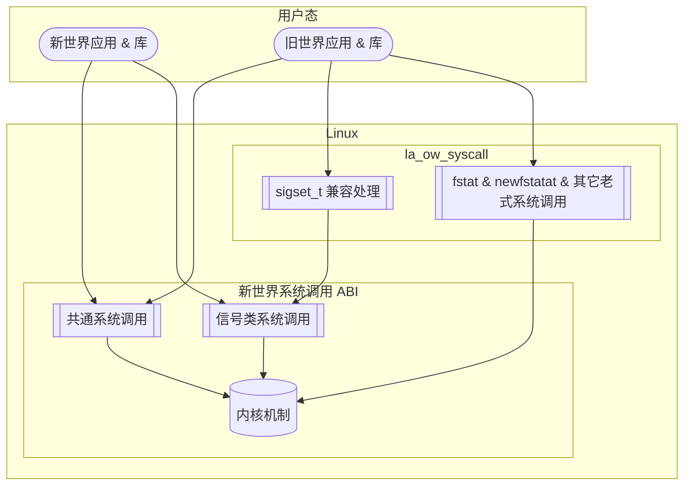
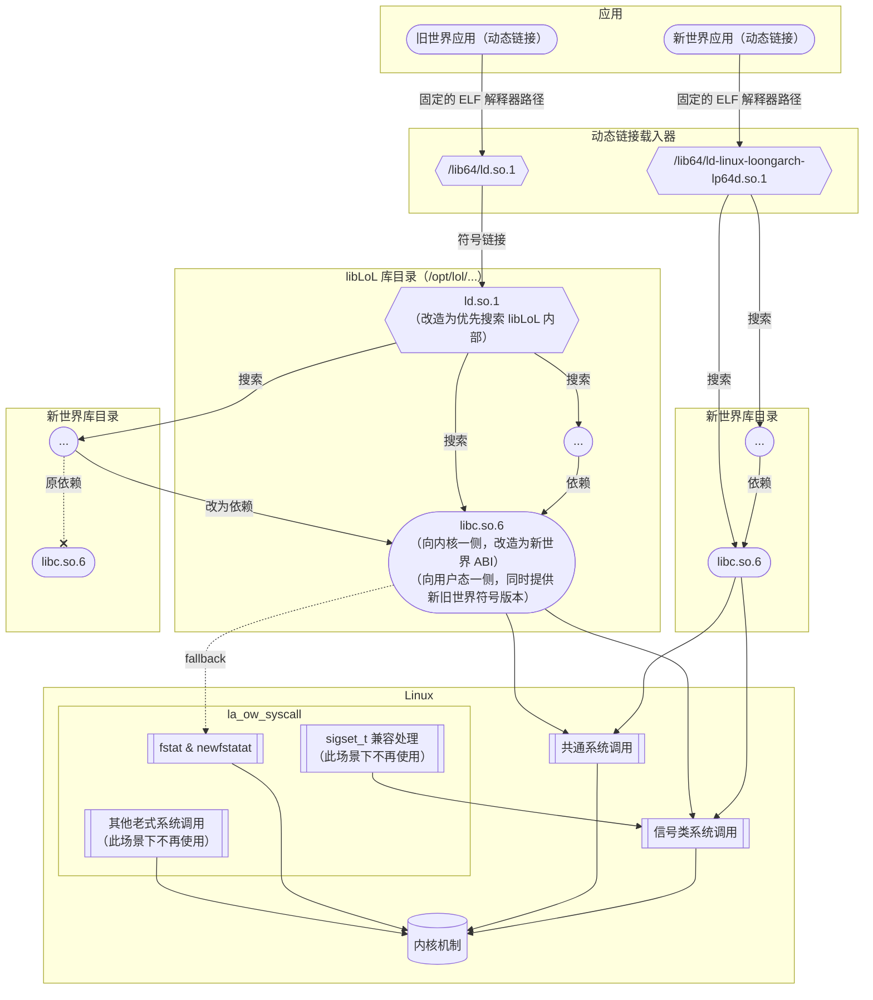

# `libLoL`

## 简介 {#introduction}

本文描述的内容都是基于 `libLoL` 0.1.3 版本的现状而总结的。
本文的最后更新日期是 2024.02.04。

这是由 AOSC 社区开发的兼容方案，由两部分组成：

* [内核模块](https://github.com/AOSC-Dev/la_ow_syscall)：提供旧世界系统调用 ABI 的支持。
* [运行时](https://github.com/shankerwangmiao/liblol)：为动态链接的旧世界应用提供依赖组件。

`libLoL` 的基本特点如下：

* 兼容性的方向：在新世界系统上提供旧世界兼容性。
* sysroot：没有单独的 sysroot，而是仅提供修改过的 glibc。该 glibc 同时提供新旧世界版本的符号，以便旧世界的可执行程序加载新世界的动态链接库。
* 内核：使用模块方式，动态 patch 系统调用表，不侵入架构无关逻辑。

这意味着：

* 磁盘空间方面，占用磁盘空间较小。
* 性能方面，几乎不存在开销。
* 侵入性方面，不存在侵入式修改，而是为宿主系统增加了修改过的 glibc，并借用宿主系统的其他动态链接库，特别方便安装与卸载。
* 正确性方面，可以认为做到了非侵入方案所能做到的一切（详见[「讨论」一节](#discussions)）。

除此之外，已知的兼容处理都正确，可正常运行多数旧世界典型应用（如 WPS Office、QQ、龙芯浏览器）了。

## 架构 {#architecture}

在内核和用户态之间，系统调用兼容性的实现方式如下图。
此图所描述的数据流适用于静态链接的程序，或自己负责一部分系统调用的动态链接的程序：
这些程序的共同特点是部分或全部系统调用无法被 `libLoL` 在用户态轻易截获，因此必须在内核层面加入相应处理。

对依赖 glibc 的动态链接应用的支持方式如下图。
动态链接的程序或库，也可能绕过 libc 而自行做系统调用，此时的行为模式与上一张图所描述的相同。

## 讨论 {#discussions}

### 关于系统调用 ABI 的正确性 {#on-syscall-abi-correctness}

在系统调用 ABI 方面，加载了内核模块之后，异世界的系统调用方式也会被接受。但这在不做侵入式修改的前提下不可避免。

在信号处理方面，受限于目前允许混合新旧世界动态链接的架构，可能出现将错误形状的上下文（`ucontext_t`）
传入异世界 signal handler 的情况。
这是因为无法识别被注册的 signal handler 是新世界的还是旧世界的，
于是只能依靠被调用的用以注册 signal handler 的函数，即 `sigaction` 的 ELF 符号版本来判断——旧世界的代码一定链接到旧世界版本的 `sigaction`，新世界的代码则一定链接到新世界版本的 `sigaction`——但即便如此，
仍然无法从理论上阻止 `sigaction` 的调用者在这之前从异世界代码拿到 signal handler。
所幸，由于大多数 signal handlers 并不处理上下文参数（即函数的第三个参数），
因此该问题并没有在实际测试中出现。

由于 `libLoL` 打包的 glibc 是修改自新世界的，因此对于动态链接到 glibc 的旧世界程序，
理论上可以仅使用新世界的系统调用为其提供服务，而不依赖于 `la_ow_syscall` 内核模块。
但 Chromium 的沙箱机制是个特例：它不放行 `statx` 而期待 libc 回落至 `fstat` 等传统系统调用。
这在 LoongArch 之前总是可以工作，但 LoongArch 是首个去除了 `fstat` 的架构！
按照[Chromium 相关变更](https://chromium-review.googlesource.com/c/chromium/src/+/2823150)中的解释，
沙箱不放行 `statx` 是由于「不存在用 signal handler 将 `statx` 的调用改写为更安全形式的方法」；
无论如何，总之在提供 `fstat` 之外，是没有别的办法能兼容带有 Chromium 内核的存量二进制程序了。

为此，`libLoL` 的 glibc 包含了特殊处理：它的 `stat` 系列函数在 `statx` 系统调用不可用时，
会如同其他有 `fstat` 支持的架构一般，回退到 `fstat` 和 `newfstatat` 系统调用。
这就仍然要由 `la_ow_syscall` 内核模块提供兼容了。

### 关于库搜索路径的特殊处理 {#on-special-treatment-of-library-search-paths}

作为二进制软件分发的基本操作之一，部分软件会捆绑（bundle）提供一些动态链接库，
并通过可执行程序的 `RPATH`，或用 `LD_LIBRARY_PATH` 环境变量等方式使其可被搜索、加载到。
默认情况下，对于一个带有捆绑库的旧世界程序而言，这些被捆绑的旧世界动态链接库，
会先于新世界宿主系统提供的动态链接库，被搜索和加载。
这意味着如果：

* 这样的旧世界动态链接库（设为 `libA`）由于版本较低，提供的符号或符号版本不全，
* 并且可执行程序又依赖了系统提供的其他动态链接库（设为 `libB`），
* 并且 `libB` 依赖较新版本的 `libA`，

那么就会出现符号版本不匹配的情况。
这种情况下，后一个动态链接库（`libB`）可能无法正确加载。

为了应对这一情况，`libLoL` 打包的 glibc 提供了一个额外的路径，该路径中的动态链接库会先于
`RPATH` 或 `LD_LIBRARY_PATH` 环境变量中指定的路径被搜索。
默认情况下，该路径中包括了 `libLoL` 提供的全部 glibc 的动态链接库，以及 `libstdc++.so`。`libLoL`
也为用户提供了一个这样的路径，以便用户按需引入更多的优先加载的动态链接库。

### 为何新世界程序加载旧世界库不可实现？ {#why-its-impossible-to-load-ow-libs-in-nw-apps}

由于 `libLoL` 打包的 glibc 并未替换新世界系统的 glibc，
新世界的可执行程序与库都完全没有必要，也不会感知到 `libLoL` 的存在。
因此,新世界的可执行程序无法载入旧世界提供的动态链接库：宿主系统的 libc 不存在旧世界的 ELF 符号版本。

该需求较为罕见，但存在一种典型场景：输入法。
按照目前 Linux 常见的输入法支持架构，应用程序支持输入法的方式是由其图形界面工具库（GUI toolkit），
如 GTK、Qt 等，按照一定规则，搜索并加载由输入法软件提供的动态链接库。
因此对于旧世界的输入法软件，其提供的动态链接库是旧世界的，无法被新世界的应用程序载入。
由于 `libLoL` 采用非侵入宿主系统的设计，无法支持在新世界系统上使用旧世界的输入法；
只能呼吁相关厂商适配新世界。

### `libLoL` 与 `patchelf` {#liblol-and-patchelf}

新旧世界的 glibc 的架构初始版本不同，为了能让修改过的 glibc 支持旧世界可执行文件加载新世界的动态链接库，
必须要同时提供新旧世界的符号版本。这意味着，对于 glibc 中大多数没有经历过 ABI 版本变更的符号，
要同时创建两个版本的符号指向同一个函数；对于经历过 ABI 版本变更的那些符号，也要类似地调整。
理论上，通过修改 glibc 的代码，可以达到这一目的。但是，这样的修改会使得 glibc 的代码修改量巨大，
难以工程实现。

为此，`libLoL` 选择了另一种实现思路，即在编译 glibc 完成后，通过「后处理程序」，
修改其动态符号表和符号版本表，使得 glibc 同时提供新旧世界的符号版本。

`patchelf` 是一个可以修改 ELF 文件的工具，但缺乏上述功能。为此，`libLoL` 为 `patchelf`
增加了这一重新映射符号版本的功能，以支持 `libLoL` 的需求：
在维护者目前看来，该功能的适用场景过于罕见，因而不适合被合并到 `patchelf` 上游。

### `libLoL` 运行时的发行 {#distribution-of-liblol}

目前，`libLoL` 项目的运行时部分实质上是 `patchelf` 工具和 glibc 的补丁合集。
在构建时，首先构建 glibc，然后构建修改版的 `patchelf`，最后以此 `patchelf` 给编译出的
glibc 的动态链接库文件进行后处理。
这一构建过程较为复杂，并且难以用发行版无关的方式描述，因此 `libLoL` 项目难以简单地被打包到其它发行版中，用户也很难自行构建。
目前，`libLoL` 项目提供适配 AOSC OS 和 Debian 的发行包。
其他需要打包 `libLoL` 的发行版开发人员需要根据本发行版对 glibc 的处理方式，以及目录布局等相关情况，
按照上述基本流程为本发行版定制 `libLoL` 构建方式。

### `libLoL` 运行时的 glibc 版本 {#glibc-version-of-liblol}

`libLoL` 使得旧世界的可执行程序可以加载新世界的动态链接库。对被载入的新世界的动态链接库而言，
它所依赖的 glibc 实际上已经是来自 `libLoL` 而非宿主了；
但由于构建这些新世界原生库时使用的 glibc 是宿主系统的,因此这些新世界库将会期待在 `libLoL` libc
中看到宿主 glibc 版本的 ELF 符号。
这意味着 `libLoL` 自身提供的 glibc 版本不可以低于新世界宿主系统的 glibc 版本。
目前，`libLoL` 项目提供的 glibc 基于 2.38 版本；
`libLoL` 项目需要紧密跟踪 glibc 的新版本，如果未来某个版本的 glibc 引入了新的 ELF 符号版本，`libLoL`
便要做相应更新。
