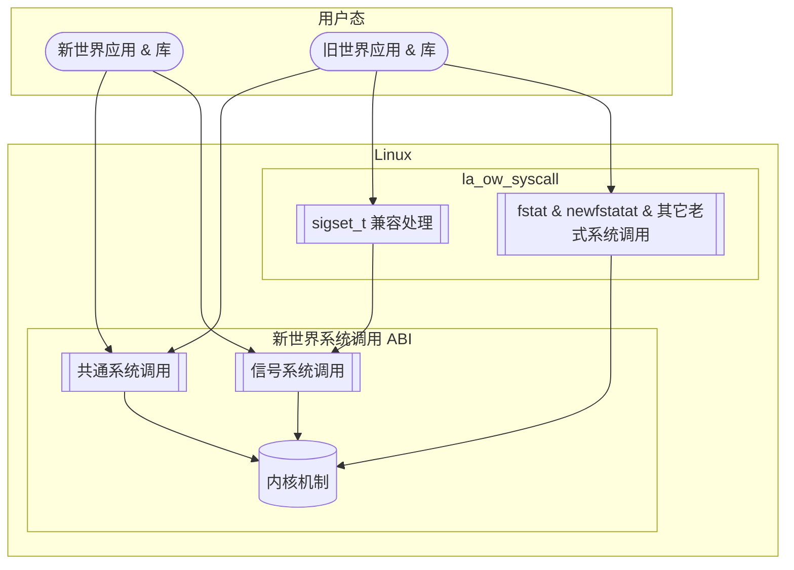
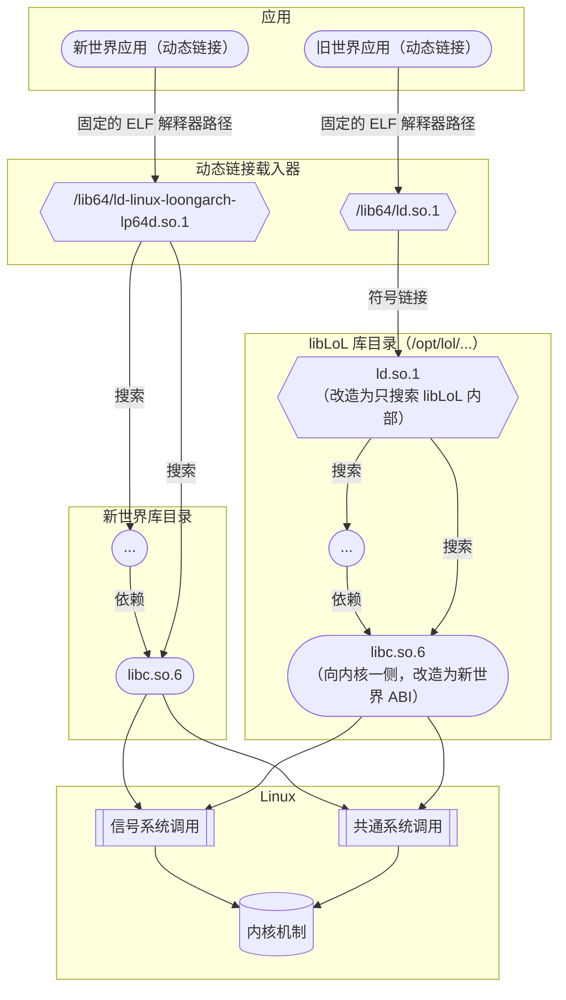

# `libLoL`

## 简介

本文描述的内容都是基于 `libLoL` 0.0.5 版本（仍在开发中）的现状而总结的。
本文的最后更新日期是 2024.01.11。

这是由 AOSC 社区开发的兼容方案，由两部分组成：

* [内核模块](https://github.com/AOSC-Dev/la_ow_syscall)：提供旧世界系统调用 ABI 的支持。
* [运行时](https://github.com/shankerwangmiao/liblol)：为动态链接的旧世界应用提供依赖组件。

`libLoL` 的基本特点如下：

* 兼容性的方向：在新世界系统上提供旧世界兼容性。
* sysroot：使用独立的旧世界 sysroot。其中部分的库经过了改造，以使其仅在 prefix 内工作，而不与宿主发生混淆。
* 内核：使用模块方式，动态 patch 系统调用表，不侵入架构无关逻辑。

这意味着：

* 磁盘空间方面，用户需要承担一套旧世界基础库的额外存储成本。
* 性能方面，几乎不存在开销。
* 侵入性方面，不存在侵入式修改，与宿主系统完全平行，特别方便安装与卸载。
* 正确性方面：
    * 加载了内核模块之后，异世界的系统调用方式也会被接受。但这在不做侵入式修改的前提下不可避免。
    * 信号处理方面，受限于目前相对简明的架构，无法支持那些预期接受旧世界形状上下文的 signal handlers。
      但这在保证新旧世界 sysroots 相互独立的前提下，风险不高：
      能被直接或间接加载的代码都属于同一世界，因而不会发生注册一个异世界 signal handler 的情况。
    * 在用户态，不排除有些软件或基础库内含的文件查找逻辑等，会不感知 `libLoL` sysroot，
      而从宿主（新世界）系统获取文件，导致可能的非预期结果。
      目前对 sysroot 内的库，会以修改过的自构建版本替换；
      对 sysroot 之外的此类行为暂未做处理。
    * 除此之外，已知的兼容处理都正确，可正常运行多数旧世界典型应用（如 WPS Office、QQ、龙芯浏览器）了。

## 架构

系统调用兼容性的实现方式如下图。

对动态链接应用的支持方式如下图。
动态链接的程序或库，也可能绕过 libc 而自行做系统调用，此时的行为模式与上一张图所描述的相同。

## 讨论

### Sysroot: 组装与授权

关于旧世界 sysroot 中 libc 以外的其他库的来源，目前 `libLoL` 项目为了降低维护工作量，选择直接从
Loongnix&reg; 软件源拉取；但也不排除自制 prefix 的可行性。

鉴于有的 Loongnix&reg; 组件包含非自由/开源软件（FLOSS）内容，为避免 `libLoL`
受到污染而给项目或用户带来法律风险，目前在 `libLoL` 一侧准备引入简单的审查机制：
对所有将要拉入的 Loongnix 二进制包，只有确认了存在对应的源码包，才接受之。
