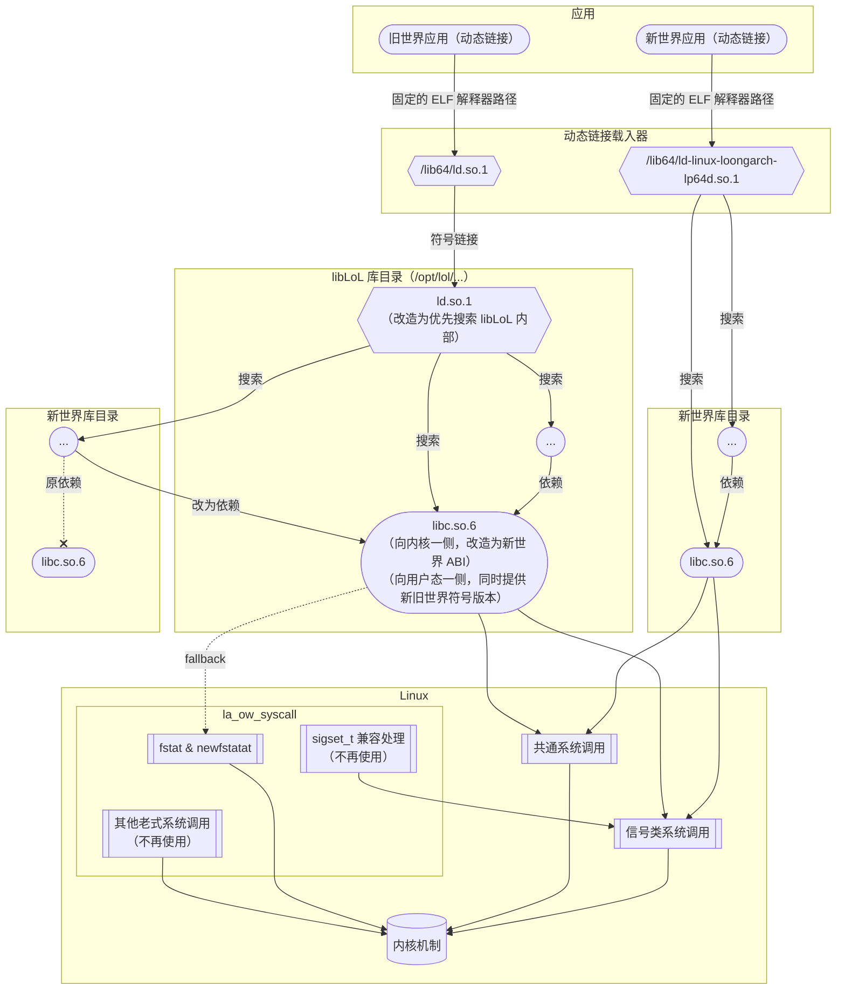

# `libLoL`

## 简介

本文描述的内容都是基于 `libLoL` 0.1.3 版本的现状而总结的。
本文的最后更新日期是 2024.02.04。

这是由 AOSC 社区开发的兼容方案，由两部分组成：

* [内核模块](https://github.com/AOSC-Dev/la_ow_syscall)：提供旧世界系统调用 ABI 的支持。
* [运行时](https://github.com/shankerwangmiao/liblol)：为动态链接的旧世界应用提供依赖组件。

`libLoL` 的基本特点如下：

* 兼容性的方向：在新世界系统上提供旧世界兼容性。
* sysroot：没有单独的 sysroot，而是仅提供修改过的 glibc。该 glibc 同时提供新旧世界版本的符号，可以让旧世界的可执行程序加载新世界的动态链接库。
* 内核：使用模块方式，动态 patch 系统调用表，不侵入架构无关逻辑。

这意味着：

* 磁盘空间方面，占用磁盘空间较小。
* 性能方面，几乎不存在开销。
* 侵入性方面，不存在侵入式修改，而是为宿主系统增加了修改过的 glibc，并借用宿主系统的其他动态链接库，特别方便安装与卸载。
* 正确性方面：
    * 加载了内核模块之后，异世界的系统调用方式也会被接受。但这在不做侵入式修改的前提下不可避免。
    * 信号处理方面，受限于目前允许混合新旧世界动态链接的架构，可能出现将错误形状的上下文（`ucontext_t`）
      传入异世界 signal handler 的情况。这是因为无法识别被注册的 signal handler 是新世界的还是旧世界的，
      于是只能依靠被调用的注册 signal handler 的函数（`sigaction`）的符号版本来判断：修改过的 glibc
      可以保证旧世界的代码一定调用的是旧世界的 `sigaction`，新世界的代码一定调用的是新世界的 `sigaction`。
      但是，由于大多数 signal handler 函数并不处理上下文参数（即函数的第三个参数），
      所以该问题并没有在实际测试中出现。
    * 在用户态，部分商业软件也打包提供了同名的旧世界动态链接库，并通过可执行程序的 `RPATH` 或用
      `LD_LIBRARY_PATH` 环境变量来指定加载路径。默认情况下，存放于这样的路径下的旧世界动态链接库会先于新世界系统提供的动态链接库被搜索和加载。
      如果这样的旧世界动态链接库由于版本较低，提供的符号或符号版本不全，并且可执行程序又依赖了系统提供的其他动态链接库，
      并且后者依赖较新版本的前一个动态链接库，那么就会出现符号版本不匹配的情况。这种情况下，后一个动态链接库可能无法正确加载。
      为了应对这一情况，`libLoL` 打包的 glibc 提供了一个额外的路径，该路径中的动态链接库会先于 `RPATH` 或 `LD_LIBRARY_PATH`
      环境变量中指定的路径被搜索。默认情况下，该路径中包括了 `libLoL` 提供的全部 glibc 的动态链接库，和 `libstdc++`。`libLoL`
      也为用户提供了一个这样的路径，以便用户按需引入更多的优先加载的动态链接库。
    * 在用户态，由于 `libLoL` 打包的 glibc 是修改自新世界的，理论上可以仅使用新世界的系统调用而不依赖于 `la_ow_syscall` 内核模块。但为了和旧世界 chromium
      的沙箱机制兼容，`libLoL` 打包的 glibc 的 `stat` 系列的函数在 `statx` 系统调用不可用时会回退到旧世界的 `fstat` 和 `newfstatat` 系统调用，
      而后者由 `la_ow_syscall` 内核模块提供兼容。
    * 在用户态，由于 `libLoL` 打包的 glibc 并未替换新世界系统的 glibc，新世界的可执行程序与 `libLoL` 完全无关。
      因此新世界的可执行程序无法载入旧世界提供的动态链接库。该需求较为罕见，但仍然出现在输入法类的软件中。在输入法软件中，
      应用程序如果要正常配合输入法工作，需要动态加载输入法提供的动态链接库。对于旧世界的输入法软件，其提供的动态链接库是旧世界的，
      无法被新世界的应用程序载入。所以旧世界的输入法软件是无法被 `libLoL` 兼容的。
    * 除此之外，已知的兼容处理都正确，可正常运行多数旧世界典型应用（如 WPS Office、QQ、龙芯浏览器）了。

## 架构

在内核和用户态之间，系统调用兼容性的实现方式如下图。

对动态链接应用的支持方式如下图。
动态链接的程序或库，也可能绕过 libc 而自行做系统调用，此时的行为模式与上一张图所描述的相同。

## 讨论

### `libLoL` 与 `patchelf`

新旧世界的 glibc 的架构初始版本不同，为了能让修改过的 glibc 支持旧世界可执行文件加载新世界的动态链接库，
必须要同时提供新旧世界的符号版本。这意味着，对于 glibc 中大多数没有经历过 ABI 版本变更的符号，
要同时创建两个版本的符号指向同一个函数。对于经历过 ABI 版本变更的那些符号，也要类似地调整。
理论上，通过修改 glibc 的代码，可以达到这一目的。但是，这样的修改会使得 glibc 的代码修改量巨大，
难以工程实现。为此，`libLoL` 选择了另一种实现思路，即在编译 glibc 完成后，通过后处理程序，
修改其动态符号表和符号版本表，使得 glibc 同时提供新旧世界的符号版本。`patchelf` 是一个可以修改 ELF 文件的工具，
但缺乏上述功能。为此，`patchelf` 被增加了这一重新映射符号版本的功能，以支持 `libLoL` 的需求。
但是，该功能由于需求过于罕见，不适合被合并到 `patchelf` 的主分支中。

### `libLoL` 运行时的发行

目前，`libLoL` 项目的运行时部分实质上是 `patchelf` 工具和 glibc 的补丁合集。在构建时，首先构建 glibc，
然后构建 `patchelf`，然后使用 `patchelf` 修改编译出的 glibc 的动态链接库文件。这一构建过程较为复杂，
并且难以用发行版无关的方式描述，因此 `libLoL` 项目难以简单地被打包到其它发行版中，用户也很难自行构建。目前，`libLoL`
项目提供适配 AOSC OS 和 Debian 的发行包。

### `libLoL` 运行时的 glibc 版本

`libLoL` 使得旧世界的可执行程序可以加载新世界的动态链接库。对被载入的新世界的动态链接库而言，
它所依赖的 glibc 实际上已经被替换为了 `libLoL` 提供的修改过的 glibc。这意味着，`libLoL`
要求新世界宿主系统的 glibc 版本必须不高于 `libLoL` 提供的 glibc 版本。目前，`libLoL` 项目提供的
glibc 是基于最新的版本 2.38。未来，如果 glibc 的新版本引入了新的符号版本，`libLoL`
项目需要相应跟踪并更新。
