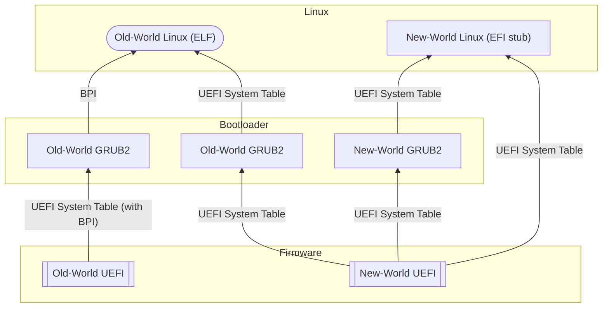
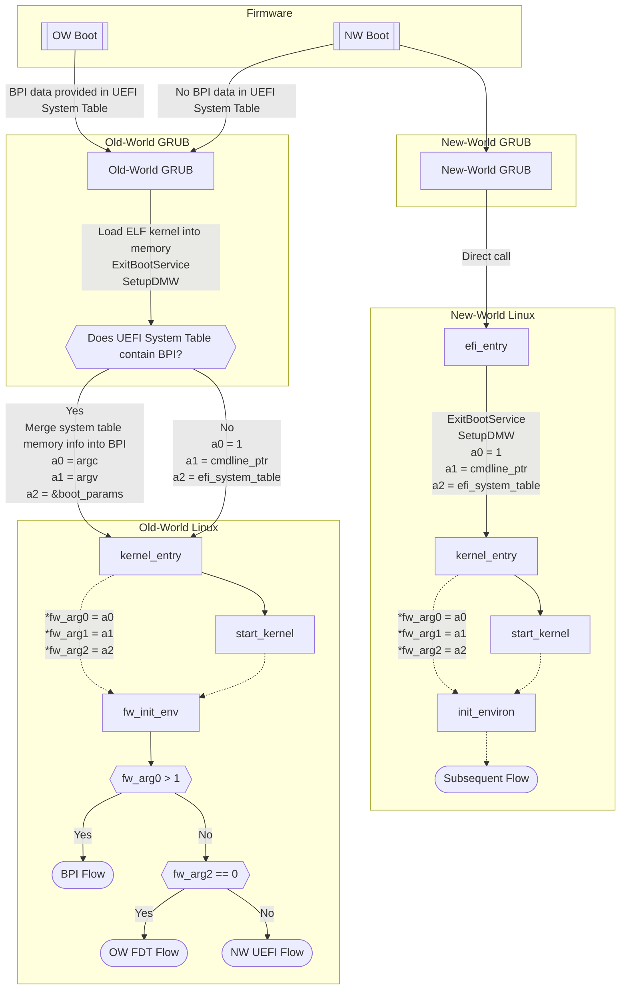

# The Old World and the New World (Low-Level Details)

This documentation is primarily intended for developers working on LoongArch kernel development, distribution integration and other low-level tasks, providing technical details about the OW/NW compatibility issues and known compatibility solutions.

Known compatibility approaches include:

* [`libLoL`](https://liblol.aosc.io)

## Introduction

While programs from the old world (OW) and the new world (NW) are almost incompatible, this does not imply fundamental differences between them. On the contrary, they share many common characteristics that make compatibility technically feasible. In fact, any feature not explicitly listed as a difference between the worlds can be considered a commonality. To better understand both the differences and similarities between the old and new worlds, this document will highlight some of their key shared characteristics.

This document examines the differences and commonalities between OW and NW from both kernel and user mode perspectives, primarily focusing on their externally visible characteristics rather than internal implementation details. Build system differences are not covered, as developers typically use a complete toolchain from the same world. Non-technical differences such as business strategies and community collaboration are also outside the scope of this document.

Given that the Loongson ecosystem currently relies on the Linux kernel and glibc C runtime, and all "old-world" systems use this combination, for simplicity, when we refer to "kernel" or "user mode"/"libc", we mean Linux or glibc respectively.

## Kernel

The kernel's external interfaces can be divided into two aspects: the boot protocol, which can be viewed as an upstream interface, and system calls, which can be considered as downstream interfaces.

### Boot Protocol

At first glance, the kernel image files provided by OW distributions are in ELF format and require an OW-ported GRUB2 bootloader to boot. In contrast, NW kernel images are PE-format EFI applications (EFI Stub) that can be booted directly by UEFI firmware or through a NW-ported GRUB2 bootloader.

Looking at the specific details of parameter passing from firmware to kernel, the Linux kernels of both worlds expect different data structures from their previous boot stage. See the following diagram for illustration.

:::info Legend
* Rectangular nodes represent EFI applications (PE format images)
* Rounded nodes represent ELF format images
* Directed edges show control flow transitions, with labels indicating passed data structures
:::

The old-world UEFI firmware comes in two versions, distinguished by their BPI structure signatures: `BPI01000` and `BPI01001`. While the UEFI firmware implementations like EDK2 share most behaviors between OW and NW, there are several notable differences:

* Different MMU states when booting the OS
    * Old World: The Direct Mapping Configuration Window (DMW) is already enabled when booting the OS, mapping virtual addresses like `0x9xxx_xxxx_xxxx_xxxx` to their corresponding physical memory space `0x0xxx_xxxx_xxxx_xxxx`. The PC register points to such virtual addresses.

      This "coincidentally" matches one of the fixed 1:1 mapping windows that Loongson Linux was required to use in the MIPS era due to architectural constraints.
      Fast forward to the LoongArch era, this "coincidentally" remains the "coherent cached" DMW configuration shared between old-world kernels and new-world kernels that haven't fully switched to TLB.

      "Coherent Cached" (CC) is a term defined in Section 2.1.7 "Storage Access Types" of the LoongArch Reference Manual Volume 1.

      Ironically, although the firmware has already configured the same DMW before the kernel gains control, the old-world kernel entry point still repeats the configuration...
      This obviously means one of these configurations is redundant!

    * New World: The DMW is not enabled when booting the OS, and the PC register points to physical addresses.

    The firmware should not, and indeed does not, make assumptions about the OS's memory management choices, let alone semi-forcing the OS to adopt a specific DMW configuration.

* Different states of non-boot CPU cores when booting the OS

    In both OW and NW, when control is transferred to the OS, non-boot CPU cores are in an idle state - blocked executing the `idle 0` instruction while waiting for interrupts. When the system needs to wake up a specific CPU core, it writes the target jump address to that core's IPI (Inter-processor interrupt) mailbox register and triggers an IPI for that core. This wakes up the core, exits the `idle 0` instruction, and continues execution. The subsequent code reads the mailbox register and jumps to the stored address.

    In NW, since DMW is not enabled on any cores during system boot, physical addresses must be written to the mailbox registers. However, in OW, since DMW is already enabled on all cores at boot, virtual addresses starting with 0x9 must be written to the mailbox registers.

    For OW firmware version `BPI01001`, it appears the firmware was additionally adapted to handle physical addresses passed through the mailbox, so cores can boot successfully whether given virtual or physical addresses.

* Pointers in UEFI tables
    * Old World: Virtual addresses in the form of `0x9xxx_xxxx_xxxx_xxxx` are used for all pointers except ACPI table addresses.
    * New World: All pointers are physical addresses.

* Memory layout information passing
    * Old World: The memory available for OS use is passed through the BPI data structure, while memory regions used or reserved by UEFI firmware are passed through the UEFI system table. The OS must combine both sources to obtain complete memory availability information.
    * New World: Complete memory availability information is passed solely through the UEFI system table.

* ACPI Data Structures:
    * Old World: Some tables in firmware version `BPI01000` followed early Loongson standards that pre-dated ACPI 6.5.

      - MADT table used `ACPI_MADT_TYPE_LOCAL_APIC` to describe CPU core interrupt controller info, and `ACPI_MADT_TYPE_IO_APIC` for CPU socket interrupt controller info.
      - In DSDT table, PCI root controller's IO resource descriptor lacked LIO controller MMIO offset information. Additionally, its IO port range didn't cover `0x0` to `0x4000`, expecting OS to unconditionally set address mapping for this range. Consequently, devices under LIO controller using IO ports in this range didn't declare dependencies on PCI root controller.
      - Missing MCFG table for describing PCI root controller information.

      These structures were incompatible with ACPI 6.5. For example, when NW kernel encounters OW `BPI01000` firmware's MADT, it interprets the system as having 0 CPUs, leading to boot failure.

      OW firmware version `BPI01001` used the same ACPI tables as NW, conforming to ACPI 6.5 or later.

    * New World: Compliant with ACPI 6.5 or later versions.

The old-world and new-world firmware also differ in how they pass essential boot information to the operating system. The new-world firmware directly passes the UEFI system table to the OS. The old-world firmware, following its MIPS-based Loongson predecessors, additionally passes a Loongson-specific "BPI" structure (`struct bootparamsinterface`, known as `struct boot_params` in Loongnix Linux source code, essentially the same thing): During boot, OW GRUB first checks for the presence of a BPI data structure in the UEFI system table. If found, indicating OW firmware, it passes the BPI structure to the OW kernel; if not found, indicating NW firmware, it passes the UEFI system table to the OW kernel instead.

More specifically, after the firmware hands over control, the early boot process differences are illustrated in the following diagram.

:::info Legend
Solid edges represent function calls. Dashed edges with annotations represent data flow, while dashed edges without annotations represent simplified function calls.
:::

The diagram doesn't include detailed depiction of the new-world FDT flow as its actual logic is quite complex. You may refer to the source code for details.
However, in brief: the new world passes the FDT root pointer through a record in the UEFI system table with type `DEVICE_TREE_GUID` (`b1b621d5-f19c-41a5-830b-d9152c69aae0`) and value being the physical address of this pointer.
Therefore, whether booting with ACPI or FDT, new-world Linux follows the UEFI convention for parameter passing - achieving a remarkable unification!
In contrast, the old world lacks this unified nature.

Under different firmware boot protocols, old-world Linux interprets the three firmware parameters differently:

|Firmware Parameter|Old-World Boot Protocol Interpretation|New-World Boot Protocol Interpretation|
|-----|--------|--------|
|`fw_arg0`|`int argc` Number of kernel command line arguments|`int efi_boot` EFI boot flag, 0 means EFI runtime services unavailable, non-zero means available|
|`fw_arg1`|`const char *argv[]` Virtual address of kernel command line argument list, used like C `main` function in user mode|`const char *argv` Physical address of kernel command line as a single string|
|`fw_arg2`|`struct boot_params *efi_bp` Virtual address of BPI table|`u64 efi_system_table` Physical address of UEFI system table|

Loongson's compatibility support for the new-world boot protocol in their old-world Linux fork was completed shortly before the 3A6000's release. This has been pushed to downstream commercial distributions like UOS and Kylin.

As shown in the diagram, the code paths in the kernel are now essentially identical to the new world's: based on a flexible interpretation of the `fw_arg0` parameter - assuming that all "normal" kernel boots have more than one kernel command line parameter - the two boot protocols can be unambiguously distinguished in practice.

In addition, Loongson also developed old-world boot protocol compatibility support for new-world Linux in 2023, and pushed it to community distributions with commercial backgrounds that needed to support machines without new-world firmware, such as openAnolis - see openAnolis's [related commit](https://gitee.com/anolis/cloud-kernel/commit/97a912cb723611c9ab706592621249354c9615a4).
(Note: This functionality has not yet been verified by third-party community members.)
This combination of boot protocols has not been reflected in the above description.

### System Calls

The ABI framework for system calls is consistent between OW and NW kernels. This includes:
- The method of making system calls (via the `syscall 0` instruction)
- System call numbers
- Register allocation for parameters and return values

Most system call numbers are identical between the worlds, and the definitions of structures accepted by most system calls are also the same. This section covers the differences that cause NW incompatibility with OW system calls.

#### Deprecated System Calls in the New World

As LoongArch is the most recently introduced architecture in the Linux kernel, a decision was made to no longer provide certain older system calls that exist in OW. These system calls include:

System Call Name | Number
------------|-----
`getrlimit`  | 163
`setrlimit`  | 164

And, two system calls didn't exist in early NW kernel versions, but they
have been reintroduced in 6.11 or newer, 6.10.6 or newer 6.10 ve-rsions,
6.6.47 or newer 6.6 versions, and 6.1.106 or newer 6.10 versions:

System Call Name | Number
------------|-----
`newfstatat` | 79
`fstat`      | 80

These compatibility issues can be resolved by directly implementing the deprecated system calls in the new-world kernel.

#### Signal Number

The `NSIG` macro (indicating the maximum allowed number of signals) is defined as 64 in the new world, while it's defined as 128 in the old world. This difference directly affects the size of `sigset_t` structures, which in turn impacts the size of `sigaction` structures.

Additionally, several signal-related system calls require a `sigsetsize` parameter (indicating the length of the `sigset_t` structure) and expect this value to match the kernel's definition. Consequently, the following NW system calls cannot properly handle OW user mode calls:

System Call Name | Number
------------|-----
`rt_sigsuspend`  | 133
`rt_sigaction` | 134
`rt_sigprocmask` | 135
`rt_sigpending` | 136
`rt_sigtimedwait` | 137
`pselect6`  | 72
`ppoll`  | 73
`signalfd4`  | 74
`epoll_pwait`  | 22
`epoll_pwait2`  | 441

Among these system calls, `rt_sigprocmask`, `rt_sigpending`, and `rt_sigaction` involve writing to user mode `sigset_t` structures, while the others only read from them.

To implement compatibility for these system calls, a straightforward approach would be to first override their definitions to accept 16 as the `sigsetsize` parameter. Additionally, since NW supports fewer signals than OW, system calls that read from user mode `sigset_t` structures can simply truncate the data to handle only the first 64 signals. For system calls that write to user mode `sigset_t` structures, if the user-provided `sigsetsize` parameter is 16, we clear the bits corresponding to the latter 64 signals in the sigset. Finally, for system calls that directly handle signal numbers, such as `sigaction` and `kill`, we can simply reject signal numbers greater than 64 from user mode.

This approach means that when OW programs make system calls according to the OW ABI, their actual behavior will differ slightly from the original OW system calls. For example, if using `rt_sigprocmask` to first set a signal mask and then read it back, if the set value has any bits set for the latter 64 signals, the read value will differ from what was set. Furthermore, attempts to install signal handlers for the latter 64 signals or send these signals to processes will return errors. However, since OW programs rarely rely on these additional 64 custom signals, this simplified approach can successfully handle the vast majority of OW programs.

#### User Mode Process Context

When a process receives a signal, the kernel saves the process context to the user mode stack and passes it as the third parameter to the signal handler (regardless of whether the user requested context information when registering the signal handler). The kernel also sets the return address of the signal handler to a function that will call the `rt_sigreturn` system call (see the [`setup_rt_frame` function](https://elixir.bootlin.com/linux/v6.6/source/arch/loongarch/kernel/signal.c#L959)).

When the signal handler returns, the program calls the `rt_sigreturn` system call. At this point, the kernel restores the previously saved context from the user mode stack to the process context (see the [`sys_rt_sigreturn` function](https://elixir.bootlin.com/linux/v6.6/source/arch/loongarch/kernel/signal.c#L926)). 

This mechanism allows user mode programs to modify the context within their signal handlers. When the signal handler returns, execution will continue from the location and context specified by these modifications, rather than returning to where the signal occurred.

The OW and NW `ucontext` structures are significantly different, with member offsets that vary considerably. This makes it impossible to achieve compatibility through specially arranged data structures in-place.

The memory layout of the `ucontext` structure in the old-world kernel is as follows:

Offset | Member | Length | Notes
-------|------|-----|-----
0 | `uc_flags` | 8
8 | `uc_link` | 8
16 | `uc_stack` | 24
40 | (padding) | 24
64 | `uc_mcontext.sc_pc` | 8
72 | `uc_mcontext.sc_regs[32]` | 32 × 8 | 32 general purpose registers
328 | `uc_mcontext.sc_flags` | 4
332 | `uc_mcontext.sc_fcsr` | 4
336 | `uc_mcontext.sc_none` | 4
340 | (padding) | 4
344 | `uc_mcontext.sc_fcc` | 8
352 | `uc_mcontext.sc_scr[4]` | 4 × 8 | 4 LBT registers
384 | `uc_mcontext.sc_fpregs[32]` | 32 × 32 | 32 FP registers, 32-byte aligned
1408 | `uc_mcontext.sc_reserved[4]` | 4 | 16-byte aligned, first 4 bytes store LBT's `eflags`
1412 | `uc_mcontext.sc_reserved[4092]` | 4092
5504 | `uc_sigmask` | 16
5520 | `__unused` | 112
5632
The old world's `ucontext` structure is fixed-length at 5632 bytes and stores the process context at interruption. This includes fields for LBT extension registers and floating-point extension registers, regardless of whether the process uses these instructions. When floating-point instructions are used, depending on the instruction set (FPU, LSX, LASX), the floating-point registers are stored aligned to the lower bits in `uc_mcontext.sc_fpregs`. However, this structure cannot indicate whether the process uses floating-point extensions and/or LBT extensions, nor which floating-point instruction set is in use. When restoring context, the kernel decides which floating-point extension registers to restore based on the process's current state.

The new world's `ucontext` structure data is more complex, divided into basic data and extension data. The basic data is stored in the `ucontext` structure with the following memory layout:

Offset | Member | Length | Notes
-------|------|-----|-----
0 | `uc_flags` | 8
8 | `uc_link` | 8
16 | `uc_stack` | 24
40 | `uc_sigmask` | 8
48 | `unused` | 120
168 | (padding) | 8
176 | `uc_mcontext.sc_pc` | 8
184 | `uc_mcontext.sc_regs[32]` | 32 × 8 | 32 general purpose registers
440 | `uc_mcontext.sc_flags` | 4
444 | (padding) | 4
448 | `uc_mcontext.sc_extcontext` |  | 16-byte aligned

The `uc_mcontext.sc_extcontext` field has a length of 0, being a [flexible array member](https://en.wikipedia.org/wiki/Flexible_array_member). Following the `ucontext` structure is a series of TLV (Type-Length-Value) extension data blocks that store context for extension instructions. The common header for extension data has the following memory layout:

Offset | Member | Length | Notes
Offset | Member | Length | Notes
-------|------|-----|-----
0 | `magic` | 4 | Identifies the extension data type
4 | `size` | 4
8 | `padding` | 8
16 | | | 16-byte aligned

Starting from an extension data header address, adding the length indicated by `size` gives the address of the next extension data block. The last extension data block has both `magic` and `size` fields set to 0, indicating the end of extension data.

Currently, there are 4 defined extension data types, corresponding to context data for FPU, LSX, LASX, and LBT extension instruction sets. The NW kernel generates extension data blocks based on the process's current state. Among these, FPU, LSX, and LASX context data blocks are mutually exclusive - at most one can be present.

For ordering, LBT extension context data (if present) is placed first, followed by either FPU, LSX, or LASX extension context data (if present), and finally the termination marker.

The memory layout for each extension type is as follows:

FPU extension instruction set, `magic` = `0x46505501`

Offset | Member | Length | Notes
-------|------|-----|-----
0 | `regs[32]` | 32 × 8 | 32 FP registers
256 | `fcc` | 8
264 | `fcsr` | 4
268 | (padding) | 4
272

LSX extension instruction set, `magic` = `0x53580001`

Offset | Member | Length | Notes
-------|------|-----|-----
0 | `regs[2*32]` | 32 × 16 | 32 FP registers
512 | `fcc` | 8
520 | `fcsr` | 4
524 | (padding) | 4
528

LASX extension instruction set, `magic` = `0x41535801`

Offset | Member | Length | Notes
-------|------|-----|-----
0 | `regs[4*32]` | 32 × 32 | 32 FP registers
1024 | `fcc` | 8
1032 | `fcsr` | 4
1036 | (padding) | 4
1040

LBT extension instruction set, `magic` = `0x42540001`

Offset | Member | Length | Notes
-------|------|-----|-----
0 | `regs[4]` | 4 × 8 | 4 个 LBT 寄存器
32 | `eflags` | 4
36 | `ftop` | 4
40

Comparing the `ucontext` data between OW and NW, we find that the layout of `uc_flags`, `uc_link`, and `uc_stack` fields is consistent, and both worlds pad `uc_sigmask` to 1024 bits (128 bytes). However, the order of `uc_mcontext` and `uc_sigmask` fields is reversed between OW and NW, and their `uc_mcontext` structures differ significantly.

The NW implementation uses variable-length TLV (Type-Length-Value) extension data to store context for extended instruction sets, leaving room for future extensions. In contrast, the OW uses fixed-length structures, with 4096 reserved bytes for future extension contexts. Additionally, in the OW implementation, the LBT extension's `ftop` register isn't stored, and the `eflags` register occupies the first 4 bytes of the aforementioned reserved space.

Kernel-level compatibility for `ucontext` data between OW and NW is infeasible because the kernel cannot determine which format the userspace program expects. Even if the kernel were modified to identify and mark processes based on their executable format, it still couldn't handle cases where a program dynamically links both OW and NW libraries, as it wouldn't know which format each signal handler expects. Therefore, compatibility must be implemented in user mode.

Based on incomplete testing, Chromium and Electron-based applications' sandbox mechanism [verifies](https://chromium.googlesource.com/chromium/src/+/refs/tags/98.0.4758.141/sandbox/linux/seccomp-bpf/trap.cc#192) that the interrupt address recorded in the `ucontext` structure received by the `SIGSYS` signal handler matches the address in the `siginfo` structure, and actively uses the `ucontext` data. Consequently, old-world Electron-based applications require sandbox disabled to run properly when using only kernel-level compatibility with a complete old-world user mode directory tree.

## User Mode

As observed up to now (February 2024), the glibc version packaged in old-world systems is 2.28, while upstream glibc support for LoongArch started with version 2.36. At the time of writing, the latest glibc version is 2.39, though most new-world systems currently package glibc 2.37 or 2.38. Given glibc's excellent backward compatibility - programs running on older glibc versions generally work on newer versions without issues - this document focuses on comparing glibc 2.38 with the old-world ported glibc 2.28. Future new-world glibc versions will be compatible with version 2.38, so the conclusions in this document should remain applicable for newer glibc versions in new-world systems.

### ELF File Format

The ELF file format is identical between the old world and the new world, including the architecture field `e_machine` in the ELF header, which is set to 258 in both worlds. Most other structures are also consistent. The only difference lies in `bit[7:6]` of the `e_flags` field. OW binaries have these bits set to `0`, while NW binaries have them set to `1`[^b1]. When examining an ELF file's header information using `readelf --headers`, the presence of `OBJ-v1` in the `Flags:` section under `ELF Header:` indicates the file was compiled for the new world; conversely, `OBJ-v0` indicates compilation for the old world.

This flag provides the most direct and reliable[^b2] method to determine whether an ELF file was compiled for OW or NW. However, as of mid-February 2024, neither world's runtime components (including the kernel's ELF loader and glibc's dynamic linker) reject loading ELF files based on this flag, nor do they behave differently because of it.

[^b1]: In fact, this flag's true purpose is to indicate to the linker which version of relocation instruction semantics the object file (`.o`) contains. 
    These version-specific relocation instructions are not used in dynamic linking and thus don't appear in final linking products (`.so` and executables).
    Therefore, while the flag's original meaning is irrelevant for shared libraries and executables,
    it conveniently serves to distinguish between OW and NW programs and dynamic libraries.

[^b2]: This flag was introduced in binutils 2.40 [via this commit](https://github.com/bminor/binutils-gdb/commit/c4a7e6b56218e1d5a858682186b542e2eae01a4a).
    Consequently, NW programs and dynamic libraries generated by earlier binutils versions might lack the `OBJ-v1` flag.
    Since binutils 2.40 was released in early 2023, when the NW LoongArch ecosystem hadn't yet developed a viable toolchain environment,
    the number of such programs and libraries should be minimal.

### Program Interpreter

The Program Interpreter is a field in dynamically linked ELF executables that specifies the path to the required dynamic linker. When loading a dynamically linked ELF executable, the kernel loads the dynamic linker according to this field. The OW and NW have different program interpreter paths:

* NW path: `/lib64/ld-linux-loongarch-lp64d.so.1`
* OW path: `/lib64/ld.so.1`

This path is hardcoded into all dynamically linked executables. The difference in paths directly prevents old-world programs from running in the new world and vice versa. When attempting to execute a program from the other world, the error `No such file or directory` occurs because the corresponding program interpreter cannot be found.

### Calling Convention

The calling conventions between the old world and new world are identical in terms of parameter passing and return value handling. Generally, both worlds prioritize using registers for parameter passing, with additional parameters passed on the stack, and return values passed through registers. Furthermore, both worlds use the same register numbers for parameter and return value passing.

Additionally, both worlds share identical sets of caller-saved and callee-saved registers.

### User Mode Compatibility Overview

The distinct ELF header markers and different program interpreter paths between the old world (OW) and new world (NW) make it possible to run OW programs in NW systems without requiring `chroot`.

There are two technical approaches to achieve this: isolation-based and hybrid. In the isolation-based approach, OW executables call the OW `ld.so`, which modifies its search path to avoid NW dynamic library paths and only loads OW dynamic libraries. Meanwhile, NW executables use the original NW `ld.so` and naturally won't load OW libraries since they're stored in separate paths. This approach maintains a clear separation between OW and NW environments.

For compatibility, the isolation-based approach must include a complete set of dynamic libraries required by OW programs. Framework-type libraries that search for plugin libraries in specific paths need recompilation to adjust their search locations. Other simple dynamic libraries can be ported directly from the OW. This may lead to significant storage overhead. Additionally, if a user's NW system has plugins installed but the OW compatibility layer doesn't provide OW versions of these plugins, certain functionality may be missing. The isolation approach has clear boundaries and doesn't require extensive glibc modifications. In fact, it only needs to implement context parameter (`ucontext`) translation in signal handlers, leaving other compatibility issues to the kernel. Furthermore, its correctness is easier to verify because the clear OW/NW separation ensures the OW glibc can correctly interpret data structures as OW versions without misinterpretation risks.

The hybrid approach, conversely, leverages the identical calling conventions between OW and NW by providing a modified glibc. This glibc provides multiple symbol versions, allowing both OW programs and NW dynamic libraries to link with it simultaneously. This approach mixes OW and NW environments and doesn't require a complete set of OW dynamic libraries, instead utilizing NW libraries directly. This saves storage space and avoids completeness concerns regarding included libraries. However, the hybrid approach requires complex glibc modifications. Additionally, it may face challenges in correctly identifying whether data structures are NW or OW versions, potentially leading to misinterpretation issues.

### glibc Symbol Versioning

As is well known, glibc has excellent compatibility, achieved through symbol versioning. Specifically, all symbols in glibc are assigned a version number when introduced. If a symbol's ABI changes, a new version of the symbol is introduced, while the old version is retained (though its implementation may be replaced with a compatible one). This version number is a string, and during dynamic linking, only symbols with matching version numbers are linked. Thus, even if the ABI of glibc changes, executables linked with older versions of glibc will use the old version of the symbols when running on newer glibc, ensuring compatibility. The symbol names and their associated versions are defined in the `Versions` files in each directory of glibc, such as [`io/Versions`](https://elixir.bootlin.com/glibc/glibc-2.38/source/io/Versions). In the following text, we refer to the version numbers defined in the `Versions` files as "source version numbers." From this definition, it is clear that a symbol's source version number is architecture-independent. In contrast, the version numbers defined in the compiled binary glibc library files are referred to as "binary version numbers." This version number is written into the symbol table of executables during compilation and linking, and is also used by the dynamic linker to check symbol versions when loading executables. On architectures like i386, a symbol's source version number and binary version number are the same. However, this is not true for all architecture.

We can observe that many symbols were defined as early as version 2.0, but not all architectures have been supported since version 2.0. For example, riscv64 was only supported starting from version 2.27. Therefore, it is impossible for programs compiled and linked with glibc 2.26 or earlier to exist for the riscv64 architecture. This means that if a symbol's ABI changed between versions 2.0 and 2.26, the old version of that symbol is unnecessary. glibc addresses this issue by defining an "epoch version number" for each architecture, which is the glibc version number when the architecture was introduced. For all symbols, if their source version number is less than the architecture's epoch version number, the binary version number in the compiled glibc will be set to the epoch version number. If there are multiple source version numbers less than the epoch version number, only the latest one is compiled, and its binary version number is set to the epoch version number.

For example, `setrlimit` has two source versions, `GLIBC_2.0` and `GLIBC_2.2`, while the epoch version for riscv64 is 2.27. Therefore, in glibc compiled for riscv64, the binary version of `setrlimit` will be set to `GLIBC_2.27`, with the actual content being the `GLIBC_2.2` version of the symbol. If a new source version `GLIBC_2.50` is introduced in glibc 2.50, then in glibc compiled for riscv64, `setrlimit` will have two binary versions: `GLIBC_2.27` and `GLIBC_2.50`.

The source of the differences in symbol versions between the old world (OW) and the new world (NW) is that the epoch version number for LoongArch in OW is 2.27[^a1], while in NW it is 2.36. Since most symbol source version numbers in glibc start from 2.0, in OW, the binary version number for most symbols in glibc is `GLIBC_2.27`; correspondingly, in NW, the binary version number for most symbols is `GLIBC_2.36`. Thus, even if you modify the program interpreter of a binary executable to force it to run in the other world, it will not work correctly because the expected glibc symbol versions do not exist in the other world. Similarly, if an NW executable tries to load (e.g., via `dlopen`) an OW dynamic library (non-glibc), it will fail because the glibc symbol versions required by the OW dynamic library do not exist in NW.

[^a1]: Coincidentally, the [epoch version number](https://elixir.bootlin.com/glibc/glibc-2.38/source/sysdeps/unix/sysv/linux/riscv/shlib-versions#L2) for riscv64 is also 2.27.

A more complex situation arises with `libpthread`. In the OW LoongArch, the epoch version number for `libpthread` is 2.0, which is different from the epoch version number for `libc`. Among all Linux-supported architectures known in glibc, only the OW LoongArch exhibits this phenomenon. The reason for this is unknown[^a2], but the consequences are clear. Before glibc 2.34, `libpthread` and `libc` were separate libraries. Some symbols, such as `open` and `write`, were defined in both libraries, but their implementations might differ (due to macro definitions at compile time). When a multithreaded program runs, the `open` and `write` symbols it calls are those defined in `libpthread`, overriding the definitions in `libc`. From glibc 2.34 onwards, `libpthread` was merged into `libc`, so the `open` and `write` symbols in `libc` are always the multithreaded versions. The inconsistency in epoch version numbers between `libpthread` and `libc` in the OW results in two binary version numbers for symbols like `open` and `write` in the OW: `GLIBC_2.0` in `libpthread` and `GLIBC_2.27` in `libc`.

[^a2]: Note that the [epoch version number](https://elixir.bootlin.com/glibc/glibc-2.38/source/sysdeps/unix/sysv/linux/mips/shlib-versions#L25) for the MIPS architecture is 2.0, skipping 2.1. In fact, the epoch version number for `libpthread` in the OW is also 2.0, skipping 2.1 as well.

### glibc Library List

Dynamically linked ELF files (including libraries and executables) describe the library name for symbols with version numbers. However, glibc ignores the actual library name providing the corresponding versioned symbols during dynamic linking. This behavior was [introduced](https://github.com/bminor/glibc/commit/f0b2132b35248c1f4a80f62a2c38cddcc802aa8c) in glibc 2.30. This facilitates the subsequent consolidation of symbols from other libraries into `libc`. For example, in glibc 2.34 and later, the `pthread_join` symbol is provided by `libc`, and `libpthread` becomes a placeholder. For programs or other libraries linked with glibc versions before 2.34, `pthread_join` is required from `libpthread`. During dynamic linking, glibc will find both `libc` and `libpthread` library files to satisfy the program's and library's dependencies. When specifically looking for `pthread_join`, glibc's dynamic linker does not consider the required provider of `pthread_join`; it completes the dynamic link as long as the corresponding version is defined in any loaded library.

After this, and before the NW epoch version 2.36, some library symbols were moved to `libc`, and these library files no longer exist in NW. However, for OW programs, these library files are still needed and should be provided as placeholder library files. The table below lists all libraries available for dynamic linking in both OW and NW.

Library Name | OW    | NW | Notes
-----|-------|------|----
`libBrokenLocale.so.1` | Exist | Exist
`libanl.so.1` | Exist    | Not Exist | Placeholder needed
`libc.so.6` | Exist    | Exist
`libc_malloc_debug.so.0` | Not Exist   | Exist | Introduced in 2.34
`libcrypt.so.1`| Exist    | Not Exist | Disabled by default in NW
`libdl.so.2` | Exist    | Exist (Placeholder)
`libm.so.6` | Exist    | Exist
`libnsl.so.1` | Exist    | Not Exist | Disabled by default in NW
`libpthread.so.0` | Exist    | Exist (Placeholder)
`libresolv.so.2` | Exist    | Exist
`librt.so.1` | Exist    | Exist (Placeholder)
`libthread_db.so.1` | Exist    | Exist
`libutil.so.1` | Exist    | Not Exist | Placeholder needed

### Specific Function Behavior Differences

There are some differences in the behavior of functions provided by glibc between the old world (OW) and the new world (NW). These differences are due to the different user mode interfaces provided by the kernel. This section will discuss these function behavior differences. Here, "behavior" mainly refers to the behavior presented by glibc to the function caller. However, in specific discussions, we will also involve the behavior of making system calls to the kernel.

#### Signal

In the NW kernel, the maximum signal number is 64, while in the OW kernel, it is 128. This results in different sizes for the `sigset_t` data accepted by the kernel. However, the `sigset_t` structure defined in glibc is the same size in both worlds, always capable of [holding](https://elixir.bootlin.com/glibc/glibc-2.38/source/sysdeps/unix/sysv/linux/bits/types/__sigset_t.h) 1024 signals. This means the `sigset_t` data size in NW glibc is 128 bytes. Therefore, all glibc functions that accept `sigset_t` structures have compatible ABIs, preventing data overflow. All NW functions that read `sigset_t` structures can read those provided by OW programs and work correctly. NW functions that write to `sigset_t` structures can also write to those provided by OW programs. Since OW programs use the first 128 bits (i.e., 128 signals), NW functions writing to `sigset_t` structures only write the first 64 bits, so the subsequent 64 bits need to be zeroed to ensure OW programs do not receive uninitialized data. Additionally, glibc provides functions to modify or perform logical operations on `sigset_t` structures, which only operate on the bits corresponding to the signals available in their respective worlds, resulting in different external behaviors.

The following functions belong to the `sigset_t` editing and modification category, and the range of signal numbers they can operate on differs:

- `sigorset`
- `sigandset`
- `sigisemptyset`
- `sigismember`
- `sigaddset`
- `sigfillset`
- `sigemptyset`
- `sigdelset`

The following functions are read-only for `sigset_t`. NW functions can correctly read `sigset_t` provided by OW programs:

- `epoll_pwait2`
- `epoll_pwait`
- `ppoll`
- `__ppoll_chk`
- `pselect`
- `signalfd`
- `sigwaitinfo`
- `sigwait`
- `sigtimedwait`
- `__sigsuspend`
- `sigsuspend`

The following functions write to `sigset_t`. If an NW function writes to an OW-provided `sigset_t`, the subsequent 64 bits need to be zeroed out:

- `sigpending`
- `pthread_sigmask`
- `sigprocmask`

The following functions read and write `sigset_t` but copy the entire `sigset_t` structure, so their behavior is unaffected by the maximum signal number:

- `posix_spawnattr_getsigmask`
- `posix_spawnattr_getsigdefault`
- `posix_spawnattr_setsigmask`
- `posix_spawnattr_setsigdefault`

#### `ucontext`

The `ucontext_t` structure appears in two places: as the third parameter in signal handlers[^1] and in the `getcontext`, `setcontext`, `makecontext`, and `swapcontext` functions[^2]. For glibc users, the `ucontext_t` structure should be interoperable in both contexts[^3]. For example, if a signal handler receives a `ucontext_t` structure saved by the `getcontext` function, the program flow will return to the context saved by `getcontext` after the signal handler finishes. If the signal handler saves the received `ucontext_t` structure elsewhere and later calls `setcontext` with it, the program flow will return to the context where the signal was interrupted. Note that the `ucontext_t` structure received by the signal handler comes directly from the kernel, while the `*context` functions are provided by glibc. Therefore, the `ucontext_t` structure provided by glibc must be fully binary compatible with the one provided by the kernel. This is different from other structures, where glibc can provide a different version from the kernel as long as glibc functions correctly convert between them. For example, the `sigaction` structure provided by glibc differs from the one provided by the kernel[^4], and glibc functions handle the conversion.

[^1]: [`sigaction(2)`](https://man7.org/linux/man-pages/man2/sigaction.2.html) "The siginfo_t argument to a SA_SIGINFO handler"
[^2]: [`getcontext(3)`](https://man7.org/linux/man-pages/man3/getcontext.3.html)
[^3]: [`getcontext(3)`](https://man7.org/linux/man-pages/man3/getcontext.3.html) "The function setcontext() restores the user context" which "should have
been...received as the third argument to a signal handler"
[^4]: Compare [`sigaction`](https://elixir.bootlin.com/glibc/glibc-2.38/source/sysdeps/unix/sysv/linux/bits/sigaction.h#L27) and
[`kernel_sigaction`](https://elixir.bootlin.com/glibc/glibc-2.38/source/sysdeps/unix/sysv/linux/kernel_sigaction.h#L9)

As of glibc version 2.38, NW `*context` functions can only handle the general (integer) registers in the `ucontext_t` structure, and cannot handle floating-point, vector extension, or LBT extension parts. OW `*context` functions can handle both general (integer) and floating-point registers in the `ucontext_t` structure, but not vector extension or LBT extension parts. Additionally, comparing the `ucontext_t` definition provided by OW glibc[^5] with that of the OW kernel[^6], the former lacks the `uc_mcontext.sc_scr[4]` field for storing LBT extension registers, causing the offset for the subsequent `uc_mcontext.sc_fpregs[32]` field for floating-point registers to change. This means OW `*context` functions cannot correctly handle floating-point registers in the `ucontext_t` structure provided by the OW kernel to signal handlers. In summary, OW glibc can only correctly handle the general (integer) registers in the `ucontext_t` structure. Thus, functionally, both OW and NW can only correctly handle the general registers.

[^5]: Found in the Loongnix distribution at `/usr/include/loongarch64-linux-gnu/sys/ucontext.h`
[^6]: Found in the Loongnix distribution at `/usr/include/loongarch64-linux-gnu/bits/sigcontext.h`

glibc provides two functions for registering signal handlers: `sigaction` and `signal`. The `signal` function is a wrapper around `sigaction`. Regardless of how the signal handler is registered, it will receive a `ucontext_t` structure pointer as the third parameter. However, according to the glibc [documentation](https://man7.org/linux/man-pages/man2/signal.2.html), signal handlers registered with the `signal` function should only accept the first parameter. This means that if a signal handler registered with `signal` follows the documentation and only accepts the first parameter, it will ignore the third parameter, i.e., the `ucontext_t` structure pointer will be ignored. Therefore, signal handlers registered with `signal` are OW/NW irrelevant and do not require any compatibility handling.

On the other hand, signal handlers registered with `sigaction` are OW/NW specific and require additional compatibility handling. One possible approach is to register a wrapper function instead of the user-provided handler when `sigaction` is called with an OW `ucontext_t` structure handler. This wrapper function would accept an NW `ucontext_t` structure, construct an OW `ucontext_t` structure on the stack, and then call the user-provided handler. After the user-provided handler returns, the wrapper function would copy the contents of the OW `ucontext_t` structure back to the NW `ucontext_t` structure. Note that signal handlers cannot accept custom parameters, so the address of the original user-provided handler must be saved in some way for the wrapper function to call it. Careful handling of locks and signal masks is required, as the entire process of registering the signal handler is no longer atomic.

No matter how it is handled, the fact remains that the `ucontext_t` structures of the old world (OW) and the new world (NW) are completely incompatible. Additionally, the differences between the OW glibc and the OW kernel `ucontext_t` structures cannot be resolved. Therefore, if there is a mix of OW and NW executables and dynamic libraries, and `ucontext_t` structures are passed between them, it is impossible to guarantee correct identification of whether a `ucontext_t` structure is from the OW or NW. Fortunately, such cases are very rare.

The following functions involve the `ucontext_t` structure and are therefore not binary compatible between OW and NW:

- `getcontext`
- `setcontext`
- `makecontext`
- `swapcontext`

The following functions involve registering signal handlers that can accept `ucontext_t` structures, thus requiring additional compatibility handling:

- `sigaction`

The following functions register signal handlers that ignore the `ucontext_t` structure pointer, so no special handling is required:

- `signal`

#### longjmp

The `setjmp`, `sigsetjmp`, `longjmp`, and `siglongjmp` functions are used for non-local jumps. The `set*jmp` functions save the current program state (optionally including the current signal mask, i.e., sigmask) into a `jmp_buf` structure, while the `*longjmp` functions restore this state. These functions behave similarly to the `*context` functions. In both the OW and the NW, the `jmp_buf` structure definition is identical, making these `*jmp` functions fully binary compatible.

The following functions involving the `jmp_buf` structure are fully compatible between OW and NW:

- `setjmp`
- `sigsetjmp`
- `longjmp`
- `siglongjmp`

#### `fstat`

In the NW kernel, the `fstat` and `newfstatat` system calls are missing. These system calls can be used to obtain file metadata. Specifically, `fstat` retrieves metadata for a file corresponding to an open file descriptor (fd), while `newfstatat` can retrieve metadata for a file corresponding to either an open file descriptor or a file path. Functionally, `statx` is consistent with `newfstatat` but can return more information as needed. Therefore, `statx` is a superset of `fstat` and `newfstatat`, replacing these two system calls.

In glibc 2.38, some C preprocessing directives check at compile time whether the latest kernel version released at the time of the freeze for this glibc release[^7] (for example, Linux 6.3 for glibc 2.38) provides definitions for `fstat` or `newfstatat`. If not, these functions call `statx`[^8] and handle the data structure conversion. This means that, compared to the OW, the behavior of these `*stat*` functions remains unchanged externally, and the functions are binary compatible between the OW and the NW. This section will focus on the differences in how these functions make system calls to the kernel.

[^7]: Specifically, the preprocessing directives check against a copy of the system call list of that kernel version shipped within the glibc source code, instead of the kernel headers used for building glibc.  So even if glibc 2.38 is built with the headers from Linux 6.11 or later, the check will still determine `fstat` and `newfstatat` “do not exist.”
[^8]: These functions ultimately call [__fstatat64_time64](https://elixir.bootlin.com/glibc/glibc-2.38/source/sysdeps/unix/sysv/linux/fstatat64.c#L157)

For Chromium-based browsers and Electron-based applications in the OW, Chromium's seccomp sandbox mechanism [returns](https://chromium.googlesource.com/chromium/src/sandbox/+/7462a4fd179376882292be2381a22df6819041c7%5E%21) an `ENOSYS` error for `statx`, expecting the process to fall back to `fstat` or `newfstatat`. This is because [seccomp](https://lwn.net/Articles/799557/) cannot inspect the contents behind system call pointer parameters. Chromium's sandbox rule requires programs to operate only on already opened fds and not access any system paths. Therefore, it only allows `fstat` (which doesn't exist in the NW kernel) and uses a `SIGSYS` hook to [intercept](https://chromium.googlesource.com/chromium/src/sandbox/+/b3267c8b40b6133b2db5475caed8f6722837a95e%5E%21/#F2) `newfstatat` and rewrite it as `fstat`.

To ensure these programs run correctly, the behavior of the aforementioned functions needs to be adjusted to use `fstat` or `newfstatat` when `statx` returns `ENOSYS`. Additionally, `fstat` and `newfstatat` need to be implemented for the NW kernel unless it's already recent enough to support them out of the box.

The following exported functions in glibc involve `fstat` and `newfstatat`, requiring additional compatibility handling for Chromium's sandbox mechanism, which has not yet adapted to `statx`:

- `stat`
- `fstat`
- `lstat`
- `fstatat`

The following internal glibc functions, which are called by the above functions, actually make the system calls:

- `__fstatat64_time64`

Additionally, the following compatibility symbols provided for glibc versions prior to 2.33 also involve this issue:

- `___fxstat64`
- `__fxstatat64`
- `___lxstat64`
- `___xstat64`

#### Miscellaneous

The new-world system provides both `clone3` and `clone`, while the old-world system only provides `clone`.
New-world glibc checks at compile time if the kernel provides `clone3`. If it does, functions like `fork` and `pthread_create` will call `clone3`.
At runtime, if `clone3` returns `ENOSYS`, it [falls back to](https://elixir.bootlin.com/glibc/glibc-2.38/source/sysdeps/unix/sysv/linux/clone-internal.c#L109) `clone`.
This behavior does not affect the binary compatibility of functions between the old world and the new world. However, since `clone3` parameters are passed through a structure in memory, Chromium's seccomp sandbox mechanism cannot inspect `clone3` parameters and always [returns](https://chromium.googlesource.com/chromium/src/sandbox/+/482404adee4fc0487452c7ae5ac9c192b0f4fd30%5E%21) `ENOSYS`, expecting glibc to fall back to `clone`.
This mechanism ensures that new-world glibc functions are compatible with the old-world Chromium sandbox.
However, some old-world Electron applications, due to older bundled Chromium versions, do not support returning `ENOSYS` for `clone3` and return other errors, causing glibc to fail to fall back to `clone`, resulting in application failure.

To avoid this issue, if mixed linking between the old world and the new world is required, `clone3` support needs to be disabled, and `clone` should be called directly.

Additionally, the old-world glibc exports the `___brk_addr` symbol, which is not exported in the new world.
