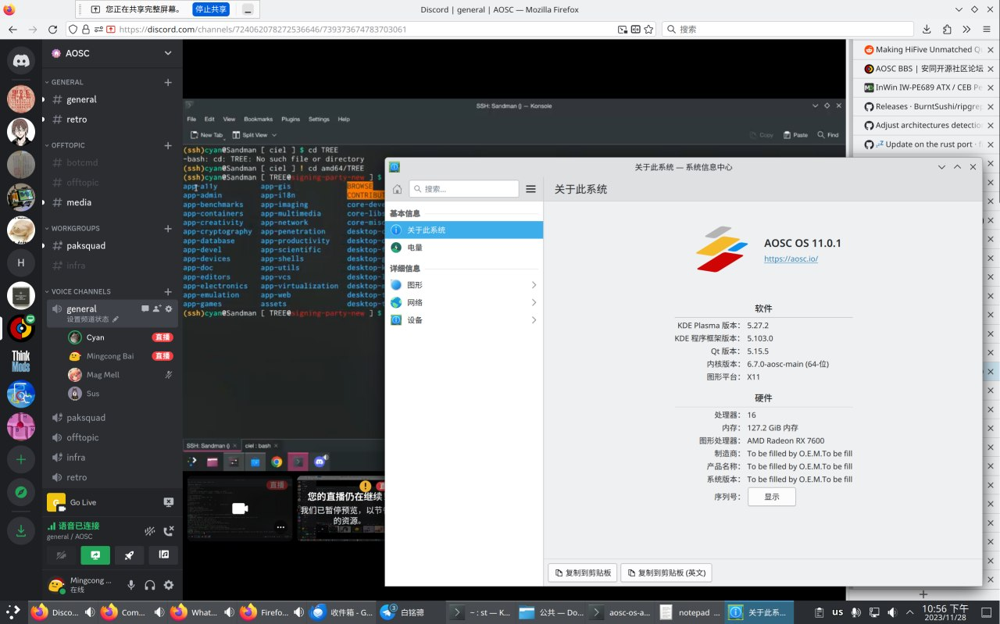

每周一都为大家报道 LoongArch&reg; 社区最前线的第一手新鲜资讯！
上周的进展主要有 ABI、工具链、Firefox、固件、OpenSSL。
详情点进来看！

<!-- truncate -->

如无特别说明，文中提及的日期、时间都为北京时间（UTC+8）。

本期周报的实际发稿时间是周二凌晨，因为这个点:儿:才写完——白天都在忙别的。
网页上显示的发稿时间仍然是 12 月 4 日：这是 [Docusaurus 早期为了修复一个时区 bug 而导致的又一个时区 bug](https://github.com/facebook/docusaurus/issues/4881)。

## 要闻速递 {#breaking-news}

11 月 28 日，龙芯公司在国家会议中心举办了 2023 龙芯产品发布暨用户大会。
笔者在现场获得了一些有价值信息；在接下来的周报中将陆续为您播报。

## 先「马」再看 {#marked-projects}

本栏目的内容具有一定延续性，将持续追踪报道 LoongArch&reg; 领域的重要或长期项目（坑）。

### Linux {#linux}

Hengqi Chen 在跑 BPF 自我测试的时候，[发现](https://lore.kernel.org/loongarch/CAEyhmHT6UOryPZi7eEfw01Y_CjAqxy8NM6eKkdvdojJqB9P7eQ@mail.gmail.com/)开启
LoongArch BPF JIT 之后，一些用例会导致内核 panic 或导致 RCU 卡死。
截至发稿时，[修了](https://lore.kernel.org/loongarch/20231204141938.7230-1-hengqi.chen@gmail.com/)一种 panic。

Hengqi Chen 继续迭代 :ta: 的将系统调用号存入 `struct thread_info` 的补丁系列。
为了解决 `execsnoop` 等工具不可用的燃眉之急，:ta: 单独[拆出了](https://lore.kernel.org/loongarch/20231204053745.3153-1-hengqi.chen@gmail.com/)
`exec` 时不清零 `$a7`（系统调用号寄存器）的补丁；此补丁已被 Huacai Chen 接受，
将在 Linux 6.7 最终发布时可用。

Tiezhu Yang [贴出了](https://lore.kernel.org/loongarch/20231129130701.27744-1-yangtiezhu@loongson.cn/)第 5 版的为
LoongArch 适配 [ORC stack unwinder](https://lwn.net/Articles/728339/) 的补丁。

### 工具链 {#toolchain}

#### ABI {#abi}

龙芯团队完成了初版 TLS[^tls] 描述符（TLS descriptors，TLSDESC）ABI 的设计与实现：

[^tls]: Thread-Local Storage，线程本地存储。此 TLS 非彼 TLS（Transport Layer Security，传输层安全）。

* [binutils](https://sourceware.org/pipermail/binutils/2023-December/130916.html)（Lulu Cai）
* [gcc](https://gcc.gnu.org/pipermail/gcc-patches/2023-December/638907.html)（mengqinggang）
* [glibc](https://sourceware.org/pipermail/libc-alpha/2023-December/153052.html)（mengqinggang）

TLS 描述符是一种用来优化线程本地变量（thread-local variables）访问速度的方案，
由 Alexandre Oliva 在 2005 年前后设计；作者[公开了](https://www.fsfla.org/~lxoliva/writeups/TLS/RFC-TLSDESC-x86.txt)设计文档。
目前实现了或即将实现 TLS 描述符的架构有以下几种：

* 富士通 FR-V：最初设计的灵感来源和目标架构。
* x86：i386、AMD64。
* ARM：ARM、AArch64。
* Andes NDS32
* Tensilica Xtensa
* RISC-V：正在推进中，[工单](https://github.com/riscv-non-isa/riscv-elf-psabi-doc/issues/94)、[设计稿](https://github.com/riscv-non-isa/riscv-elf-psabi-doc/pull/373)。

LoongArch 不日也将加入它们的行列。
第一版代码还有些地方要改，请直接去上游围观。
值得一提的是原作者也[加入了](https://sourceware.org/pipermail/binutils/2023-December/130932.html)讨论，并从自己的经验给出了宝贵建议！

几乎与此同时，常佳琛同学也[贴出了](https://sourceware.org/pipermail/binutils/2023-December/130921.html)一版对
TLS LE 操作的 relaxation 支持。
这名号在龙芯圈子是头一回见，邮箱后缀也是西安邮电大学，而非 `loongson.cn`——新鲜血液本就不多见，
何况首秀就在 ABI 这种硬核领域。
让我们热烈欢迎 :ta:！

#### binutils {#binutils}

先前[报道过的](../2023-10-30-this-week-in-loongarch-22.md#binutils)
[Jiajie Chen](https://github.com/jiegec)
帮忙加的 LoongArch&reg; v1.10 新指令，已经进入主线：[补丁甲](https://sourceware.org/git/?p=binutils-gdb.git;a=commit;h=cd51849c90e8fd13779bec69f5d4c7aadf03a532)、[补丁乙](https://sourceware.org/git/?p=binutils-gdb.git;a=commit;h=9ff4752d0f6d46ca0f7d275ea07e05790ac8dd1d)。

mengqinggang 继续跟进新的中等代码模型（medium code model）过程调用方式 `R_LARCH_CALL36`
的适配工作，给 binutils [添加了](https://sourceware.org/pipermail/binutils/2023-December/130906.html)
`call` 和 `tail` 伪指令支持。
在邮件列表已经进行了一些讨论，因此这些指令的具体形态可能还会微调，但要加入这两类伪指令这件事:儿:应该是确定了。
熟悉 RISC-V 的读者应该（终于）会感到家的温暖 :wink:

#### GCC {#gcc}

Joern Rennecke 与 Jeff Law [做了](https://gcc.gnu.org/pipermail/gcc-patches/2023-November/638380.html)一稿多余的符号扩展、零扩展的消除工序（pass）。
这不是专门为 LoongArch 做的工作，但包括 LoongArch 在内的不少架构将从中受益。

Jiahao Xu 按照[之前 Xi Ruoyao 的改法](../2023-11-13-this-week-in-loongarch-24.md#gcc)，
修复了剩余的子寄存器（subreg）误用，
等于消灭了这些问题逻辑将导致的编译器崩溃（ICE）。

Jiahao Xu 还[修复了](https://gcc.gnu.org/pipermail/gcc-patches/2023-November/638556.html)
`{v,xv}shuf` 的测试用例在 LA664 上失败的问题（bug [PR112611]）。
这是因为原先的预期计算结果就是 LA464 上相应指令的执行效果，而原先的输入数据会触发 LA464 的未定义行为。

[PR112611]: https://gcc.gnu.org/bugzilla/show_bug.cgi?id=112611

Jiahao Xu 还[加了](https://gcc.gnu.org/pipermail/gcc-patches/2023-November/638369.html)
`-mrecip` 选项，用来控制是否利用 LA664 的两种浮点近似倒数指令。代码仍需修改。

liwei 用 LoongArch SIMD 指令[优化了](https://gcc.gnu.org/pipermail/gcc-patches/2023-November/638384.html)标量的
`__builtin_popcount`（置 1 个数）操作。

:::info 编者按
这个操作有向量版：`{v,xv}pcnt.[bhwd]`，却没有标量版，不对称。
在一些零星使用，因而不值得向量化的场景可能吃亏。
希望以后能补上这一块……
:::

liwei 还[优化了](https://gcc.gnu.org/pipermail/gcc-patches/2023-November/638385.html)取奇/偶元素的向量操作。

liwei 还[清理了](https://gcc.gnu.org/pipermail/gcc-patches/2023-November/638390.html)[上次优化后](../2023-11-20-this-week-in-loongarch-25.md#CLZ_DEFINED_VALUE_AT_ZERO)重复的
`CLZ_DEFINED_VALUE_AT_ZERO` 定义。

guojie 在 UBSan 的指导下[修复了](https://gcc.gnu.org/pipermail/gcc-patches/2023-November/637859.html)
LoongArch 后端在处理立即数时，可能触发的一处未定义行为。

guojie 还[优化了](https://gcc.gnu.org/pipermail/gcc-patches/2023-November/637858.html)高 32 位与低 32 位碰巧相同的立即数的装载。

本期的 GCC 新闻都是 [Xi Ruoyao][xry111] 帮忙整理（以及一部分自己制造）的，让我们感谢 :ta: 的奉献！

#### LLVM {#llvm}

[wangleiat] 仿照两年前的一组 x86 改动，[修复了](https://github.com/llvm/llvm-project/pull/73742)在代码生成的边界情况时
`fnmsub.[sd]` 的错误用法。

[wangleiat] 用 SIMD 指令[支持了](https://github.com/llvm/llvm-project/pull/73759)
LLVM IR 的 [`extractelement` 操作](https://llvm.org/docs/LangRef.html#extractelement-instruction)（提取元素：提取位于输入向量的给定索引的标量元素）。
这应该是最早一批的 LLVM/Clang 向量支持了，期待后续的更多内容。

[SixWeining] 让 LoongArch Clang [支持了](https://github.com/llvm/llvm-project/pull/72514)
`-mcmodel=`（代码模型）参数，用法与 GCC 的该参数相同。

[heiher] 的 LLVM IR `code_model` 新增工作[接近尾声](https://github.com/llvm/llvm-project/pull/72077#issuecomment-1837468951)：
目前所有代码审查意见都处理完了。

[wangleiat]: https://github.com/wangleiat
[SixWeining]: https://github.com/SixWeining
[heiher]: https://github.com/heiher

## 杂闻播报 {#assorted-news}

### Firefox {#firefox}

[安同开源社区（AOSC）][aosc]注重桌面用户体验与生产力，已经在圈内小有名气。AOSC 的开发者们本次也为火狐（Firefox）浏览器在
LoongArch 的良好用户体验帮了很大忙。

[liushuyu](https://github.com/liushuyu) 成功适配了 WebRTC，已经可以用 Discord 连麦了，其他类似网站说不定也能用：

此工作后续会推入上游。

[Jiangjin Wang](https://github.com/RedL0tus) [去除了](https://phabricator.services.mozilla.com/D194320)视频硬解接口
VA-API 的架构放行名单，使所有的 Linux 平台不论架构，只要能成功加载 `libva`，即可硬解视频。Firefox 122 将包含此改进。

### 固件 {#firmware}

龙芯固件团队[放出了](https://github.com/loongson/Firmware/pull/79)
3A6000 评估板 `EVB_XA61200` 的固件更新。
相比出厂版本，修复了如较新型号的 AMD 显卡插上则无法亮机、DMI 信息不含内存实际运行频率等大量问题，
建议有动手能力的同学跟进更新。
请去[官方仓库页面](https://github.com/loongson/Firmware/tree/main/6000Series/PC/XA61200)查看自己的硬件是否匹配，
及下载更新文件。
感谢 [Xi Ruoyao][xry111] 提供新闻线索！

[yetist](https://github.com/yetist) 为著名的自动固件升级工具 fwupd 的 UEFI 模块 fwupd-efi
[增加了](https://github.com/fwupd/fwupd-efi/pull/48) LoongArch 支持。
感谢 [Revy](https://github.com/RevySR) 提供新闻线索！

### OpenSSL {#openssl}

上期[提到的](../2023-11-27-this-week-in-loongarch-26.md#assorted-news)别名分析（aliasing analysis）
问题已被修复，并往回移植到 3.2.x 分支了：
从 OpenSSL 3.2.1 开始，即便启用 LTO，也不用非得手工指定平台为 `linux64-loongarch64` 了。
感谢 [Xi Ruoyao][xry111] 完成此工作并提供新闻线索！

[xry111]: https://github.com/xry111

## 张贴栏 {#bulletin}

本栏目可供张贴公益性质的各种信息。

* 友情扩散：[安同开源社区（AOSC）][aosc]的龙架构移植主线化工作「合龙」仍在如火如荼进行中，
  此工作完成后龙架构将升格为 AOSC OS 的 Tier 1 架构。
  欢迎同学们试用、反馈，也欢迎有志之士一同加入（沟通渠道详见 AOSC 网站相关栏目）。
* 本周报[持续接受网友投稿][call-for-submissions]。欢迎来上游坐坐！

[aosc]: https://aosc.io
[call-for-submissions]: https://github.com/loongson-community/areweloongyet/issues/16
