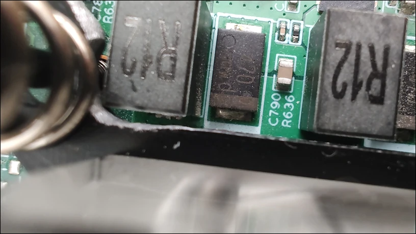
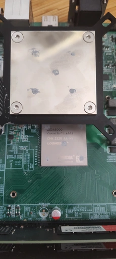
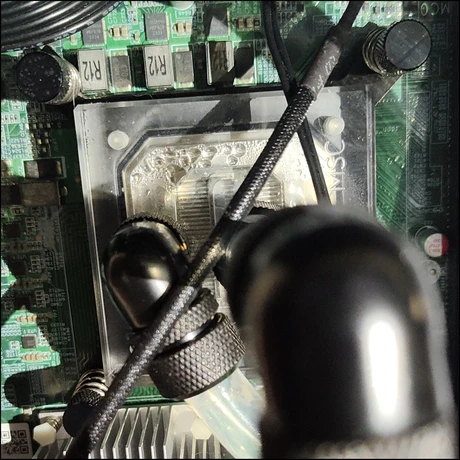

每周一都为大家报道 LoongArch&reg; 社区最前线的第一手新鲜资讯！
上周的进展主要有工具链、本站阅读材料的新增，以及证实了 3A6000 可上水冷（但需自备角磨机等机加工设备）。
详情点进来看！

<!-- truncate -->

如无特别说明，文中提及的日期、时间都为北京时间（UTC+8）。

## 先「马」再看 {#marked-projects}

本栏目的内容具有一定延续性，将持续追踪报道 LoongArch&reg; 领域的重要或长期项目（坑）。

### Linux {#linux}

Huacai Chen [发出了](https://lore.kernel.org/loongarch/20231209112317.1542046-1-chenhuacai@loongson.cn/)本开发周期的第二组问题修复，
Linus 已[将其合并](https://github.com/torvalds/linux/commit/b10a3ccaf6e39f6290ca29d7c24604082eacaea0)入 tag `v6.7-rc5`。
主要的变更有：

* 修复了上期周报[提到的](../2023-12-05-this-week-in-loongarch-27/index.md#linux)
  BPF JIT 错误实现（[Hengqi Chen][chenhengqi]），Tiezhu Yang 也修了另两个问题；
* 修复了[上上期](../2023-11-27-this-week-in-loongarch-26.md#linux)、上期周报都提到的
  `execve` 之后丢失系统调用号信息的问题（[Hengqi Chen][chenhengqi]）；
* 修复了上上期周报提到的 Clang 构建的压缩内核[不能引导](https://github.com/ClangBuiltLinux/linux/issues/1962)的问题（[WANG Rui][heiher]）。

[chenhengqi]: https://github.com/chenhengqi
[heiher]: https://github.com/heiher

### 工具链 {#toolchain}

#### binutils

[Xi Ruoyao][xry111] 为共享库[启用了](https://sourceware.org/pipermail/binutils/2023-December/130991.html)
`la.got` 到 `la.pcrel` 的 relaxation 优化。

mengqinggang [意图](https://sourceware.org/pipermail/binutils/2023-December/130993.html)为
LoongArch 汇编语言增加双引号括起来的符号名和寄存器名支持，但未一并给出意欲支持的需求场景。Fangrui Song
随后指出了寄存器名还加引号有点奇怪，应该是不用支持；作者同意了，会再改一版。

:::info 引号表示符号名的意义
这样做大概是为了支持引用那些内含奇特字符的符号。例如在 x86 上：

```
movq $1, "%rax"  ; 向名为 %rax 的符号指向的 8 字节位置写 1
movq $1, %rax    ; 向 rax 寄存器写 1
```

详见 [Xi Ruoyao][xry111] 的[解释文字](https://github.com/loongson-community/areweloongyet/pull/105#discussion_r1417857333)。
:::

#### GCC {#gcc}

[杰哥][jiegec]三天前
（12 月 8 日）[发现](https://github.com/loongson-community/discussions/issues/23)
GCC 14 的 20231203 快照版本，相比 GCC 13.2.1 居然劣化了 3A6000 的 CoreMark 跑分高达 15%！Xi Ruoyao
立即加入排查队伍。
大家发现了至少 4 个彼此独立的问题：

* [PR112919]：先前在 LA464 上证实最优的代码块对齐参数，对 LA664 反而是损害；
* [PR112935]：架构无关部分发生了劣化，Andrew Pinski
  已经[给出](https://gcc.gnu.org/pipermail/gcc-patches/2023-December/640030.html)补丁；
* [PR112936]：排查上一个问题时，发现 LoongArch 的乘除法指令成本定义得非常坏，完全不反映现实，Xi Ruoyao
  也已[给出](https://gcc.gnu.org/pipermail/gcc-patches/2023-December/640012.html)补丁；以及
* [PR111126] 也与本问题存在一定关系，是后续可以惠及 LoongArch、RISC-V 和 MIPS64r6 的一项改进。

[PR112919]: https://gcc.gnu.org/PR112919
[PR112935]: https://gcc.gnu.org/PR112935
[PR112936]: https://gcc.gnu.org/PR112936
[PR111126]: https://gcc.gnu.org/PR111126

Jiahao Xu 做的 LoongArch v1.10 的近似浮点倒数指令 `frecipe.[sd]`、近似浮点平方根倒数指令 `frsqrte.[sd]`
及其 SIMD 支持，已由 chenglulu [合入主线](https://github.com/gcc-mirror/gcc/commit/61f1001f2f4ab9128e5eb6e9a4adbbb0f9f0bc75)。
感谢[杰哥][jiegec]提供新闻线索！

[Xi Ruoyao][xry111] [允许了](https://gcc.gnu.org/pipermail/gcc-patches/2023-December/639748.html)把 `-mcmodel=extreme` 与 `model` 属性，
搭配 `-mexplicit-relocs=auto` 使用。

[Yang Yujie][scylaac] [修复了](https://gcc.gnu.org/pipermail/gcc-patches/2023-December/639651.html)对
`__builtin_eh_return` 的调用会导致同一函数中其他常规返回路径的返回值被破坏的问题。
此问题被发现会导致 libgcc 的 `_Unwind_RaiseException` 在极端情况下返回错误结果。

[Yang Yujie][scylaac] 还基于 AOSC 开发者 Zixing Liu 先前在 9 月份[发出的](https://gcc.gnu.org/pipermail/gcc-patches/2023-September/631260.html)
D 语言 LoongArch 适配补丁，
将其[迭代到了](https://gcc.gnu.org/pipermail/gcc-patches/2023-December/638912.html)第三版。

本期的大多数 GCC 新闻都是 [Xi Ruoyao][xry111] 帮忙整理（以及自己制造）的，让我们感谢 :ta: 的奉献！

[jiegec]: https://github.com/jiegec
[scylaac]: https://github.com/scylaac
[xry111]: https://github.com/xry111

#### LLVM {#llvm}

[wangleiat](https://github.com/wangleiat) 教会了 LLVM 做很多 SIMD 代码生成：

* [整数元素的取完整乘法结果高半部分](https://github.com/llvm/llvm-project/commit/e9cd197d15300f186a5a32092103add65fbd3f50)，
  对应 LLVM IR 中操作向量数据类型的 [`mul`][llvm-langref-mul] 随后
  `ashr`/`lshr` 再 `trunc` 的操作；
* [整数元素的选择](https://github.com/llvm/llvm-project/commit/de21308f78f3b0f0910638dbdac90967150d19f0)，
  对应 LLVM IR 中操作向量数据类型的 [`select`][llvm-langref-select]；
* [浮点、整数的元素比较](https://github.com/llvm/llvm-project/pull/74700)，
  分别对应 LLVM IR 中操作向量数据类型的 [`fcmp`][llvm-langref-fcmp]
  与 [`icmp`][llvm-langref-icmp]；
* [浮点开平方、求倒数](https://github.com/llvm/llvm-project/pull/74795)，
  分别对应 LLVM IR 中的 [`llvm.sqrt.*`][llvm-langref-sqrt] intrinsics，
  以及被除数是 1.0 的 [`fdiv`][llvm-langref-fdiv]；
* [浮点求相反数](https://github.com/llvm/llvm-project/commit/cdc37325669c0321328a7245083c427b229e79e9),
  对应 LLVM IR 中操作向量数据类型的 [`fneg`][llvm-langref-fneg]。

[llvm-langref-fcmp]: https://llvm.org/docs/LangRef.html#fcmp-instruction
[llvm-langref-fdiv]: https://llvm.org/docs/LangRef.html#fdiv-instruction
[llvm-langref-fneg]: https://llvm.org/docs/LangRef.html#fneg-instruction
[llvm-langref-icmp]: https://llvm.org/docs/LangRef.html#icmp-instruction
[llvm-langref-mul]: https://llvm.org/docs/LangRef.html#mul-instruction
[llvm-langref-select]: https://llvm.org/docs/LangRef.html#select-instruction
[llvm-langref-sqrt]: https://llvm.org/docs/LangRef.html#llvm-sqrt-intrinsic

[SixWeining](https://github.com/SixWeining)
[同步了](https://github.com/llvm/llvm-project/pull/73345)
LoongArch ELF psABI 20231102 版本（整体版本号 v2.20）变更了的重定位类型定义。

## 杂闻播报 {#assorted-news}

本站的其他栏目得到了些久违的更新：

* 新增了[《基础设施版本基线参考》](/docs/baseline-reference/)与[《典型龙架构配置数据收集》](/docs/collection-of-typical-configurations/)两篇阅读材料；
* 为[《如何称呼龙架构？》](/docs/loong-or-loongarch/)更新了信息，
* 在首页新增了 [ALT Linux](https://en.altlinux.org/Main_Page)、[勇豹](https://github.com/sunhaiyong1978/Yongbao)两种发行版；
* 在首页新增了 Haiku、ReactOS 两种历史悠久的小众内核。

欢迎读者们[提出建议](https://github.com/loongson-community/areweloongyet/issues)、[参与贡献](https://github.com/loongson-community/areweloongyet/pulls)！

[Xinmudotmoe] 十月份向 ROCm 的 ROCR-Runtime
组件[提交的](https://github.com/ROCm/ROCR-Runtime/pull/168)
LoongArch 支持补丁，已为 AMD 维护者所确认：将进入 ROCm 6.1 官方版本。

[Xinmudotmoe]: https://github.com/Xinmudotmoe

AOSC 贡献者 [eatradish](https://github.com/eatradish) 为 Rust 的 Lua 绑定库
mlua [新增了](https://github.com/khvzak/mlua/pull/339) LoongArch 支持。
感谢 [MingcongBai](https://github.com/MingcongBai) 投递新闻线索！

## 社区整活:儿: {#grins}

本栏目接受任何网友的投稿，只要内容与 LoongArch&reg; 有关，并可以为读者带来价值，
无论严肃贡献（整的大活:儿:）或是博君一笑都一概欢迎！

近日，[Xinmudotmoe] 在角磨机的配合下，为 :ta: 的 3A6000 换上了水冷！
看看 :ta: 的好活:儿:：

### 3A6000 水冷计划！

固件组[更新太快](https://github.com/loongson/Firmware/pull/79)，
使得我刚磨开 PCIe 槽就有了更好的固件。（白干）

（编者按：3A6000 评估板的出厂固件是不能点亮 RDNA 或更往后的 A 卡的。
虽然可用[「献祭流」](https://github.com/loongson/Firmware/issues/74#issuecomment-1831442404)绕过，
但前提是要「解决 x8 槽插 x16 卡的问题」——朋友的角磨机怕不是就为这购买的……）

XA61200 主板扣具兼容 LGA 115x 孔位，但处理器高度过低，且桥片散热器与处理器供电电感位置冲突。
只得用角磨机对 115x 水冷头框架进行打磨，使其兼容。
可见打磨后水冷头的变化（点击可看高清大图，下同）：

<!-- convert reduced-frame-closeup.jpg -resize 816x459 reduced-frame-closeup@0.25x.webp -->
[](./reduced-frame-closeup.jpg)

测试安装压力：

<!-- convert pressure-test.jpg -resize 512x230 -rotate 90 pressure-test@0.125x.webp -->
[](./pressure-test.jpg)

运行效果：

<!-- convert final-effect.jpg -resize 460x460 final-effect@0.25x.webp -->
[](./final-effect.jpg)

~~角磨一时爽，漏液火葬场！~~

## 张贴栏 {#bulletin}

本栏目可供张贴公益性质的各种信息。

* 友情扩散：[安同开源社区（AOSC）][aosc]的龙架构移植主线化工作「合龙」仍在如火如荼进行中，
  此工作完成后龙架构将升格为 AOSC OS 的 Tier 1 架构。
  欢迎同学们试用、反馈，也欢迎有志之士一同加入（沟通渠道详见 AOSC 网站相关栏目）。
* 新增一篇英雄帖：[在社区中新增 LoongArch 的 SMBIOS Type 44 表格支持](https://github.com/loongson-community/discussions/issues/28)。
  欢迎有志之士去评论区报到！
* 本周报[持续接受网友投稿][call-for-submissions]。欢迎来上游坐坐！

[aosc]: https://aosc.io
[call-for-submissions]: https://github.com/loongson-community/areweloongyet/issues/16
