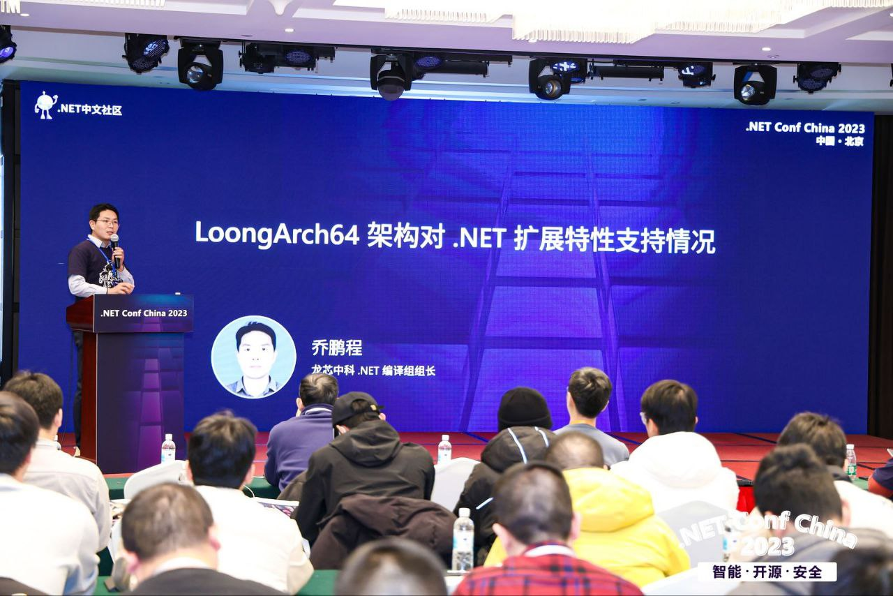
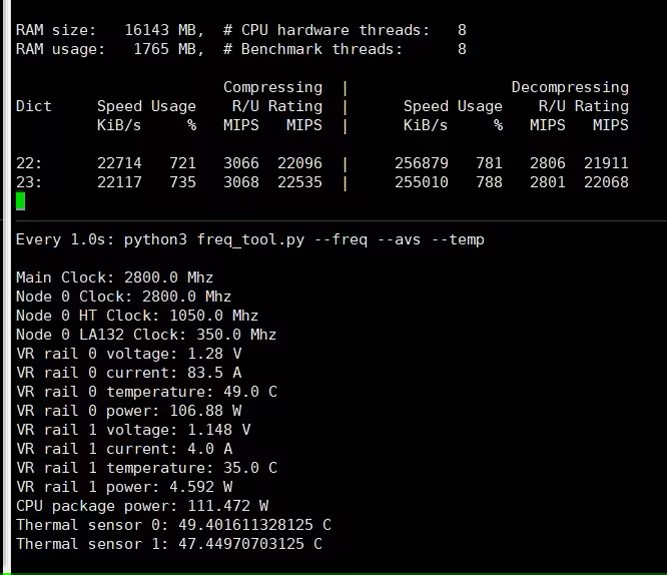

每周一都为大家报道 LoongArch 社区最前线的第一手新鲜资讯！
上周的进展主要有社区版龙芯 SIMD 指令文档、3A6000 社区版超频固件，以及 ABI。
详情点进来看！

<!-- truncate -->

如无特别说明，文中提及的日期、时间都为北京时间（UTC+8）。

## 先「马」再看 {#marked-projects}

本栏目的内容具有一定延续性，将持续追踪报道 LoongArch 领域的重要或长期项目（坑）。

### Linux {#linux}

Linux 6.6 LTS 分支日前[向后移植了](https://git.kernel.org/pub/scm/linux/kernel/git/stable/stable-queue.git/diff/queue-6.6/loongarch-mark-dmw-tlb-_virt_to_page-exports-as-non-.patch?id=f5b20a28332e98771485a6ebbd97791f4031f6a5)放宽
`{dmw,virt}_to_page` 两个符号的许可证要求的提交。
这意味着 OpenZFS 2.2.x 将可搭配 Linux 6.6.x 系列中的 6.6.8 或更高版本使用了。

### 工具链 {#toolchain}

#### ABI {#abi}

[安同开源社区（AOSC）][aosc]开发者[王江津](https://github.com/RedL0tus)在适配 JetBrains 开发环境全家桶时，
发现有 [Java 组件](https://github.com/JetBrains/pty4j)想动态加载 `libutil.so`，而该共享库在 LoongArch 上并不存在。
在 glibc 的实现中，该共享库的所有函数都[合并入 `libc.so` 了](https://sourceware.org/git/?p=glibc.git;a=commit;h=734c60ebb607086ad6d67b2544d6b7baba72a652)；
此事发生在 LoongArch 进入 glibc 上游之前，因此 glibc 在 LoongArch 上自始就不提供该共享库。
但同样来自 AOSC 的 [Icenowy](https://github.com/Icenowy) 翻查规范文档发现 [LSB 似乎有要求提供该文件](https://refspecs.linuxbase.org/LSB_5.0.0/LSB-Core-generic/LSB-Core-generic/libutil.html)，
故[建立了](https://github.com/loongson-community/discussions/issues/29)龙芯社区的跟踪工单，
以及相应的 [glibc 问题报告](https://sourceware.org/bugzilla/show_bug.cgi?id=31136)。
根据目前的上游口径，似乎提供一个指向 `libc.so` 的符号链接就足够了。

## 杂闻播报 {#assorted-news}

### .net {#dotnet}

龙芯中科的工程师[乔鹏程](https://github.com/shushanhf)在 2023 年 12 月 16 日举行的
.NET Conf China 2023 介绍了 LoongArch .net/Mono 相关进展：

* .net 8.0 EA 版的新世界二进制已经有首个发布版本：[GitHub 页面](https://github.com/shushanhf/LoongArch64-Blog-for-.NET-Mono/releases/tag/sdk8.0.0-LA64-newABI-upstream)
- Mono LoongArch 支持预计 2024Q1 开始推送社区，计划在 2024 年 7 月之前完成
- Unity（团结引擎）已与 LoongArch 完成适配

出于历史原因，开源世界对于 .net/Mono 的关注度并不高，但 .net/Mono 是 Unreal（虚幻）、Unity（团结）、Godot
等游戏引擎的核心组件，也是大量商业公司部署桌面、服务端产品的重要生态。LoongArch .net/Mono port
推送计划明确，对于普通桌面用户，即使为了打游戏，那也是极好的。

<!-- https://github.com/loongson-community/areweloongyet/assets/5524744/cd444646-6449-40f1-a418-8ca16d307ae2 -->

<!-- https://github.com/loongson-community/areweloongyet/assets/5524744/ff3b38e8-2c42-4e8d-8b70-491ca42a6bb1 -->

以上的新闻由 [phorcys] 为您播报。

### Gentoo {#gentoo}

[xen0n](https://github.com/xen0n) 正在 Gentoo 推进 LoongArch 的安装 CD 与 LLVM/Clang stage3 的构建工作。
为此需要给 Gentoo 发行版内核（dist kernel）[增加](https://github.com/gentoo/gentoo/pull/34291)
LoongArch 支持，以及[增加](https://github.com/gentoo/gentoo/pull/34324) Clang profiles；
他觉得在 2024 到来之前有望完成这两部分工作。

### Ghidra {#ghidra}

近日，美国国家安全局（NSA）为 Ghidra
[增加了](https://github.com/NationalSecurityAgency/ghidra/commit/0f09d6fed3b1c884f1843bda5ec1bf1dfbada06c) LoongArch 支持，
将于 Ghidra 10.5 正式发布。Ghidra 是 NSA 主导开发的软件逆向工程框架，为近年全球信息安全领域的从业者所逐渐采用。
感谢[杰哥][jiegec]提供新闻线索。

致关心此事的中国立场网友们

尽管本站谈论技术话题尽量不涉及政治与人事，但由于 NSA 的隐蔽战线背景十分明显，
笔者合理推测那些站在中国利益一边，但不熟悉信息安全领域的网友们，会对此有诸多疑虑。
以下是笔者站在个人立场的分析：

任何受到广泛支持的架构，都免不了被安全研究者们仔细审视。LoongArch 作为国内外的产业界、开源社区多少都在拥抱的一门新兴架构，
它受到 NSA 项目组重视并进入 Ghidra 全家桶，是必然的发展。
某种程度上，这也能起到积极效果——逼迫龙芯及社区的参与者们，必须通过可公开的精心设计实现软硬件的整体安全，
而不能指望靠着向公众隐藏什么东西来换取暂时的「安全感」。

实际上：即便 LoongArch 文档始终不被公开，在足够多的社区成员折腾过后，同样的文档被写出也只是时间问题——例如在《龙芯架构参考手册》卷一尚未公布的
2021 年 3 月初，xen0n 还是[能够掏出](https://github.com/loongson-community/docs/pull/4)保真度相当高的基础指令文档。
虽然事后看来这份文档的错误不少，但请注意：当时 LoongArch 不光没有公开文档，甚至在公开渠道连硬件都没有，
而这些信息只需要有足量的机器语言，靠脑子就足以揭露了。
如果当时能够摸到真实 LoongArch 硬件以实际验证想法，或者将更多机器语言材料加入分析，
那么让文档的准确率达到 100% 也不是什么难事。

这其实意味着，如果一个架构想不被安全研究者们盯上，只有让 :ta: 们硬件软件都拿不到；
但这样一来，也就不可能将此架构大面积推广了。

（此外，接下来将为您报道的社区制 3A6000 超频固件，就是那位信息安全从业者使用 Ghidra
研究、操作龙芯固件的结果。
考虑到「真正敏感的信息不会被公开」这一点，NSA 选择将 Ghidra 开源，可能也是对全球同行的贡献了。——由于中国同行们并未将自己的类似框架也开源，
为 :ta: 们担心的中国立场网友们，也可以放心了。）

## 社区整活:儿: {#grins}

本栏目接受任何网友的投稿，只要内容与 LoongArch 有关，并可以为读者带来价值，
无论严肃贡献（整的大活:儿:）或是博君一笑都一概欢迎！

也许是热心群众觉得快到年末了，社区里新闻还不够大；
因此在全国降温的背景下，我们的勇士们还是挺身而出，用狠活:儿:加热屏幕前阅读周报的您
（和您的电脑主机——如果您看完之后也热血沸腾，而决定上手干点啥的话）！

### 3A6000 XA61200 官方固件爆改超频！

在华硕[发布了](https://www.bilibili.com/video/BV15u4y1A7aK) 3A6000 超频视频后，
对 3A6000 超频的关注一下子多了起来。

虽然龙芯中科的固件工程师 [@MarsDoge] 已经在评论区[提到](https://github.com/loongson/Firmware/pull/79#issuecomment-1832171459)，
会在下个发布周期（2024 年 2 月）提供固件的超频选项，但社区的小伙伴，已经完全等不及了。

Bilibili 用户 [nywkkk]（GitHub [@naivekun]）18 日凌晨[发布了](https://www.bilibili.com/video/BV11a4y1r7Qc)自制的
XA61200 主板（3A6000）手动自定义超频固件。

[@MarsDoge]: https://github.com/MarsDoge
[nywkkk]: https://space.bilibili.com/25097496
[@naivekun]: https://github.com/naivekun

nywkkk 上周根据手册逆向并修改了主板 UEFI 固件，通过二进制修改 PEI（Pre-EFI Initialization，EFI 前初始化）阶段
PLL 配置，达成了 3A6000 的 2.7GHz 超频；:ta:
将改好的固件文件在 GitHub 上[发布了](https://github.com/naivekun/ls3a6000-overclock-firmware)。
本周 :ta: 再进一步，编写了超频 UEFI PEI 模块并[公开了](https://github.com/naivekun/LoongsonOverclockPkg)模块源码：
该模块插入主板固件 PEI 启动链后，可以实现对电压、频率的自定义调节。

刷入修改版固件后，也可以在 UEFI shell 中通过新增的 `overclock` 命令调节处理器电压，频率，重启后生效。
但如果频率或电压太高，则会变砖，需要通过 SPI 编程器刷写固件，或者切换到主板备用固件后重刷固件来解决问题。
没有 SPI 编程器（CH341A、FT2232 或类似方案）的用户可能会面临无法救砖的风险。

不过，由于 3A6000 和 7A2000 的各个频率域耦合关系比较多，目前修改固件只是初步解决了频率、电压的调节，没有彻底解耦。
提高运行频率会对 HT、DDR 和桥片频率有影响，但猜测大部分 3A6000 可以轻松超频到 2.7~2.8GHz 稳定运行，
刚好对应老胡提到的「3A6000 有 200MHz 睿频提升空间」。
和大多数 Intel、AMD CPU 超频一样，单通道内存会减少超频难度以及增加稳定性。

:::danger
虽然目前超频至 2.8GHz 会带来 10%~15% 的性能提升，但仍然不推荐普通用户进行超频。
超频有可能会**永久损坏**你的 CPU 和主板，有时也会连带损坏内存、PCIe 设备。
尤其目前 3A6000 超频属于极早期测试，并没有明确的电压频率安全区间。
因此**请务必确保你已经明确上述风险，并准备好再买一块主板的钱**，再进行超频。
:::

nywkkk 还同步[开发了](https://github.com/naivekun/ls3a6000_freq_tool)用来查看频率功耗的工具。
此工具需要名为 `devmem` 的工具辅助（未给出源码，但看上去实现较为简单，自己写一个即可），且搭配 4.19 内核使用。
以下是 :ta: 在 Bilibili 视频评论区展示了 :ta: 将 3A6000 超频至 2.8GHz 时满载测试的截图：

<!-- https://github.com/loongson-community/areweloongyet/assets/5524744/61208f01-d939-4619-a85d-180d6e855cfa -->

推荐感兴趣的同学移步 naivekun 同学的个人网站，阅读 :ta: 亲笔的[原理讲解文章](https://naivekun.com/2023/12/loongson-3a6000-overclock/)。

本栏目由 [phorcys] 为您播报（文字有少许编辑）。

[phorcys]: https://github.com/phorcys

### 龙芯 SIMD 指令文档：现已推出社区版！

还在为龙芯迟迟不放出《龙芯架构参考手册》第二卷，SIMD 指令明明放在眼前却不知道怎么用，而感到为难？
感谢[杰哥][jiegec]：现在不用等了！

「在 LoongArch 第二卷向量指令集文档没有放出的情况下，社区开发者对一些软件进行 SIMD 加速的移植会面临很大的困难。
因此，我开始根据公开代码（QEMU 和 GCC）整理 LSX/LASX intrinsics 的文档，
仓库[托管在 GitHub 上](https://github.com/jiegec/unofficial-loongarch-intrinsics-guide/)，
目前[部署在个人网站上](http://jia.je/unofficial-loongarch-intrinsics-guide/)，
欢迎试用和提交贡献。

「目前已经完成所有的 LSX 和 LASX intrinsics，并且测量了向量指令在两代 LA 处理器上的延迟和吞吐。
同时也验证了之前提到过的 `vshuf/xvshuf` 的 LA464 和 LA664 不一致的行为，
并且另外发现 `xvpermi.q` 也有类似问题，
见 [The Guide](http://jia.je/unofficial-loongarch-intrinsics-guide/viewer/?q=MACHINE_3C5000)。」

[jiegec]: https://github.com/jiegec

本栏目由[杰哥][jiegec]为您播报（文字有少许编辑）。

## 张贴栏 {#bulletin}

本栏目可供张贴公益性质的各种信息。

* 友情扩散：[安同开源社区（AOSC）][aosc]的龙架构移植主线化工作「合龙」仍在如火如荼进行中，
  此工作完成后龙架构将升格为 AOSC OS 的 Tier 1 架构。
  欢迎同学们试用、反馈，也欢迎有志之士一同加入（沟通渠道详见 AOSC 网站相关栏目）。
* 请关注[龙芯社区的讨论园地][discussions-issues]：目前大家经常在这里追踪工作进度和派活:儿:了。行有余力的同学请来报到！
* 本周报[持续接受网友投稿][call-for-submissions]。欢迎来上游坐坐！

[aosc]: https://aosc.io
[call-for-submissions]: https://github.com/loongson-community/areweloongyet/issues/16
[discussions-issues]: https://github.com/loongson-community/discussions/issues
