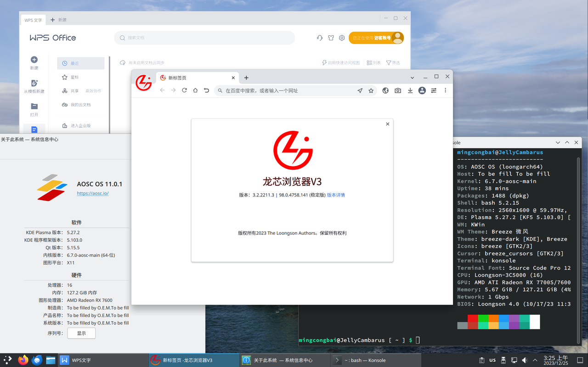

每周一都为大家报道 LoongArch&reg; 社区最前线的第一手新鲜资讯！
上周的进展主要有 TODO。
详情点进来看！

<!-- truncate -->

如无特别说明，文中提及的日期、时间都为北京时间（UTC+8）。

本期周报的实际发稿时间是周二凌晨，因为这个点才写完——白天都在忙别的。
网页上显示的发稿时间仍然是 12 月 25 日：
这是 Docusaurus 早期为了修复一个时区 bug 而[导致的](https://github.com/facebook/docusaurus/issues/4881)又一个时区 bug。

## 先「马」再看 {#marked-projects}

本栏目的内容具有一定延续性，将持续追踪报道 LoongArch&reg; 领域的重要或长期项目（坑）。

### Linux {#linux}

Huacai Chen [发出了](https://lore.kernel.org/loongarch/20231223120642.1067728-1-chenhuacai@loongson.cn/)
Linux v6.8 开发周期的龙架构 KVM 变更 PR。
其中，Bibo Mao 修复了定时器的模拟；Tianrui Zhao 让虚拟机内部可以使用 LSX、LASX 指令。

Huacai Chen [修复了](https://lore.kernel.org/loongarch/20231225070002.1350705-1-chenhuacai@loongson.cn/)单节点的逻辑处理器数量大于 64 时，系统引导过程会写坏一些内存内容的问题。

龙芯 QEMU 开发者 Song Gao 为方便用户以 FDT（flattened device tree，拍平设备树）协议启动主线内核，
预备为主线内核的默认配置[开启](https://lore.kernel.org/loongarch/20231222024628.3138406-1-gaosong@loongson.cn)通用 PCIe 宿主支持。

[Xi Ruoyao][xry111] 尝试[微调了](https://lore.kernel.org/loongarch/20231214130206.21219-1-xry111@xry111.site/)
LoongArch 上下文切换代码中保存、恢复 8 个浮点条件码的片段，
因为先前的简单写法在 LA464 上性能很差。
然而 Huacai Chen 还是[喜欢](https://lore.kernel.org/loongarch/CAAhV-H5m65qL05W9VZw7Qff-qg8TUc_wY8zs-pSeBuWSAFnSaQ@mail.gmail.com/)简单的代码，
因此估计在谁掏出这么改可以提升上下文切换性能的客观证据，例如跑分对比之前，这个补丁是不会被收了 :confused:。

:::info 究竟有多差？
根据 Xi Ruoyao 的实验结果，LA464 上每次 `movcf2gr` 花的时间是 `movcf2fr + movfr2gr` 的 7 倍，
而 `movgr2cf` 更是 `movgr2fr + movfr2cf` 的 15 倍！
想在浮点条件码和整数寄存器之间搬运多达 1 比特的数据，多经过浮点寄存器倒一手，居然能快几倍甚至十几倍，简直离谱。
还好 LA664 把这坑填掉了。
:::

### 工具链 {#toolchain}

#### ABI {#abi}

今（25）日下班前，龙芯工具链团队[合并了](https://github.com/loongson/la-abi-specs/pull/5)
LoongArch ABI 规范文档的 v2.30 更新（整体版本号；文档版本号为 v20231219）。
本次更新的主要内容有：

* 明确了基础 ABI 下，函数的向量参数的传递方式。基础 ABI 不保证 SIMD 扩展一定存在，因此只能将向量参数视作基本类型量的数组处理。
* 修复了一些重定位操作的算术描述。
* 增加了代码模型（code model）章节。主要是明确定义了 `normal`、`medium` 与 `extreme` 三种代码模型，以及要求 `extreme` 代码模型的四条拼接地址指令必须相邻。
  后者是先前针对该问题的社区讨论所[提到的](https://github.com/loongson-community/discussions/issues/17)简单方案。
  周报第 26 期的[猜测](../2023-11-27-this-week-in-loongarch-26.md#abi)出了些偏差：
  可能出于工作量和兼容性考虑，本次并未「一步到位」，直接实现那个通过提供完整关联信息而解决问题的复杂方案。
  本站的基线参考文档也已[同步更新了](/docs/baseline-reference/)。
* 正式加入了周报第 27 期[提及的](../2023-12-05-this-week-in-loongarch-27/index.md#abi)
  TLS 描述符（TLSDESC）相关定义。

#### binutils {#binutils}

mengqinggang [修复了](https://sourceware.org/pipermail/binutils/2023-December/131391.html)先前会给不是函数类型的符号也生成
PLT（procedure linkage table，过程链接表）记录的问题。

mengqinggang 还按照本次的 ELF psABI 更新，[实现了](https://sourceware.org/pipermail/binutils/2023-December/131386.html)
`R_LARCH_ALIGN` 对汇编器 `.align` 第三位置的表达式参数的支持。

#### GCC {#gcc}

[Xi Ruoyao][xry111] 修复了[杰哥][jiegec][发现的](https://gcc.gnu.org/PR113033)编译
LSX 的循环移位操作会崩溃（ICE）的问题：[补丁甲](https://gcc.gnu.org/pipermail/gcc-patches/2023-December/640937.html)、[补丁乙](https://gcc.gnu.org/pipermail/gcc-patches/2023-December/641401.html)。

Xi Ruoyao 还[修复了](https://gcc.gnu.org/pipermail/gcc-patches/2023-December/640808.html)同样由杰哥[发现的](https://gcc.gnu.org/PR113034)
`__m128` 类型的「不等于」比较操作会被错误编译的问题。

Xi Ruoyao 还[节约了](https://gcc.gnu.org/pipermail/gcc-patches/2023-December/640809.html)每次 32 位循环移位操作先前都附带的一次多余符号扩展。

Xi Ruoyao 还[尝试解决了](https://gcc.gnu.org/pipermail/gcc-patches/2023-December/640280.html)先前在
`-mexplicit-relocs=auto` 时，有些适合合并的符号地址装载操作没被识别出来、予以合并的问题；
目前还有小坑，正在调整。

Xi Ruoyao 还改善了对于浮点条件码的处理：[清理了](https://gcc.gnu.org/pipermail/gcc-patches/2023-December/640731.html)
LoongArch 后端定义中一处不会被用到的情况，
又[实现了](https://gcc.gnu.org/pipermail/gcc-patches/2023-December/640713.html)浮点条件码（`FCCmode`）
的重新装载（reload）。
后者有利于在某处浮点比较操作的结果无法预测时，提升此处结果向目标位置的保存性能。

Lulu Cheng [实现了](https://gcc.gnu.org/pipermail/gcc-patches/2023-December/640977.html)
TLS LE (local-exec) relaxation（线程本地存储的本地执行模型的松弛）优化的编译器一侧。
搭配周报第 27 期[提到的](../2023-12-05-this-week-in-loongarch-27/index.md#abi)汇编器一侧支持，
预计能在某些多线程场景下提升性能。

Li Wei [修复了](https://gcc.gnu.org/pipermail/gcc-patches/2023-December/641407.html)启用链接时优化（LTO）时，
可能导致个别位域装载操作被错误编译的问题；原因是 `*bstrins_<mode>_for_ior_mask` 这条规则写错了。
该问题至少波及了 SPEC 2006 的 `400.perlbench` 用例。

本期的 GCC 新闻都是 [Xi Ruoyao][xry111] 帮忙整理的，让我们感谢 :ta: 的奉献！

[jiegec]: https://github.com/jiegec

#### LLVM {#llvm}

TODO

## 杂闻播报 {#assorted-news}

欧洲时间 12 月 20 日晚间，首度包含了龙架构支持的 GRUB 2.12
[正式发布了](https://lists.gnu.org/archive/html/grub-devel/2023-12/msg00052.html)。
久等了！
知名科技媒体 Phoronix 也[报道了](https://www.phoronix.com/news/GRUB-2.12-Released)此事。
感谢 [xry111] 提供新闻线索。

[xry111]: https://github.com/xry111

## 社区整活:儿: {#grins}

本栏目接受任何网友的投稿，只要内容与 LoongArch&reg; 有关，并可以为读者带来价值，
无论严肃贡献（整的大活:儿:）或是博君一笑都一概欢迎！

## `libLoL`: AOSC 为您在新旧世界之间架起桥梁！ {#liblol}

众所周知，LoongArch 的[新旧世界生态割裂问题](/docs/old-and-new-worlds/)已经困扰了社区发行版用户许久：
虽然许多闭源软件都陆续支持了 LoongArch，但都是在采用旧世界 ABI 的商业发行版上，
从而与基于新世界 ABI 的社区发行版和用户群体「绝缘」。
虽然在早先[上证路演的投资者互动环节][sse-roadshow]、11 月 28 日的产品发布会上，
龙芯公司都表态将开发新旧世界应用的兼容方案，
但截至目前，关于龙芯方案的技术细节，满怀热忱的同学们仍未在公开渠道得到正面回应。
考虑到性能喜人的 3A6000 板卡已经陆续上市，不难作出合理推测：
总有群众等不及两年后（或者甚至更久）这些软件的官方新世界版本，而现在就要用！

[sse-roadshow]: https://roadshow.sseinfo.com/roadshowIndex.do?id=16536#cd-placeholder-hdjl

[安同开源社区（AOSC）][aosc]作为「牢记服务用户需求这一宗旨」的一群人，此刻便站了出来。:ta: 们给出的答案是：`libLoL`——LoongArch on LoongArch。

AOSC 开发者[王邈][shankerwangmiao]与[刘子兴][liushuyu]，
在内核层面实现了以外挂模块（亦可理解为「驱动」）方式，动态载入的旧世界系统调用支持。
王邈也设计、实现了位于用户态的运行时部分：打包了旧世界参考发行版 Loongnix&reg; 的核心运行时库，
使旧世界应用能够有「回家的感觉」从而正常启动。
在本期周报发稿当天，AOSC OS 已经能够运行 WPS Office 与龙芯浏览器等标志性的旧世界应用，
如图所示（点击即看高清大图）：

[shankerwangmiao]: https://github.com/shankerwangmiao
[liushuyu]: https://github.com/liushuyu

后续，在完成配套内核模块的载入向导后，使用龙架构设备的 AOSC OS 用户便可按需启用此兼容方案了。AOSC 同仁们也欢迎其他新世界发行版维护者考察 `libLoL`，并视自身情况和需求集成此项目的成果。

12 月 23 日发布的 AOSC 双周报《安记冰室・十二月下》[记载了](https://github.com/AOSC-Dev/newsroom/blob/2c5443a792291702438cbf6059d8d4039ca5dc85/coffee-break/20231223/zh_CN.md#%E5%B1%95%E6%9C%9B-liblol%E9%BE%99%E6%9E%B6%E6%9E%84%E6%97%A7%E4%B8%96%E7%95%8C%E5%BA%94%E7%94%A8%E7%A8%8B%E5%BA%8F%E5%85%BC%E5%AE%B9%E8%BF%90%E8%A1%8C%E6%97%B6)这项工作的更多信息，推荐阅读。

## 张贴栏 {#bulletin}

本栏目可供张贴公益性质的各种信息。

* 友情扩散：[安同开源社区（AOSC）][aosc]的龙架构移植主线化工作「合龙」仍在如火如荼进行中，
  此工作完成后龙架构将升格为 AOSC OS 的 Tier 1 架构。
  欢迎同学们试用、反馈，也欢迎有志之士一同加入（沟通渠道详见 AOSC 网站相关栏目）。
* 本周报[持续接受网友投稿][call-for-submissions]。欢迎来上游坐坐！

[aosc]: https://aosc.io
[call-for-submissions]: https://github.com/loongson-community/areweloongyet/issues/16
