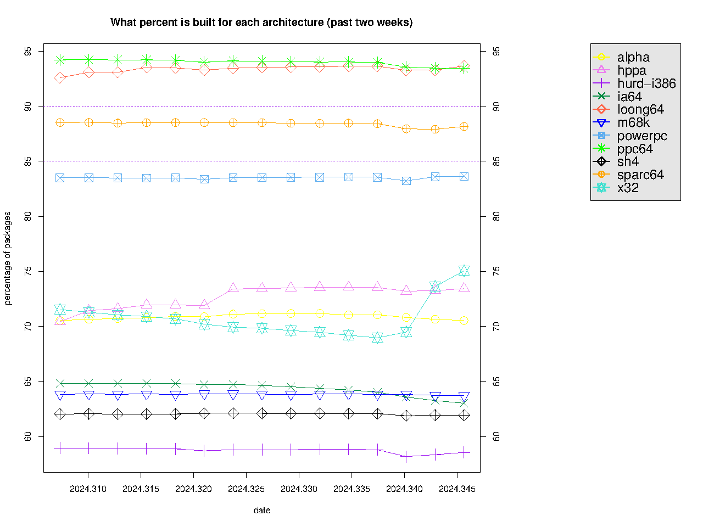

每周一都为大家报道 LoongArch 社区最前线的第一手新鲜资讯！
上周的进展主要有工具链与发行版适配。
详情点进来看！

<!-- truncate -->

如无特别说明，文中提及的日期、时间都为北京时间（UTC+8）。

本期周报的实际发稿时间是周二，因为 xen0n 周一晚上在装机。

## 先「马」再看 {#marked-projects}

本栏目的内容具有一定延续性，将持续追踪报道 LoongArch 领域的重要或长期项目（坑）。

### Linux {#linux}

Li Jun [意图改变](https://lore.kernel.org/loongarch/20240506092419.4109941-1-lijun01@kylinos.cn/)冲刷最后一级缓存的方式，以「修复从
S3 睡眠醒来时找不到映像信息」。从补丁的 `Signed-off-by`（「签发人」）信息看，该改动是与三名龙芯员工
Baoqi Zhang、Jianmin Lv 与 Biao Dong 一同完成的。

:::info 需要注意的是
该补丁在解释性文字、代码质量方面都有需要改进之处，例如：

* 提交说明中，未对问题机理与解决方案作出解释；
* 补丁涉及到向 IOCSR `0x280` 写入 `1`，但此 IOCSR 编号未见于任何公开资料，补丁中也未包含对其用途的解释；
* 补丁涉及到强制访问内存地址，但未使用如 `READ_ONCE` 等的内核惯用写法。

目前原作者[改到了](https://lore.kernel.org/loongarch/20240507074357.2156083-1-lijun01@kylinos.cn/)第二版，仍然没改完。由于
xen0n 的主力工作站仍未完全恢复正常，因此这些本将出现在一封回复邮件中的内容就只能先以这种形式亮相了。
:::

### 工具链 {#toolchain}

#### binutils {#binutils}

mengqinggang [调整了](https://sourceware.org/pipermail/binutils/2024-May/133976.html)
LoongArch 的 DWARF CIE 数据对齐系数 `DWARF2_CIE_DATA_ALIGNMENT` 到 `-8`
以期减少调试信息所占空间。Jinyang He
[提醒道](https://sourceware.org/pipermail/binutils/2024-May/133983.html)对
LoongArch32 应当保持此值为 `-4`；预计后续实际进入主线的修改将包含此建议。

#### GCC {#gcc}

预计 GCC 14.1 正式版将于维护者时区的 5 月 7 日发布，请打包人们注意跟进。

#### LLVM {#llvm}

[heiher] [实现了](https://github.com/llvm/llvm-project/pull/90463)「冗余
32 位符号扩展消除」的优化工序（pass）。此 pass 是受到了 RISC-V 的类似优化启发。

[heiher]: https://github.com/heiher

## 杂闻播报 {#assorted-news}

### OpenWrt 完成「合龙」 {#openwrt-loongarch64-port-mainlined}

[Weijie Gao][hackpascal] 先前[所做的](https://github.com/openwrt/openwrt/pull/14357)
OpenWrt LoongArch64 移植已[进入主线](https://github.com/openwrt/openwrt/commit/7fcb82665e96a50174084c8bfcd0302ce31291f4)。虽然
OpenWrt 官方的快照构建（snapshot builds）仍未出现 `loongarch64/generic` 型号，但有些衍生项目则已开始提供成品镜像了，如
[ImmortalWrt](https://downloads.immortalwrt.org/snapshots/targets/loongarch64/generic/)。

[hackpascal]: https://github.com/hackpascal

### `loong64` 移植完成度首度登顶 Debian Ports {#loong64-tops-debian-ports-for-first-time-in-completeness}

观察者 [LinuxResearcher] 报道说：（原文经过了编辑以保持与《每周一龙》文风相对一致）

2024 年 5 月 7 日，Debian Ports 中 `loong64` 移植的完成度稍稍领先了
`ppc64`：`loong64` 已构建完成了 16195 个软件包，而 `ppc64` 则为 16190 个。
这是 `loong64` 的完成度在所有 Debian Ports 架构中首度登顶。

此事件更多是代表一种象征意义：

* 由于领先幅度很小，以后能否保持领先暂时未知；
* `loong64` 编译失败的包比 `ppc64` 要多：136 对 82；
* 此外还有很多关键软件包，如 `gnome-shell`，还没有编译出来。

截至北京时间 2024 年 5 月 7 日 13:50，龙架构的编译进度达到了 93.67769551%。到
5 月 21 日，距离龙架构进入 Debian Ports 就整整一周年了：希望一周年的时候，完成度仍然能保持最高，并尽早达到满足转为正式支持架构的完成度——96%。

[LinuxResearcher]: https://github.com/LinuxResearcher

## 张贴栏 {#bulletin}

本栏目可供张贴公益性质的各种信息。

* 您可在 GitHub [浏览](https://github.com/loongson-community/discussions/labels/%E8%8B%B1%E9%9B%84%E5%B8%96)目前所有开放的英雄帖。
* 本周报[持续接受网友投稿][call-for-submissions]。欢迎来上游坐坐！

[call-for-submissions]: https://github.com/loongson-community/areweloongyet/issues/16
