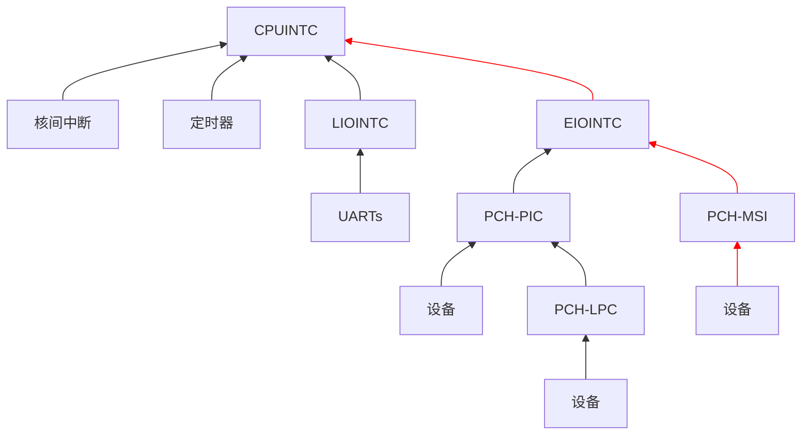
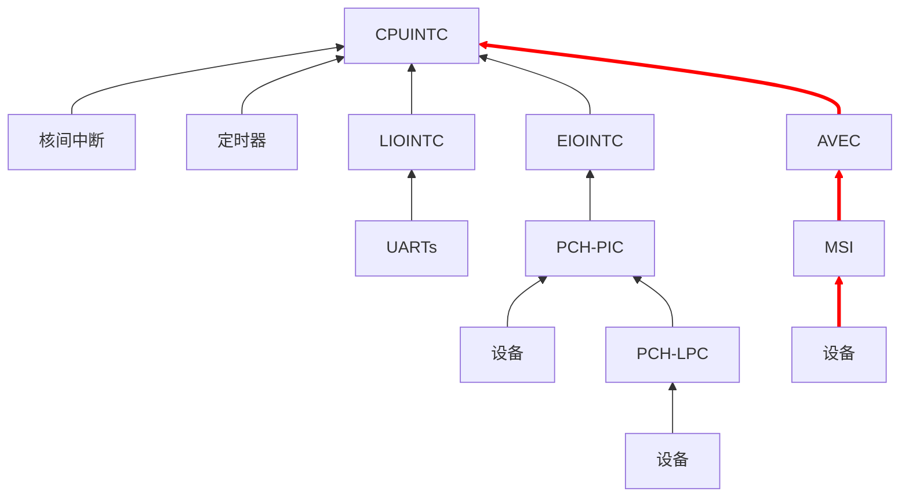

每周一都为大家报道 LoongArch 社区最前线的第一手新鲜资讯！
上周的进展主要有 TODO。
详情点进来看！

<!-- truncate -->

如无特别说明，文中提及的日期、时间都为北京时间（UTC+8）。

## 先「马」再看 {#marked-projects}

本栏目的内容具有一定延续性，将持续追踪报道 LoongArch 领域的重要或长期项目（坑）。

### Linux {#linux}

Tianyang Zhang [扩展了](https://lore.kernel.org/loongarch/20240507122228.5288-1-zhangtianyang@loongson.cn/)
Linux 的 LoongArch 中断模型说明文档，加入了「高级扩展 IRQ 模型」一节，同时也[附上了](https://lore.kernel.org/loongarch/20240507125953.9117-1-zhangtianyang@loongson.cn/)所谓「LoongArch avec」的实现。

「AVEC」应是「advanced vectored interrupt」即「高级向量中断」的缩写。从补丁内容中我们可以了解到：

* 这是从龙芯 3C6000 开始支持的硬件特性；
* 特点是每个 CPU 都有专属于自己的向量中断号；
* AVEC 控制器与现存的 EIOINTC「扩展 I/O 中断控制器」、LIOINTC「传统 I/O 中断控制器」平级。

截至目前，大部分 LoongArch 系统都遵循如下图所示的「扩展 IRQ 模型」：

可见一直以来 MSI 中断都是由 PCH 即桥片负责，经由 EIOINTC「扩展 I/O 中断控制器」到达 CPU，即
LoongArch IRQ 模型中的 CPUINTC「CPU 中断控制器」。而在存在 AVEC，从而以「高级扩展 IRQ 模型」方式工作的
LoongArch 系统上，MSI 中断则能够通过 AVEC 控制器直接到达 CPU：

显然，从龙芯 3C6000 开始，使用 MSI 中断与宿主通信的设备不再被挂在桥片上了。这使它们与
CPU 间的信号通路在逻辑上更短，进而有助于系统互联性能的提升。让我们拭目以待！

### 工具链 {#toolchain}

#### ABI {#abi}

TODO

#### binutils {#binutils}

TODO

#### GCC {#gcc}

TODO

#### LLVM {#llvm}

TODO

## 杂闻播报 {#assorted-news}

TODO

## 社区整活:儿: {#grins}

本栏目接受任何网友的投稿，只要内容与 LoongArch 有关，并可以为读者带来价值，
无论严肃贡献（整的大活:儿:）或是博君一笑都一概欢迎！

TODO

## 张贴栏 {#bulletin}

本栏目可供张贴公益性质的各种信息。

* 您可在 GitHub [浏览](https://github.com/loongson-community/discussions/labels/%E8%8B%B1%E9%9B%84%E5%B8%96)目前所有开放的英雄帖。
* 本周报[持续接受网友投稿][call-for-submissions]。欢迎来上游坐坐！

[call-for-submissions]: https://github.com/loongson-community/areweloongyet/issues/16
