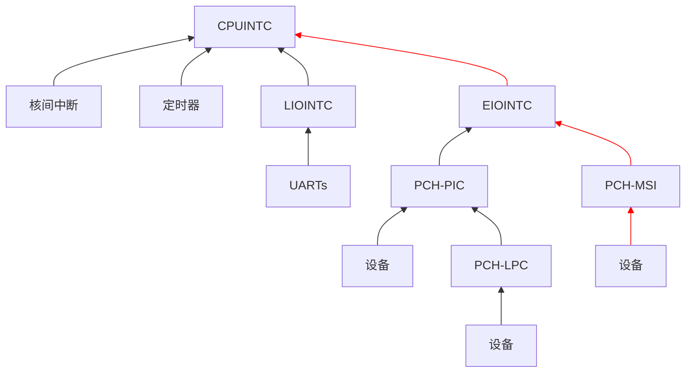
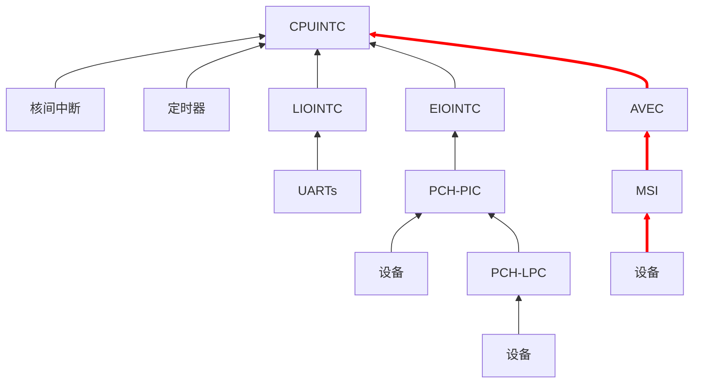

每周一都为大家报道 LoongArch 社区最前线的第一手新鲜资讯！
上周的进展主要有 Linux、Golang 与 LATX 预览版发布。
详情点进来看！

<!-- truncate -->

本期周报的实际发稿时间是周二晚间，因为 xen0n 周一在忙别的。同时，本周三（5 月 15 日）碰巧也是《每周一龙》周报创刊一周年的纪念日：小编谨在此祝贺读者朋友们和自己又成功多活一年，并祝愿大家在新的一年能为彼此整出更多狠活:儿:。

如无特别说明，文中提及的日期、时间都为北京时间（UTC+8）。

## 先「马」再看 {#marked-projects}

本栏目的内容具有一定延续性，将持续追踪报道 LoongArch 领域的重要或长期项目（坑）。

### Linux {#linux}

Tianyang Zhang [扩展了](https://lore.kernel.org/loongarch/20240507122228.5288-1-zhangtianyang@loongson.cn/)
Linux 的 LoongArch 中断模型说明文档，加入了「高级扩展 IRQ 模型」一节，同时也[附上了](https://lore.kernel.org/loongarch/20240507125953.9117-1-zhangtianyang@loongson.cn/)所谓「LoongArch avec」的实现。

「AVEC」应是「advanced vectored interrupt」即「高级向量中断」的缩写。从补丁内容中我们可以了解到：

* 这是从龙芯 3C6000 开始支持的硬件特性；
* 特点是每个 CPU 都有专属于自己的向量中断号；
* AVEC 控制器与现存的 EIOINTC「扩展 I/O 中断控制器」、LIOINTC「传统 I/O 中断控制器」平级。

参考 [Linux 的 LoongArch 中断模型描述文档](https://docs.kernel.org/translations/zh_CN/arch/loongarch/irq-chip-model.html)，截至目前，大部分
LoongArch 系统都遵循如下图所示的「扩展 IRQ 模型」。图中标红的边是 MSI 中断要走的路径。

:::info 如果您看到箭头颜色不对
这是因为您的浏览器[不支持](https://caniuse.com/?search=context-stroke)必要的 SVG 属性
`stroke: context-stroke`。我们只能希望这不影响阅读……
:::

可见一直以来 MSI 中断都是由 PCH 即桥片负责，经由 EIOINTC「扩展 I/O 中断控制器」到达 CPU，即
LoongArch IRQ 模型中的 CPUINTC「CPU 中断控制器」。而在存在 AVEC，从而以「高级扩展 IRQ 模型」方式工作的
LoongArch 系统上，MSI 中断则能够通过 AVEC 控制器直接到达 CPU：

显然，从龙芯 3C6000 开始，使用 MSI 中断与宿主通信的设备不再被挂在桥片上了。这使它们与
CPU 间的信号通路在逻辑上更短，进而有助于系统互联性能的提升。让我们拭目以待！

### 工具链 {#toolchain}

#### LLVM {#llvm}

[heiher] [优化了](https://github.com/llvm/llvm-project/pull/91174)循环左移操作的代码生成：将其视作等效的循环右移，并简化了循环右移操作的模式匹配方式。这对 32 位循环移位操作的多种情况均有改善。

[heiher]: https://github.com/heiher

#### Golang {#golang}

[abner] 优化了 Go 在 `GOARCH=loong64` 上的原子操作：

* [新增](https://go.dev/cl/481577) LoongArch 原子访存指令的 Plan 9 汇编支持；
* 以 `amswap_db` [优化](https://go.dev/cl/481578)原子交换操作 `Xchg{32,64}`；
* 以 `amadd_db` [优化](https://go.dev/cl/481937)原子加法操作 `Xadd{32,64}`；
* 以 `amand_db` 与 `amor_db` [优化](https://go.dev/cl/482756)原子按位操作 `And{64,32,8}` `Or{64,32,8}`；
* [修复](https://go.dev/cl/493435)一些指令的 Plan 9 汇编语法；
* 以单条 `dbar 0x1a`（store-store 屏障）[实现](https://go.dev/cl/577515) Go 运行时的 `publicationBarrier` 语义；
* 以 `amswap_db` 与 `dbar 0x12`（store-release 屏障）[优化](https://go.dev/cl/581356)原子写入操作 `Store{64,32,8}`；
* 以 `dbar 0x14`（load-acquire 屏障）[优化](https://go.dev/cl/581357)原子读取操作 `Load{64,32,8}`。

从测试结果看，性能收益还是不错的。

Go 社区从 2023 年开始就着手将构建机器迁移到
[Chromium LUCI 体系](https://ci.chromium.org/ui/p/golang)管理。
经过社区与构建机维护者的协同努力，目前 LUCI 上的 linux-loong64 的构建机可以愉快地工作了；可以在[官方看板](https://7419-34ac013-dot-chromium-swarm.appspot.com/botlist?c=id&c=task&c=os&c=status&d=asc&f=cipd_platform%3Alinux-loong64&k=cipd_platform&s=id)观看接入状态。

相关的工单：

* [整体迁移计划](https://go.dev/issue/63471)；
* [`loong64` 的迁移工作](https://go.dev/issue/65398)。

:::info 请贡献者注意
因为 LUCI 的接入方式所需的网络带宽和流量远远大于先前的 buildlet 方式，目前跑测试时，仍然偶尔会出现网络超时的情况。
:::

感谢 [abner] 自己制造并投递新闻线索！

[abner]: https://github.com/abner-chenc

## 杂闻播报 {#assorted-news}

### LATX 1.5.1 rc1 发布，召唤测试！ {#latx-1.5.1-rc1-call-for-testing}

观察者、打包人 [phorcys] 报告说：

上周，龙芯中科二进制翻译组的 [Lu Zeng][deuso]（@deuso）[发布了](https://github.com/deuso/latx-build/releases/tag/1.5.1-rc1)
LATX 1.5.1-rc1。RC（release candidate）版本是正式发布前的预览版。

[phorcys]: https://github.com/phorcys
[deuso]: https://github.com/deuso

本次发布的版本同时适配了新旧世界。下载后，您可根据自己系统性质，选择对应目录下的文件安装。

[deuso] 本次发布主要是想召集一些有兴趣参与的小伙伴参与测试。希望有空折腾的小伙伴多多试用，以及在[官方工单系统](https://github.com/deuso/latx-build/issues)反馈
bug，尤其是那些在 1.4.4 版本可以工作，但在 1.5.1-rc1 则不行的场景。

此版本的 LATX 新增了 AOT、库直通的支持，并有不小的性能提升，在兼容性方面也有改进。

AOT 是 ahead-of-time，提前编译的意思，与 JIT（just-in-time，即时编译）相对。LATX 的 AOT
缓存位于 `~/.cache/latx/`，但目前的缓存路径中没有包含哈希值，这可能会造成一些问题。

关于库直通功能，在 Loongnix 下测试，解除垂直同步后 `glxgears` 可以跑到和原生几乎一样的帧数。
但目前 rc1 版本的库直通只在 Loongnix 上完全调通了；新世界仅有少量库可以直通，对此还需要等待 rc2
或者后续版本更新。

尽管 LATX 的新世界直通尚未实装，Vulkan 支持也未完成，但 1.5.1-rc1 的游戏性能还是有了巨大提升。
线索投递者[测试了](https://www.bilibili.com/video/BV1iZ421j7CQ)十款游戏，相对 1.4.4
都有了 80%~150%+ 的帧率提升。预计等库直通完全实装之后，体验会有更进一步的提高。

## 张贴栏 {#bulletin}

本栏目可供张贴公益性质的各种信息。

* 您可在 GitHub [浏览](https://github.com/loongson-community/discussions/labels/%E8%8B%B1%E9%9B%84%E5%B8%96)目前所有开放的英雄帖。
* 本周报[持续接受网友投稿][call-for-submissions]。欢迎来上游坐坐！

[call-for-submissions]: https://github.com/loongson-community/areweloongyet/issues/16
